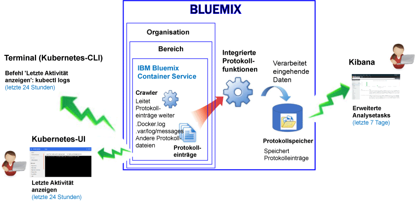
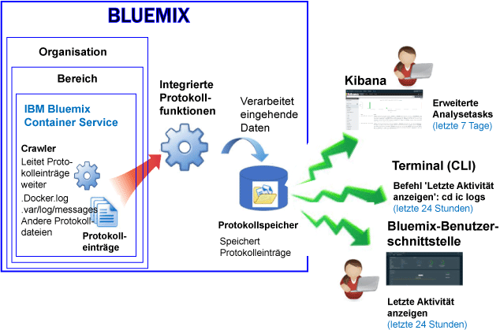

---

copyright:
  years: 2015, 2017

lastupdated: "2017-05-23"

---

{:shortdesc: .shortdesc}
{:new_window: target="_blank"}
{:codeblock: .codeblock}
{:screen: .screen}


# Protokollierung für den IBM Bluemix Container Service
{: #logging_containers_ov}

Sie können Protokolle für Docker-Container anzeigen, filtern und analysieren, die in der {{site.data.keyword.IBM}}-verwalteten Cloudinfrastruktur bereitgestellt sind, und für Docker-Container, die in Kubernetes-Clustern ausgeführt werden. Die Protokollierung von Containern wird automatisch aktiviert, wenn Sie einen Container in {{site.data.keyword.Bluemix_notm}} oder einem Kubernetes-Cluster bereitstellen.{:shortdesc}

Containerprotokolle werden von außerhalb der Container mithilfe von Crawlern überwacht und weitergeleitet. Die Daten werden von den Crawlern an eine Multi-Tenant-Elasticsearch-Instanz in {{site.data.keyword.Bluemix_notm}} gesendet.


## Protokolle für einen Container erfassen, der in einem Kubernetes-Cluster ausgeführt wird
{: #logging_containers_ov_logs_collected_kubernetes}

Die folgende Abbildung zeigt eine Übersicht über die Protokollierung für {{site.data.keyword.containershort}}:



Wenn Sie in {{site.data.keyword.Bluemix_notm}} Anwendungen in einem Kubernetes-Cluster bereitstellen, berücksichtigen Sie die folgenden Informationen:

* In einem {{site.data.keyword.Bluemix_notm}}-Konto können Sie eine oder mehr Organisation haben. 
* Jede Organisation kann 1 oder mehr {{site.data.keyword.Bluemix_notm}}-Bereiche haben. 
* In einer Organisation können Sie 1 oder mehr Kubernetes-Cluster haben. 
* Die Erfassung von Protokollen wird automatisch aktiviert, wenn Sie einen Kubernetes-Cluster erstellen. 
* Ein Kubernetes-Cluster ist agnostisch für {{site.data.keyword.Bluemix_notm}}-Bereiche. Die Protokolldaten eines Clusters und der zugehörigen Ressourcen sind jedoch einem {{site.data.keyword.Bluemix_notm}}-Bereich zugeordnet.
* Protokolldaten werden für eine Anwendung erfasst, sobald der Pod bereitgestellt wird.
* Um Protokolldaten für einen Cluster analysieren, müssen Sie auf die Kibana-Dashboards für die öffentliche Cloudregion zugreifen, in der der Cluster erstellt wird.

Bevor Sie einen Cluster erstellen, sei es über die [{{site.data.keyword.Bluemix_notm}}-Benutzerschnittstelle ](../../../containers/cs_cluster.html#cs_cluster_ui) oder die [-Befehlszeile](../../../containers/cs_cluster.html#cs_cluster_cli), müssen Sie sich in einer bestimmten {{site.data.keyword.Bluemix_notm}}-Region, einem Konto, einer Organisation und einem Bereich anmelden. Der Bereich, in dem Sie angemeldet sind, ist der Bereich, in dem Protokolldaten für den Cluster und die zugehörigen Ressourcen erfasst werden.

Standardmäßig werden die Informationen erfasst, die ein Containerprozess als "stout" (Standardausgabe) und als "stderr" (Standardfehler) ausgibt. Das Senden von Informationen an 'stdout' und 'stderr' ist die Standard-Docker-Konvention zur Bereitstellung von Informationen zu einem Container. 

Wenn Sie die Protokolldaten einer App, die in einem Container ausgeführt wird, im JSON-Format an den Docker-Protokollcollector weiterleiten, können Sie in Kibana Protokolldaten suchen und analysieren, indem Sie JSON-Felder verwenden. Weitere Informationen finden Sie unter [Angepasste Felder als Kibana-Suchfelder konfigurieren](logging_containers_ov.html#send_data_in_json).

**Hinweis:** Wenn Sie mit einem Kubernetes-Cluster arbeiten, sind die Namensbereiche *ibm-system* und *kube-system* reserviert. Erstellen, löschen und ändern Sie keine Berechtigungen für Ressourcen, die in diesen Namensbereichen verfügbar sind. Die Protokolle für diese Namensbereiche sind für die Verwendung durch {{site.data.keyword.IBM_notm}} reserviert.


## Protokolle für einen Bluemix-verwalteten Container erfassen
{: #logging_containers_ov_logs_collected}

Die folgende Abbildung zeigt eine Übersicht über die Protokollierung für {{site.data.keyword.containershort}}:



Standardmäßig werden für einen Container, der in der {{site.data.keyword.Bluemix_notm}}-verwalteten Cloudinfrastruktur bereitgestellt wird, die folgenden Protokolle erfasst:

<table>
  <caption>Tabelle 2. Protokolle für Container, die in einer Bluemix-verwalteten Cloudinfrastruktur bereitgestellt sind</caption>
  <tbody>
    <tr>
      <th align="center">Protokoll</th>
      <th align="center">Beschreibung</th>
    </tr>
    <tr>
      <td align="left" width="30%">/var/log/messages</td>
      <td align="left" width="70%"> Docker-Nachrichten werden standardmäßig im Ordner '/var/log/messages' des Containers gespeichert. Dieses Protokoll enthält Systemnachrichten.
      </td>
    </tr>
    <tr>
      <td align="left">./docker.log</td>
      <td align="left">Dieses Protokoll ist das Docker-Protokoll. <br> Die Docker-Protokolldatei wird nicht als Datei innerhalb des Containers gespeichert, jedoch trotzdem erfasst. Diese Protokolldatei wird standardmäßig erfasst, da sie die Docker-Standardkonvention zur Bereitstellung der Informationen der Standardausgabe (stdout) und der Standard-Fehlerausgabe (stderr) für den Container darstellt. Informationen, die ein Containerprozess an die Standardausgabe oder Standard-Fehlerausgabe sendet, werden erfasst.
      </td>
     </tr>
  </tbody>
</table>

Zur Erfassung zusätzlicher Protokolle fügen Sie die Umgebungsvariable **LOG_LOCATIONS** mit einem Pfad zur Protokolldatei hinzu, wenn Sie den Container erstellen. Sie können mehrere Protokolldateien hinzufügen, indem Sie sie durch Kommas getrennt angeben. Weitere Informationen finden Sie unter [Vom Standard abweichende Protokolldaten aus einem Container erfassen](logging_containers_other_logs.html#logging_containers_collect_data).


##  Angepasste Felder als Kibana-Suchfelder konfigurieren 
{: #send_data_in_json}

Standardmäßig ist die Protokollierung für Container automatisch aktiviert. Jeder Eintrag in der Docker-Protokolldatei wird in Kibana im Feld `message` angezeigt. Wenn Sie Ihre Daten in Kibana mit einem bestimmten Feld, das Teil des Containers-Protokolleintrags ist, filtern und analysieren müssen, konfigurieren Sie Ihre Anwendung so, dass sie eine gültige JSON-formatierte Ausgabe sendet.

Beachten Sie die folgenden Informationen:

* Für Container, die in einem Kubernetes-Cluster bereitgestellt sind, wird die Nachricht im JSON-Format für 'stdout' (Standardausgabe) und 'stderr' (Standardfehlerausgabe) protokolliert.

    Jedes Feld, das in der Nachricht verfügbar ist, wird in den Feldtyp analysiert, der mit dem Wert übereinstimmt. Beispiel: Jedes Feld in der folgenden JSON-Nachricht
    
    ```
    {"field1":"string type",
        "field2":123,
        "field3":false,
        "field4":"4567"
    }
    ```
    
    ist als Feld verfügbar, das Sie zum Filtern und Suchen verwenden können:
    
    * `field1` wird als `field1_str` mit dem Typ 'Zeichenfolge' analysiert.
    * `field2` wird als `field1_int` mit dem Typ 'Integer' analysiert.
    * `field3` wird als `field3_bool` mit dem Typ 'Boolesch' analysiert.
    * `field4` wird als `field4_str` mit dem Typ 'Zeichenfolge' analysiert.
    
* Für Container, die in der {{site.data.keyword.Bluemix_notm}}-verwalteten Cloudinfrastruktur bereitgestellt werden, führen Sie die folgenden Schritte aus, um Container-Protokolleinträge in einzelne Felder auszuwerten:

    1. Protokollieren Sie die Nachricht in einer Datei. 
    2. Fügen Sie die Protokolldatei der Liste der nicht standardmäßigen Protokolle hinzu, die zur Analyse aus einem Container verfügbar sind. Weitere Informationen finden Sie unter [Vom Standard abweichende Protokolldaten aus einem Container erfassen](logging_containers_other_logs.html#logging_containers_collect_data). 
    
   Wenn Sie die Nachrichten in einer Datei protokollieren und eine Nachricht als gültige JSON ermittelt wird, werden die Felder analysiert und für jedes Feld in der Nachricht neue Felder erstellt. Nur Feldwerte eines Zeichenfolgetyps sind für die Filterung und Sortierung in Kibana verfügbar.


## Container-Protokolle für einen Container anzeigen, der in einem Kubernetes-Cluster ausgeführt wird
{: #logging_containers_ov_methods_view_kube}

Sie können die aktuellen Protokolle für einen Container in einem Kubernetes-Pod mit einer der folgenden Methoden anzeigen:

* Anzeige der Protokolle über die Kubernetes-Benutzerschnittstelle. Für jeden Pod können Sie sie auswählen und auf die zugehörigen Protokolle zugreifen. Weitere Informationen finden Sie unter [Webbenutzerschnittstellen-Dashboard](https://kubernetes.io/docs/tasks/access-application-cluster/web-ui-dashboard/){: new_window}.

* Anzeige der Protokolle mittels des Kubernetes-CLI-Befehls [kubectl logs ](http://vishh.github.io/docs/user-guide/kubectl/kubectl_logs/){: new_window}. 

Zur Anzeige von Langzeitprotokollen können Sie Kibana verwenden. Unter [Protokollspeicherung](logging_containers_ov.html#logging_containers_ov_log_retention) erhalten Sie Informationen über die Richtlinien für Datenaufbewahrungszeiträume.


## Protokolle für einen Bluemix-verwalteten Container anzeigen
{: #logging_containers_ov_methods_view_bmx}

Sie können die aktuellen Protokolle für einen Container anzeigen, der in der {{site.data.keyword.Bluemix_notm}}-verwalteten Cloudinfrastruktur bereitgestellt wird, indem Sie eine der folgenden Methoden verwenden:

* Zeigen Sie Protokolle über die {{site.data.keyword.Bluemix_notm}}-Benutzerschnittstelle an, um die letzten Aktivitäten des Containers anzuzeigen.
    
    Sie können Protokolle über die Registerkarte **Überwachung und Protokolle** anzeigen, filtern und analysieren, die für jeden Container verfügbar ist. Weitere Informationen finden Sie unter [Protokolle über das Bluemix-Dashboard analysieren](../logging_view_dashboard.html#analyzing_logs_bmx_ui).
    
    
* Anzeige von Protokollen über die {site.data.keyword.containershort}}-CLI. Verwenden Sie Befehle, um die Protokolle programmgesteuert zu verwalten.
    
    Sie können Protokolle über die Befehlszeilenschnittstelle (CLI) mit dem Befehl **cf ic logs** anzeigen, filtern und analysieren. Weitere Informationen finden Sie unter [Protokolle über die Befehlszeilenschnittstelle analysieren](../logging_view_cli.html#analyzing_logs_cli).


## Containerprotokolle analysieren
{: #logging_containers_ov_methods}

Zum Analysieren von Container-Protokollen verwenden Sie Kibana, um erweiterte Anaylsetasks auszuführen. Sie können Kibana, eine quelloffene Analyse- und Visualisierungsplattform, dazu verwenden, Ihre Daten in einer Reihe von Darstellungsarten, wie zum Beispiel Diagrammen und Tabellen, zu überwachen, zu durchsuchen, zu analysieren und zu visualisieren. Weitere Informationen finden Sie unter [Protokolle in Kibana analysieren](../kibana4/analyzing_logs_Kibana.html#analyzing_logs_Kibana).


## Protokollspeicherung
{: #logging_containers_ov_log_retention}

Beachten Sie die folgenden Informationen zur Protokollspeicherung:

* Es werden maximal 1 GB an Daten pro Bereich und Tag gespeichert. Alle Protokolle, die die 1-GB-Begrenzung überschreiten, werden verworfen. Die Zuordnung der Obergrenze wird jeden Tag um 12:30 Uhr (UTC) zurückgesetzt. 

    Sie können sich an den Support wenden, um Ihre Obergrenze erhöhen zu lassen. Geben Sie in Ihrem Support-Ticket Ihre Bereichs-ID für die Anforderung der Obergrenzenerhöhung, die neue Obergrenze und den Grund für die Anforderung an.

* Bis zu 7 GB an Daten können maximal 7 Tage lang durchsucht werden. In die Protokolldaten wird wieder erneut von vorn geschrieben (First In, First Out), wenn entweder die Begrenzung von 7 GB an Daten oder die Dauer von 7 Tagen erreicht wird.

## Lernprogramm: Analysieren Sie Protokolle in Kibana für eine App, die in einem Kubernetes-Cluster bereitgestellt wird.
{: #tutorial1}

Informationen dazu, wie Sie mit Kibana die Protokolle eines Containers, der in einem Kubernetes-Cluster implementiert ist, analysieren können, finden Sie unter [Lernprogramm: Protokolle in Kibana für eine App analysieren, die in einem Kubernetes-Cluster bereitgestellt wird](tutorials/kibana_tutorial_1.html#kibana_tutorial_1).


