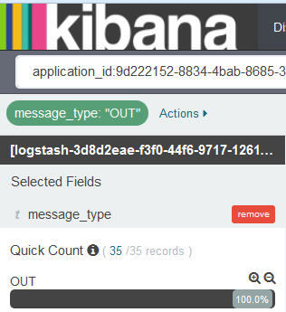

---

copyright:
  years: 2015, 2017

lastupdated: "2017-03-13"

---

{:shortdesc: .shortdesc}
{:new_window: target="_blank"}
{:codeblock: .codeblock}
{:screen: .screen}

# CF-App-Protokolle nach Nachrichtentyp filtern
{:#k4_filter_cf_logs_by_msg_type}

Sie können Cloud Foundry-Protokolle nach Nachrichtentyp in Kibana anzeigen und filtern.
{:shortdesc}

Führen Sie die folgenden Schritte aus, um nach Einträgen zu suchen, die einen bestimmten Nachrichtentyp enthalten: 

1. Schauen Sie sich die Kibana-Seite 'Discover' an, um festzustellen, welche Untergruppe Ihrer Daten dort angezeigt wird. Weitere Informationen finden Sie unter [Auf der Kibana-Seite 'Discover' angezeigte Daten ermitteln](logging_kibana_analize_logs_interactively.html#k4_identify_data). 

2. Wählen Sie in der Feldliste *Fields* das Feld **message_type** aus. 

    Die folgende Abbildung zeigt Werte, die für das Feld *message_type* in den Protokollen einer CF-App gefunden wurden: 
    
         

3. Zum Hinzufügen eines Filters, der nach Einträgen mit einem bestimmten Wert für *message_type* sucht, wählen Sie die Schaltfläche mit dem Lupensymbol  für diesen Wert aus. 

    Beispiel: Zum Hinzufügen eines Filters, der Einträge mit dem Wert *OUT* für 'message_type' einschließt, wählen Sie die Schaltfläche mit dem Lupensymbol  aus, die für den Wert *OUT* im Abschnitt der Feldliste *Fields* verfügbar ist. Die folgende Abbildung zeigt den aktivierten Filter für den Wert *OUT* im Feld 'message_type'. 
    
    

    Zum Hinzufügen eines Filters, der nach Einträgen sucht, die einen bestimmten Wert für *message_type* nicht enthalten, wählen Sie die Schaltfläche mit dem Lupensymbol  für den Wert aus. 
    
    Beispiel: Zum Hinzufügen eines Filters, der Einträge mit dem Wert *OUT* für 'message_type' ausschließt, wählen Sie die Schaltfläche mit dem Lupensymbol  aus, die für den Wert *OUT* im Abschnitt der Feldliste *Fields* verfügbar ist. Die folgende Abbildung zeigt den Filter, der Einträge mit dem Wert *OUT* für 'message_type' ausschließt. 

    

