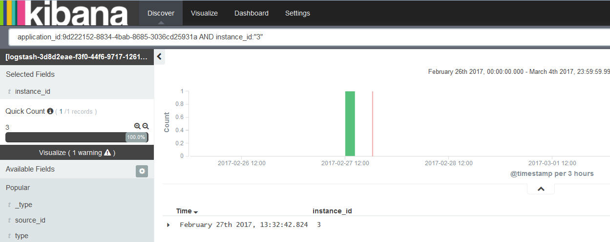
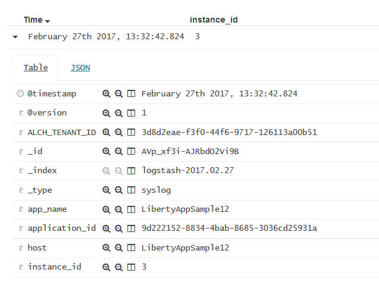
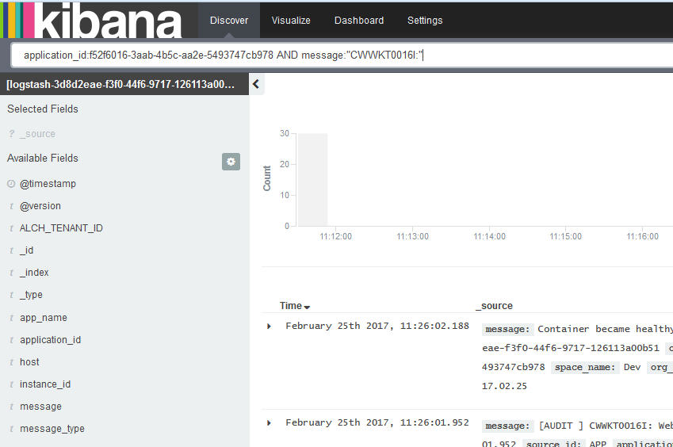

---

copyright:
  years: 2015, 2017

lastupdated: "2017-04-06"

---

{:shortdesc: .shortdesc}
{:new_window: target="_blank"}
{:codeblock: .codeblock}
{:screen: .screen}

# Protokolle in Kibana filtern
{:#k4_filter_logs}

Auf der Seite 'Discover' können Sie Suchabfragen erstellen und Filter anwenden, um die Informationen zu beschränken, die zur Analyse angezeigt werden.
{:shortdesc}

* Sie können eine oder mehrere Suchabfragen über die Suchleiste der Seite 'Discover' definieren. Eine Suchabfrage definiert eine Teilmenge von Protokolleinträgen. Zum Definieren einer Suchabfrage verwenden Sie die Abfragesprache Lucene. 

* Sie können Filter über die Feldliste (*Fields*) oder über die Tabelleneinträge hinzufügen. Ein Filter verfeinert die Datenauswahl durch Ein- oder Ausschluss von Informationen. Sie können einen Filter aktivieren oder inaktivieren, die Filteraktion umkehren, den Filter ein- oder ausschalten oder den Filter ganz entfernen. 

Wenn Sie eine neue Suche definiert haben, speichern Sie sie, sodass Sie sie für zukünftige Analysen auf der Seite 'Discover' oder zum Erstellen von Visualisierungen wiederverwenden können, die Sie in angepassten Dashboards nutzen können. Weitere Informationen finden Sie unter [Suche speichern](logging_kibana_filtering_logs.html#k4_save_search).

Wenn Sie eine neue Suche ausführen, werden das Histogramm, die Tabelle und die Feldliste automatisch aktualisiert, um die Suchergebnisse anzuzeigen. Informationen dazu, wie Sie ermitteln, welche Daten angezeigt werden, finden Sie unter [Auf der Seite 'Discover' angezeigte Daten ermitteln](k4_identify_data.html#k4_identify_data).

In der folgenden Liste werden Szenarios für die Möglichkeiten zum Filtern von Daten in den Protokollen zusammengefasst:

* Sie können angepasste Suchen zum Filtern Ihrer Protokolle erstellen. Weitere Informationen finden Sie unter [Protokolle durch Definieren angepasster Abfragen filtern](k4_filter_queries.html#k4_filter_queries).

* Sie können Ihre Protokolle nach Einträgen durchsuchen, die einen bestimmten Text im Wert eines Felds enthalten. Weitere Informationen finden Sie unter [Protokolle nach bestimmtem Text in einem Feldwert filtern](k4_filter_logs_spec_text.html#k4_filter_logs_spec_text).
 
* Sie können Ihr Protokoll nach einem bestimmten Feldwert durchsuchen oder Einträge aus dem Protokoll mit einem bestimmten Feldwert ausschließen. Weitere Informationen finden Sie unter [Protokolle nach einem bestimmten Feldwert filtern](k4_filter_logs_spec_field.html#k4_filter_logs_spec_field).
 
* Sie können Ihre Protokolle filtern, um Einträge innerhalb eines Zeitraums anzuzeigen. Weitere Informationen finden Sie unter [Zeitfilter festlegen](logging_kibana_set_time_filter.html#set_time_filter).
     

## Filter für einen Wert hinzufügen, der nicht in der Liste *Fields* enthalten ist
{:#k4_add_filter_out_value}

Wenn Sie einen Filter für einen Wert hinzufügen wollen, der nicht in der Feldliste *Fields* angezeigt wird, suchen Sie durch eine Abfrage nach Datensätzen, die den Wert enthalten. Anschließend fügen Sie den Filter über den Tabelleneintrag hinzu, der auf der Seite 'Discover' verfügbar ist. 

Führen Sie die folgenden Schritte aus, um einen Filter für einen Wert hinzuzufügen, der nicht in der Liste im Abschnitt *Fields* verfügbar ist:

1. Schauen Sie sich die Kibana-Seite 'Discover' an, um festzustellen, welche Untergruppe Ihrer Daten dort angezeigt wird. Weitere Informationen finden Sie unter [Auf der Kibana-Seite 'Discover' angezeigte Daten ermitteln](logging_kibana_analize_logs_interactively.html#k4_identify_data).

    Die folgende Abbildung zeigt zum Beispiel die Werte von Instanzen für eine CF-App in der Feldliste *Fields*. 
    
    
    
    Sie interessieren sich für die Instanz mit der Nummer *3*, die jedoch in der angezeigten Liste nicht verfügbar ist.

2. Ändern Sie auf der Seite 'Discover' die Abfrage, um nach einem bestimmten Feldwert zu suchen.

    Beispiel: Für die Suche nach Instanz *3* sieht die Abfrage, die Sie eingeben, wie folgt aus:
   `application_id:9d222152-8834-4bab-8685-3036cd25931a AND instance_id:"3"`
    
    
    
    In der Tabelle werden alle Datensätze angezeigt, die Ihrer Abfrage entsprechen. 
    
 3. Erweitern Sie einen Datensatz und wählen Sie die Schaltfläche mit dem Lupensymbol  aus, um einen Filter hinzuzufügen.
 
     Beispiel: Zum Hinzufügen eines Filters für die Instanz-ID mit dem Wert *3* klicken Sie auf die Schaltfläche mit dem Lupensymbol  neben dem Feld *instance_id*.
     
     
     
4. Prüfen Sie, ob der Filter hinzugefügt wurde.

    Die folgende Abbildung zeigt zum Beispiel den aktivierten Filter, nachdem Sie ihn über die Tabelle hinzugefügt haben.
    
    
    
    

## Protokolle nach einem bestimmten Feldwert filtern
{:#k4_filter_logs_spec_field}

Sie können nach Einträgen suchen, die einen bestimmten Feldwert enthalten. 

Führen Sie die folgenden Schritte aus, um nach Einträgen zu suchen, die einen bestimmten Feldwert enthalten:

1. Schauen Sie sich die Kibana-Seite 'Discover' an, um festzustellen, welche Untergruppe Ihrer Daten dort angezeigt wird. Weitere Informationen finden Sie unter [Auf der Kibana-Seite 'Discover' angezeigte Daten ermitteln](logging_kibana_analize_logs_interactively.html#k4_identify_data).

2. Suchen Sie in der Feldliste *Fields* das Feld, für das Sie einen Filter definieren wollen, und klicken Sie darauf.

    Für das Feld werden maximal fünf Werte angezeigt. Für jeden Wert sind zwei Lupensymbolschaltflächen vorhanden. 
    
    Wenn der Wert nicht angezeigt wird, finden Sie weitere Informationen unter [Filter für einen Wert hinzufügen, der nicht in der Liste 'Fields' enthalten ist](k4_add_filter_out_value.html#k4_add_filter_out_value).

3. Zum Hinzufügen eines Filters, der nach Einträgen mit einem Feldwert sucht, wählen Sie die Schaltfläche mit dem Lupensymbol  für diesen Wert aus.

    

    Zum Hinzufügen eines Filters, der nach Einträgen sucht, die diesen Feldwert nicht enthalten, wählen Sie die Schaltfläche mit dem Lupensymbol  für den Wert aus.

    

4. Wählen Sie beliebige der folgenden Optionen aus, um mit Filtern in Kibana zu arbeiten:

    <table>
      <caption>Tabelle 1. Methoden zur Arbeit mit Filtern</caption>
      <tbody>
        <tr>
          <th align="center">Option</th>
          <th align="center">Beschreibung</th>
          <th align="center">Weitere Informationen</th>
        </tr>
        <tr>
          <td align="left">Enable</td>
          <td align="left">Wählen Sie diese Option aus, um einen Filter zu aktivieren.</td>
          <td align="left">Wenn Sie einen Filter hinzufügen, wird er automatisch aktiviert.   Wenn ein Filter inaktiviert ist, klicken Sie auf den Filter, um ihn zu aktivieren.</td>
        </tr>
        <tr>
          <td align="left">Disable</td>
          <td align="left">Wählen Sie diese Option aus, um einen Filter zu inaktivieren.</td>
          <td align="left">Wenn Sie nach dem Hinzufügen eines Filters die Einträge für einen Feldwert ausblenden wollen, klicken Sie auf **Disable**.</td>
        </tr>
        <tr>
          <td align="left">Pin</td>
          <td align="left">Wählen Sie diese Option aus, um den Filter über Kibana-Seiten hinweg zu fixieren.</td>
          <td align="left">Sie können einen Filter auf der Seite *Discover*, auf der Seite *Visualize* oder auf der Seite *Dashboard* fixieren.</td>
        </tr>
        <tr>
          <td align="left">Toggle</td>
          <td align="left">Wählen Sie diese Option aus, um einen Filter umzuschalten.</td>
          <td align="left">Standardmäßig werden die Einträge, die einem Filter entsprechen, angezeigt. Zum Anzeigen von Einträgen, die dem Filter nicht entsprechen, schalten Sie den Filter um.</td>
        </tr>
        <tr>
          <td align="left">Remove</td>
          <td align="left">Wählen Sie diese Option aus, um einen Filter zu entfernen.</td>
          <td align="left"></td>
        </tr>
      </tbody>
    </table>

## CF-App-Protokolle nach Quelle filtern
{:#k4_filter_logs_by_source}

Führen Sie die folgenden Schritte aus, um nach Einträgen zu suchen, die eine bestimmte Protokollquelle enthalten:

1. Schauen Sie sich die Kibana-Seite 'Discover' an, um festzustellen, welche Untergruppe Ihrer Daten dort angezeigt wird. Weitere Informationen finden Sie unter [Auf der Kibana-Seite 'Discover' angezeigte Daten ermitteln](logging_kibana_analize_logs_interactively.html#k4_identify_data).

2. Wählen Sie in der Feldliste *Fields* das Feld **source_id** aus.

         

3. Zum Hinzufügen eines Filters, der nach Einträgen mit einem bestimmten Wert für 'source_id' sucht, wählen Sie die Schaltfläche mit dem Lupensymbol  für diesen Wert aus.

    Eine Liste von Protokollquellen, die für CF-Apps verfügbar sind, finden Sie unter [Protokollquellen für CF-Apps](../logging_cf_apps.html#logging_bluemix_cf_apps_log_sources).

    Beispiel: Zum Hinzufügen eines Filters, der Protokolleinträge zu Start-, Stopp- oder Ausfallereignissen einer CF-Anwendung einschließt, wählen Sie die Schaltfläche mit dem Lupensymbol  aus, die für den Wert *CELL* im Abschnitt der Feldliste *Fields* verfügbar ist. Die folgende Abbildung zeigt den aktivierten Filter für den Wert *CELL* im Feld 'source_id '.
    
    

    Zum Hinzufügen eines Filters, der nach Einträgen sucht, die einen bestimmten Wert für 'source_id' nicht enthalten, wählen Sie die Schaltfläche mit dem Lupensymbol  für den Wert aus.
    
    Beispiel: Zum Hinzufügen eines Filters, der Protokolleinträge zu Start-, Stopp- oder Ausfallereignissen einer CF-Anwendung ausschließt, wählen Sie die Schaltfläche mit dem Lupensymbol  aus, die für den Wert *CELL* im Abschnitt der Feldliste *Fields* verfügbar ist. Die folgende Abbildung zeigt den Filter, der mit dem Wert *CELL* für 'source_id' ausschließt.

    

## Protokolle nach Protokolltyp filtern
{:#k4_filter_logs_by_log_type}

Führen Sie die folgenden Schritte aus, um nach Einträgen zu suchen, die einen bestimmten Protokolltyp enthalten:

1. Schauen Sie sich die Kibana-Seite 'Discover' an, um festzustellen, welche Untergruppe Ihrer Daten dort angezeigt wird. Weitere Informationen finden Sie unter [Auf der Kibana-Seite 'Discover' angezeigte Daten ermitteln](logging_kibana_analize_logs_interactively.html#k4_identify_data).

2. Wählen Sie in der Feldliste *Fields* das Feld **type** aus.

    In der folgenden Abbildung ist zum Beispiel nur ein Protokolltyp verfügbar: *syslog*.
    
    
   
3. Zum Hinzufügen eines Filters, der nach einem bestimmten Protokolltyp sucht, wählen Sie die Schaltfläche mit dem Lupensymbol  für den Typ von Protokoll aus, den Sie analysieren wollen.

    Beispiel: Zum Hinzufügen eines Filters, der Protokolleinträge für *syslog* einschließt, wählen Sie die Schaltfläche mit dem Lupensymbol  aus, die für den Wert *syslog* im Abschnitt der Feldliste *Fields* verfügbar ist. Die folgende Abbildung zeigt den Filter, der Einträge für den Protokolltyp *syslog* einschließt.

    

    Zum Hinzufügen eines Filters, der nach Einträgen sucht, die einen bestimmten Protokolltyp nicht enthalten, wählen Sie die Schaltfläche mit dem Lupensymbol  für den Wert aus.

     Beispiel: Zum Hinzufügen eines Filters, der Protokolleinträge für *syslog* ausschließt, wählen Sie die Schaltfläche mit dem Lupensymbol  aus, die für den Wert *syslog* im Abschnitt der Feldliste *Fields* verfügbar ist. Die folgende Abbildung zeigt den Filter, der Einträge für den Protokolltyp *syslog* ausschließt.
     
     

## Protokolle nach Instanz-ID filtern
{:#k4_filter_logs_by_instance_id}

Führen Sie die folgenden Schritte aus, um Ihre Protokolle nach Instanz-ID im Kibana-Dashboard anzuzeigen und zu filtern:

1. Schauen Sie sich die Kibana-Seite 'Discover' an, um festzustellen, welche Untergruppe Ihrer Daten dort angezeigt wird. Weitere Informationen finden Sie unter [Auf der Kibana-Seite 'Discover' angezeigte Daten ermitteln](logging_kibana_analize_logs_interactively.html#k4_identify_data).

2. Wählen Sie in der Feldliste *Fields* eines der folgenden Felder aus, um nach einer bestimmten Instanz-ID zu suchen:

    * **instance_ID**: In diesem Feld werden die verschiedenen Instanz-IDs aufgelistet, die in dem Protokoll für eine Cloud Foundry-Anwendung verfügbar sind. 
    * **instance**: In diesem Feld werden die verschiedenen GUIDs aller Instanzen für eine Containergruppe aufgelistet. 

    Die folgende Abbildung zeigt zum Beispiel verschiedene Werte von Instanzen für eine CF-App:
    
    
   
3. Zum Hinzufügen eines Filters, der nach einem bestimmten Protokolltyp sucht, wählen Sie die Schaltfläche mit dem Lupensymbol  für den Typ von Protokoll aus, den Sie analysieren wollen.

   Beispiel: Zum Hinzufügen eines Filters, der Einträge für die CF-App-Instanz *2* einschließt, wählen Sie die Schaltfläche mit dem Lupensymbol  aus, die für den Wert *2* im Feldlistenabschnitt verfügbar ist. Die folgende Abbildung zeigt den Filter, der Einträge für die Instanz *2* einschließt.
    
    

    Zum Hinzufügen eines Filters, der nach Einträgen sucht, die eine bestimmte Instanz-ID nicht enthalten, wählen Sie die Schaltfläche mit dem Lupensymbol  für den Wert aus.

     Beispiel: Zum Hinzufügen eines Filters, der Einträge für die CF-App-Instanz *2* ausschließt, wählen Sie die Schaltfläche mit dem Lupensymbol  aus, die für den Wert *2* im Feldlistenabschnitt verfügbar ist. Die folgende Abbildung zeigt den Filter, der Einträge für die Instanz *2* ausschließt.
     
      

## CF-App-Protokolle nach Nachrichtentyp filtern
{:#k4_filter_cf_logs_by_msg_type}

Führen Sie die folgenden Schritte aus, um nach Einträgen zu suchen, die einen bestimmten Nachrichtentyp enthalten:

1. Schauen Sie sich die Kibana-Seite 'Discover' an, um festzustellen, welche Untergruppe Ihrer Daten dort angezeigt wird. Weitere Informationen finden Sie unter [Auf der Kibana-Seite 'Discover' angezeigte Daten ermitteln](logging_kibana_analize_logs_interactively.html#k4_identify_data).

2. Wählen Sie in der Feldliste *Fields* das Feld **message_type** aus.

    Die folgende Abbildung zeigt Werte, die für das Feld *message_type* in den Protokollen einer CF-App gefunden wurden:
    
         

3. Zum Hinzufügen eines Filters, der nach Einträgen mit einem bestimmten Wert für *message_type* sucht, wählen Sie die Schaltfläche mit dem Lupensymbol  für diesen Wert aus.

    Beispiel: Zum Hinzufügen eines Filters, der Einträge mit dem Wert *OUT* für 'message_type' einschließt, wählen Sie die Schaltfläche mit dem Lupensymbol  aus, die für den Wert *OUT* im Abschnitt der Feldliste *Fields* verfügbar ist. Die folgende Abbildung zeigt den aktivierten Filter für den Wert *OUT* im Feld 'message_type'.
    
    

    Zum Hinzufügen eines Filters, der nach Einträgen sucht, die einen bestimmten Wert für *message_type* nicht enthalten, wählen Sie die Schaltfläche mit dem Lupensymbol  für den Wert aus.
    
    Beispiel: Zum Hinzufügen eines Filters, der Einträge mit dem Wert *OUT* für 'message_type' ausschließt, wählen Sie die Schaltfläche mit dem Lupensymbol  aus, die für den Wert *OUT* im Abschnitt der Feldliste *Fields* verfügbar ist. Die folgende Abbildung zeigt den Filter, der Einträge mit dem Wert *OUT* für 'message_type' ausschließt.

    

## Protokolle nach einem bestimmten Text in einem Feldwert filtern
{:#k4_filter_logs_spec_text}

Sie können nach Einträgen suchen, die einen bestimmten Text im Wert eines Felds enthalten. 

**Hinweis:** Sie können eine Freitextsuche nur über Zeichenfolgefelder ausführen, die durch Elasticsearch Analyzer analysiert wurden. 
    
Wenn Elasticsearch den Wert eines Zeichenfolgefelds analysiert, gliedert die Analysefunktion den Text an den durch das Unicode Consortium definierten Wortgrenzen auf, entfernt die Interpunktion und setzt alle Wörter in Kleinbuchstaben um.
    
Führen Sie die folgenden Schritte aus, um nach Einträgen zu suchen, die bestimmten Text in einem Feldwert enthalten:

1. Schauen Sie sich die Kibana-Seite 'Discover' an, um festzustellen, welche Untergruppe Ihrer Daten dort angezeigt wird. Weitere Informationen finden Sie unter [Auf der Kibana-Seite 'Discover' angezeigte Daten ermitteln](logging_kibana_analize_logs_interactively.html#k4_identify_data).

2. Ermitteln Sie die Felder, die in ElasticSearch standardmäßig analysiert werden.

    Zum Anzeigen der vollständigen Liste der analysierten Felder, die für das Suchen und Filtern von Protokolldaten verfügbar sind, [laden Sie die Feldliste erneut](logging_kibana_analize_logs_interactively.html#kibana_discover_view_reload_fields). Führen Sie anschließend in der Feldliste *Fields*, die auf der Seite 'Discover' verfügbar ist, die folgenden Schritte aus:
    
    1. Klicken Sie auf das Symbol zum Konfigurieren . Der Abschnitt **Selected fields** wird angezeigt, in dem Sie Filterfelder hinzufügen können.

        
    
    2. Wählen Sie zum Ermitteln der Felder, die analysiert werden, die Option **Yes** für das Suchfeld **Analyzed** aus.

        
    
        Die Liste der analysierten Felder wird angezeigt.
    
        
        
         
    3. Prüfen Sie, ob das Feld, in dem Sie nach Text mit freiem Format suchen wollen, ein Feld ist, das standardmäßig von ElasticSearch analysiert wird.
    
3. Wenn das Feld analysiert wird, ändern Sie die Abfrage, um nach Einträgen in den Protokollen zu suchen, die diesen Text mit freiem Format als Teil des Werts eines Felds enthalten.

    
**Beispiel**

Wenn Sie Kibana für eine Cloud Foundry-Anwendung (CF-Anwendung) aus der {{site.data.keyword.Bluemix}}-Benutzerschnittstelle heraus starten und nach einer bestimmten Nachricht suchen wollen, die die Nachrichten-ID *CWWKT0016I:* enthält, ändern Sie die Suche, um den Text mit freiem Format einzuschließen.
    
1. Prüfen Sie die geladene Suchabfrage und die auf der Seite 'Discover' angezeigten Daten.
       
    
        
2. Für die Suche nach der Nachrichten-ID *CWWKT0016I* ändern Sie die Suchabfrage und drücken die **Eingabetaste**:
    
    <pre class="pre">application_id:f52f6016-3aab-4b5c-aa2e-5493747cb978 AND message:"CWWKT0016I:" </pre>
        
    
      
Die Tabelle zeigt Einträge für Ihre CF-App an, in denen der Text *CWWKT0016I* Teil des Werts im Feld *message* ist.
    
     	
        

## Zeitfilter festlegen
{: #set_time_filter}

Sie können {{site.data.keyword.Bluemix_notm}}-Protokolle aus einem Zeitraum anzeigen und filtern, indem Sie das Zeitauswahlfeld (*Time Picker*) konfigurieren.

Sie können das Zeitauswahlfeld (*Time Picker*) auf der Seite 'Discover' konfigurieren. Standardmäßig ist es auf die letzten 15 Minuten eingestellt. 

Führen Sie die folgenden Schritte aus, um nach Einträgen zu suchen, die einen bestimmten Zeitraum umfassen:

1. Klicken Sie in der Menüleiste der Seite 'Discover' auf das Zeitauswahlfeld (Time Picker) .

2. Richten Sie das Zeitintervall ein. 

    Sie können einen beliebigen der folgenden Typen von Zeitintervallen definieren:
    
    * Quick: Diese Option listet die vordefinierten Zeitintervalle auf, die die häufigsten Verwendungen relativer und absoluter Zeitintervalle, wie zum Beispiel *Today* (Heute) und *This Month* (Dieser Monat) umfassen. 
    
        
    
    * Relative: Diese Optionen ermöglichen Zeitintervalle, bei denen Sie den Startzeitpunkt (Datum/Uhrzeit) und den Endzeitpunkt angeben können. Sie können auf Stunden runden.
    
        
    
    * Absolute: Diese Option ermöglicht Zeitintervalle zwischen einem Startdatum und einem Enddatum.
    
        
      

Nach der Konfiguration eines Zeitintervalls entsprechen die in Kibana angezeigten Daten Einträgen aus diesem Zeitbereich.

