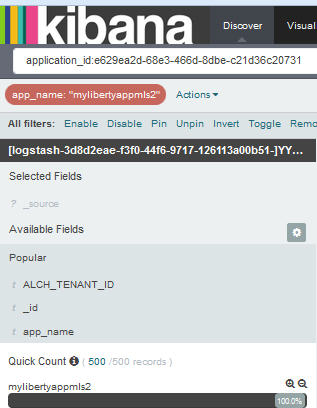

---

copyright:
  years: 2015, 2017

lastupdated: "2017-03-13"

---

{:shortdesc: .shortdesc}
{:new_window: target="_blank"}
{:codeblock: .codeblock}
{:screen: .screen}

# Protokolle nach einem bestimmten Feldwert filtern
{:#k4_filter_logs_spec_field}

Sie können nach Einträgen suchen, die einen bestimmten Feldwert enthalten.
{:shortdesc}

Führen Sie die folgenden Schritte aus, um nach Einträgen zu suchen, die einen bestimmten Feldwert enthalten: 

1. Schauen Sie sich die Kibana-Seite 'Discover' an, um festzustellen, welche Untergruppe Ihrer Daten dort angezeigt wird. Weitere Informationen finden Sie unter [Auf der Kibana-Seite 'Discover' angezeigte Daten ermitteln](logging_kibana_analize_logs_interactively.html#k4_identify_data). 

2. Suchen Sie in der Feldliste *Fields* das Feld, für das Sie einen Filter definieren wollen, und klicken Sie darauf. 

    Für das Feld werden maximal fünf Werte angezeigt. Für jeden Wert sind zwei Lupensymbolschaltflächen vorhanden.  
    
    Wenn der Wert nicht angezeigt wird, finden Sie weitere Informationen unter [Filter für einen Wert hinzufügen, der nicht in der Liste 'Fields' enthalten ist](k4_add_filter_out_value.html#k4_add_filter_out_value). 

3. Zum Hinzufügen eines Filters, der nach Einträgen mit einem Feldwert sucht, wählen Sie die Schaltfläche mit dem Lupensymbol  für diesen Wert aus. 

    

    Zum Hinzufügen eines Filters, der nach Einträgen sucht, die diesen Feldwert nicht enthalten, wählen Sie die Schaltfläche mit dem Lupensymbol  für den Wert aus. 

    

4. Wählen Sie beliebige der folgenden Optionen aus, um mit Filtern in Kibana zu arbeiten: 

    <table>
      <tbody>
        <tr>
          <th align="center">Option</th>
          <th align="center">Beschreibung</th>
          <th align="center">Weitere Informationen</th>
        </tr>
        <tr>
          <td align="left">Enable</td>
          <td align="left">Wählen Sie diese Option aus, um einen Filter zu aktivieren. </td>
          <td align="left">Wenn Sie einen Filter hinzufügen, wird er automatisch aktiviert.   Wenn ein Filter inaktiviert ist, klicken Sie auf den Filter, um ihn zu aktivieren. </td>
        </tr>
        <tr>
          <td align="left">Disable</td>
          <td align="left">Wählen Sie diese Option aus, um einen Filter zu inaktivieren. </td>
          <td align="left">Wenn Sie nach dem Hinzufügen eines Filters die Einträge für einen Feldwert ausblenden wollen, klicken Sie auf **Disable**.</td>
        </tr>
        <tr>
          <td align="left">Pin</td>
          <td align="left">Wählen Sie diese Option aus, um den Filter über Kibana-Seiten hinweg zu fixieren. </td>
          <td align="left">Sie können einen Filter auf der Seite *Discover*, auf der Seite *Visualize* oder auf der Seite *Dashboard* fixieren. </td>
        </tr>
        <tr>
          <td align="left">Toggle</td>
          <td align="left">Wählen Sie diese Option aus, um einen Filter umzuschalten. </td>
          <td align="left">Standardmäßig werden die Einträge, die einem Filter entsprechen, angezeigt. Zum Anzeigen von Einträgen, die dem Filter nicht entsprechen, schalten Sie den Filter um. </td>
        </tr>
        <tr>
          <td align="left">Remove</td>
          <td align="left">Wählen Sie diese Option aus, um einen Filter zu entfernen. </td>
          <td align="left"></td>
        </tr>
      </tbody>
    </table>

 

 
 

