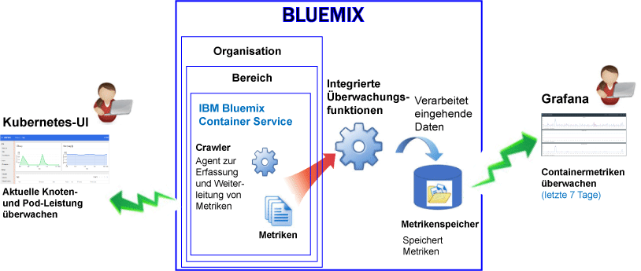
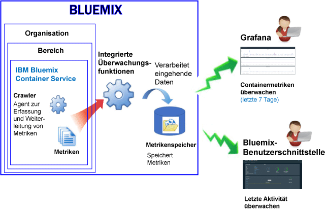

---

copyright:
  years: 2015, 2017

lastupdated: "2017-05-26"

---

{:shortdesc: .shortdesc}
{:new_window: target="_blank"}
{:codeblock: .codeblock}
{:screen: .screen}

# Überwachung für den IBM Bluemix-Container-Service
{: #monitoring_bmx_containers_ov}

In {{site.data.keyword.Bluemix}} werden Containermetriken automatisch von außerhalb des Containers erfasst, ohne das Agenten innerhalb des Containers installiert und verwaltet werden müssen. Sie können Grafana verwenden, um Container-Metriken darzustellen. Sie können auch die Kubernetes-Benutzerschnittstelle verwenden, um Metriken für Knoten (Worker) und Pods anzuzeigen.{:shortdesc}

## Metriken für einen Container erfassen, der in einem Kubernetes-Cluster ausgeführt wird
{: #metrics_containers_kube_ov}

Wenn Sie in {{site.data.keyword.Bluemix_notm}} Anwendungen in einem Kubernetes-Cluster bereitstellen, berücksichtigen Sie die folgenden Informationen:

* In einem {{site.data.keyword.Bluemix_notm}}-Konto können Sie eine oder mehr Organisation haben.
* Jede Organisation kann 1 oder mehr {{site.data.keyword.Bluemix_notm}}-Bereiche haben.
* In einer Organisation können Sie 1 oder mehr Kubernetes-Cluster haben.
* Die Erfassung von Metriken wird automatisch aktiviert, wenn Sie einen Kubernetes-Cluster erstellen.
* Ein Kubernetes-Cluster ist agnostisch für {{site.data.keyword.Bluemix_notm}}-Bereiche. Die für einen Cluster und die zugehörigen Ressourcen erfassten Metriken sind jedoch einem {{site.data.keyword.Bluemix_notm}}-Bereich zugeordnet.
* Die Protokolldaten werden für einen Container erfasst, sobald der Pod bereitgestellt wird.
* Sie können Metriken in Grafana oder in der Kubernetes-Benutzerschnittstelle anzeigen.
* Zum Anzeigen von Metrikdaten für einen Cluster müssen Sie Grafana-Dashboards für die öffentliche Cloudregion konfigurieren, in der der Cluster erstellt wird.

Bevor Sie einen Cluster erstellen, sei es über die {{site.data.keyword.Bluemix_notm}}-Benutzerschnittstelle oder über die Befehlszeile, müssen Sie sich bei einer bestimmten {{site.data.keyword.Bluemix_notm}}-Region, einem Konto, einer Organisation und einem Bereich anmelden. Der Bereich, in dem Sie angemeldet sind, ist der Bereich, in dem Metrikdaten für den Cluster und die zugehörigen Ressourcen erfasst werden.

Die folgende Abbildung zeigt eine Übersicht über die Protokollierung für {{site.data.keyword.containershort}}:

Der Crawler ist ein Prozess, der im Host ausgeführt wird und die agentenlose Überwachung für Metriken durchführt. Standardmäßig erfasst der Crawler kontinuierlich die folgenden Metriken von allen Containern:

<table>
  <caption>Tabelle 1. Standardmäßig erfasste Metriken</caption>
  <tr>
    <th>Metriktyp</th>
    <th>Metrikname</th>
    <th>Beschreibung</th>
  </tr>
  <tr>
    <td>Hauptspeicher</td>
    <td>*memory_current*</td>
    <td>Diese Metrik berichtet den Speicherplatz in Byte, der aktuell vom Container genutzt wird.</td>
  </tr>
  <tr>
    <td>Hauptspeicher</td>
    <td>*memory_limit*</td>
    <td>Diese Metrik berichtet die Speichermenge, die ein Container auf Platte auslagern kann, im Vergleich zu den minimalen und maximalen Grenzwerten, die für einen Pod festgelegt sind.   Standardmäßig werden die Pods ohne Speicherbegrenzungen ausgeführt. Ein Pod kann so viel Speicherplatz beanspruchen, wie auf dem Worker verfügbar ist, auf dem er ausgeführt wird. Wenn Sie einen Pod bereitstellen, können Sie Grenzwerte für den Speicher festlegen, den ein Pod verwenden kann.</td>
  </tr>
  <tr>
    <td>CPU</td>
    <td>*cpu_usage*</td>
    <td>Diese Metrik berichtet die Nanosekunden der CPU-Zeit für alle Kerne.   Wenn die CPU-Auslastung hoch ist, können Verzögerungen auftreten. Eine hohe CPU-Belastung weist auf unzureichende Verarbeitungsleistung hin.</td>
  </tr>
  <tr>
    <td>CPU</td>
    <td>*cpu_usage_pct*</td>
    <td>Diese Metrik berichtet die verbrauchte CPU-Zeit als Prozentsatz der CPU-Kapazität.   Wenn der Prozentsatz für die CPU-Auslastung hoch ist, können Verzögerungen auftreten. Eine hohe CPU-Belastung weist auf unzureichende Verarbeitungsleistung hin.</td>
  </tr>
  <tr>
    <td>CPU</td>
    <td>*cpu_num_cores*</td>
    <td>Diese Metrik berichtet die Anzahl der CPU-Kerne, die für den Container verfügbar sind.</td>
  </tr>
</table>

## Metriken für einen Bluemix-verwalteten Container erfassen
{: #metrics_containers_bmx_ov}

Die folgende Abbildung zeigt eine Übersicht über die Protokollierung für {{site.data.keyword.containershort}}:

Standardmäßig erfasst der Crawler kontinuierlich die folgenden Metriken von allen Containern:

* CPU
* Hauptspeicher
* Netzinformationen

## Metriken für einen Container überwachen, der in einem Kubernetes-Cluster ausgeführt wird
{: #monitoring_metrics_kube}

Die Metriken werden erfasst und sowohl in der Kubernetes-Benutzerschnittstelle als auch in Grafana angezeigt:

* Sie können Grafana, eine quelloffene Analyse- und Visualisierungsplattform, dazu verwenden, Ihre Metrikdaten in einer Reihe von Darstellungsarten, wie zum Beispiel Diagrammen und Tabellen, zu überwachen, zu durchsuchen, zu analysieren und zu visualisieren.
 
    Sie können Grafana über einen Browser starten. Weitere Informationen finden Sie unter [Zum Grafana-Dashboard über einen Web-Browser navigieren](../grafana/navigating_grafana.html#launch_grafana_from_browser).
    
* Verwenden Sie die Kubernetes-Benutzerschnittstelle zur Anzeige von Metriken zu Knoten und Pods. Weitere Informationen finden Sie unter [Webbenutzerschnittstellen-Dashboard](https://kubernetes.io/docs/tasks/access-application-cluster/web-ui-dashboard/){: new_window}.

## Metriken für einen Bluemix-verwalteten Container überwachen
{: #monitoring_metrics_bmx}

Die Metriken werden erfasst und sowohl in der {{site.data.keyword.Bluemix_notm}}-Benutzerschnittstelle als auch in Grafana angezeigt:

* Sie können Grafana, eine quelloffene Analyse- und Visualisierungsplattform, dazu verwenden, Ihre Metrikdaten in einer Reihe von Darstellungsarten, wie zum Beispiel Diagrammen und Tabellen, zu überwachen, zu durchsuchen, zu analysieren und zu visualisieren.
 
    Sie können Grafana über die {{site.data.keyword.Bluemix_notm}}-Benutzerschnittstelle oder über einen Browser starten. Weitere Informationen finden Sie unter [Zum Grafana-Dashboard navigieren](../grafana/navigating_grafana.html#navigating_grafana).
    

* Verwenden Sie die {{site.data.keyword.Bluemix_notm}}-Benutzerschnittstelle zur Anzeige der letzten Metriken.

    Informationen zur Anzeige der Metriken in der {{site.data.keyword.Bluemix_notm}}-Benutzerschnittstelle finden Sie unter [Metriken über die Bluemix-Konsole analysieren](analyzing_metrics_bmx_ui.html#analyzing_metrics_bmx_ui).

## Speicherung von Metrikdaten
{: #metrics_retention}

Es wird bis zu einem Datenpunkt pro Minute erfasst. Containermetriken, in die über einen Zeitraum von sieben Tagen nicht geschrieben wurde, werden gelöscht.
    

