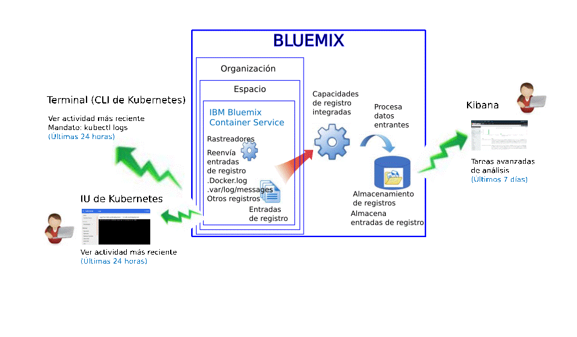
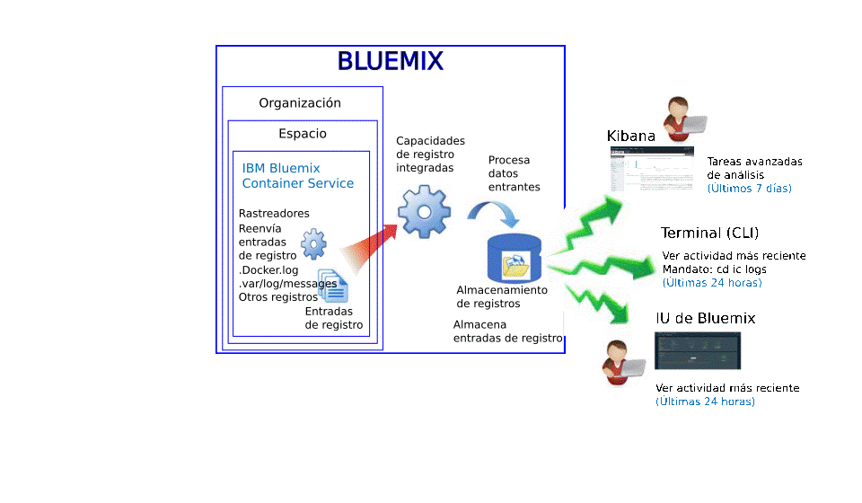

---

copyright:
  years: 2015, 2017

lastupdated: "2017-05-23"

---

{:shortdesc: .shortdesc}
{:new_window: target="_blank"}
{:codeblock: .codeblock}
{:screen: .screen}


# Registro correspondiente al servicio IBM Bluemix Container
{: #logging_containers_ov}

Tiene la posibilidad de visualizar, filtrar y analizar registros de contenedores Docker desplegados en la infraestructura de nube gestionada de {{site.data.keyword.IBM}} y contenedores Docker que se ejecutan en clústeres Kubernetes. El registro de contenedores se habilita automáticamente al desplegar un contenedor en {{site.data.keyword.Bluemix_notm}} o en un clúster Kubernetes. {:shortdesc}

Los registros de contenedor se supervisan y se reenvía desde fuera del contenedor mediante rastreadores. Los rastreadores envían los datos a un sistema Elasticsearch multiarrendatario de {{site.data.keyword.Bluemix_notm}}.


## Recopilación de registros para un contenedor que se ejecuta en un clúster Kubernetes
{: #logging_containers_ov_logs_collected_kubernetes}

En la siguiente figura se muestra una vista de alto nivel de la recopilación de registros para {{site.data.keyword.containershort}}:



En {{site.data.keyword.Bluemix_notm}}, al desplegar las aplicaciones en un clúster Kubernetes, tenga en cuenta la información siguiente:

* En una cuenta de {{site.data.keyword.Bluemix_notm}}, puede tener una o más organizaciones. 
* Cada organización puede tener uno o más espacios de {{site.data.keyword.Bluemix_notm}}.  
* Puede tener uno o varios clústeres Kubernetes en una organización. 
* La recopilación de registros se habilita automáticamente al crear un clúster Kubernetes.  
* Un clúster de Kubernetes es agnóstico con relación a los espacios de {{site.data.keyword.Bluemix_notm}}. Sin embargo, los datos de registros recopilados para un clúster y sus recursos están asociados a un espacio de {{site.data.keyword.Bluemix_notm}}. 
* Los datos de registros se recopilan para una aplicación tan pronto como se despliega el pod. 
* Para analizar los datos de registro para un clúster, debe acceder a los paneles de control de Kibana para la región Pública de la nube en la que se ha creado el clúster. 

Antes de crear un clúster, ya sea a través de la [interfaz de usuario de {{site.data.keyword.Bluemix_notm}}](../../../containers/cs_cluster.html#cs_cluster_ui) como a través de la [interfaz de línea de mandatos](../../../containers/cs_cluster.html#cs_cluster_cli), debe iniciar una sesión en un espacio, organización, cuenta y región específicos de {{site.data.keyword.Bluemix_notm}}.  El espacio en donde ha iniciado una sesión es el espacio donde se recopilarán los datos de registro para el clúster y sus recursos. 

De forma predeterminada, se recopila toda la información que los procesos de contenedor imprimen en stdout (salida estándar) y stderr (error estándar). El envío de información a stdout y stderr corresponde a la convención de Docker para exponer la información de un contenedor.  

Si reenvía los datos de registro de una app que se ejecuta en contenedor al recopilador de registros de Docker en un formato JSON, podrá buscar y analizar datos de registro en Kibana utilizando los campos JSON. Para obtener más información, consulte [Configuración de campos personalizados como campos de búsqueda de Kibana](logging_containers_ov.html#send_data_in_json).

**Nota:** Cuando trabaja con un clúster Kubernetes, se reservan los espacios de nombres *ibm-system* y *kube-system*. No cree, suprima, modifique ni cambie permisos de recursos que estén disponibles en dichos espacios de nombres. Los registros para estos espacios de nombres están para que {{site.data.keyword.IBM_notm}} los utilice. 


## Recopilación de registros para un contenedor gestionado por Bluemix
{: #logging_containers_ov_logs_collected}

En la siguiente figura se muestra una vista de alto nivel de la recopilación de registros para {{site.data.keyword.containershort}}:



De forma predeterminada, los siguientes registros se recopilan para un contenedor desplegado en una infraestructura de nube gestionada de {{site.data.keyword.Bluemix_notm}}:  

<table>
  <caption>Tabla 2. Registros recopilados para contenedores desplegados en una infraestructura de nube gestionada de Bluemix</caption>
  <tbody>
    <tr>
      <th align="center">Registro</th>
      <th align="center">Descripción</th>
    </tr>
    <tr>
      <td align="left" width="30%">/var/log/messages</td>
      <td align="left" width="70%"> De forma predeterminada, los mensajes de Docker se almacenan en la carpeta /var/log/messages del contenedor. Este registro incluye los mensajes del sistema.
      </td>
    </tr>
    <tr>
      <td align="left">./docker.log</td>
      <td align="left">Este es el registro de Docker. <br> El archivo de registro de Docker no se almacena como archivo dentro del contenedor, pero se recopila igualmente. Este archivo de registro se recopila de forma predeterminada, ya que constituye el convenio estándar de Docker para exponer la información
stdout (salida estándar) y stderr (error estándar) del contenedor. Se recopila la información que los procesos de contenedor imprimen en stdout o stderr.
      </td>
     </tr>
  </tbody>
</table>

Para recopilar registros adicionales, añada la variable de entorno de **LOG_LOCATIONS** con una vía de acceso al archivo de registro cuando cree el contenedor. Puede añadir varios archivos de registro separándolos con comas. Para obtener más información, consulte [Recopilación de datos de registro no predeterminado desde un contenedor](logging_containers_other_logs.html#logging_containers_collect_data).


##  Configuración de campos personalizados como campos de búsqueda de Kibana 
{: #send_data_in_json}

De forma predeterminada, la creación de registros se habilita de forma automática para los contenedores. Cada entrada en el archivo de registro Docker se visualiza en Kibana en el campo `message`. Si necesita filtrar y analizar sus datos en Kibana mediante un campo específico que sea parte de la entrada de registro del contenedor, configure su aplicación para enviar la salida en un formato JSON que sea válido. 

Considere la siguiente información:

* Para contenedores desplegados en un clúster Kubernetes, registre el mensaje en formato JSON para stdout (salida estándar) y (error estándar). 

    Cada campos disponible en el mensaje se analiza para el tipo de campo que coincide con su valor. Por ejemplo, cada campo en el siguiente mensaje JSON: 
    
    ```
    {"field1":"string type",
        "field2":123,
        "field3":false,
        "field4":"4567"
    }
    ```
    
    está disponible como un campo que se puede utilizar para filtrar y realizar búsquedas: 
    
    * `field1` se analiza como `field1_str` de tipo serie. 
    * `field2` se analiza como `field1_int` de tipo entero.
    * `field3` se analiza como `field3_bool` de tipo booleano.
    * `field4` se analiza como `field4_str` de tipo serie. 
    
* Con contenedores desplegados en la infraestructura de nube gestionada de {{site.data.keyword.Bluemix_notm}}, complete los siguientes pasos para analizar entradas de registro de contenedor en campos individuales: 

    1. Registre el mensaje en un archivo.  
    2. Añada el archivo de registro a la lista de registros no predeterminados que están disponibles para su análisis de un contenedor. Para obtener más información, consulte [Recopilación de datos de registro no predeterminado desde un contenedor](logging_containers_other_logs.html#logging_containers_collect_data). 
    
   Si registra el mensaje en un archivo, y si se determina que su formato JSON es válido, los campos se analizan y se crean nuevos campos para cada campo en el mensaje. En Kibana, únicamente están disponibles los campos de tipo serie para filtrar y clasificar.


## Visualización de registros para un contenedor que se ejecuta en un clúster Kubernetes
{: #logging_containers_ov_methods_view_kube}

Visualice los registros más recientes de un contenedor en un pod Kubernetes utilizando cualquiera de los siguientes métodos:

* Visualizar registros a través de la interfaz de usuario de Kubernetes. Seleccione cada pod y acceda a sus registros. Para obtener más información, consulte [Panel de control de interfaz de usuario web ](https://kubernetes.io/docs/tasks/access-application-cluster/web-ui-dashboard/){: new_window}.

* Visualizar registros utilizando el mandato de interfaz de línea de mandatos de Kubernetes [kubectl logs ](http://vishh.github.io/docs/user-guide/kubectl/kubectl_logs/){: new_window}. 

Para visualizar registros a más largo plazo, utilice Kibana. Compruebe la información de [Retención de registros](logging_containers_ov.html#logging_containers_ov_log_retention) para obtener más información sobre las políticas del periodo de retención de los datos. 


## Visualización de registros para un contenedor gestionado por Bluemix
{: #logging_containers_ov_methods_view_bmx}

Visualice los registros más recientes de un contenedor desplegado en la infraestructura de nube gestionada de {{site.data.keyword.Bluemix_notm}} utilizando cualquiera de los siguientes métodos: 

* Visualizar registros a través de la interfaz de usuario de {{site.data.keyword.Bluemix_notm}} para supervisar la actividad más reciente del contenedor. 
    
    Puede ver, filtrar y analizar registros desde el separador **Supervisión y registro** disponible para cada contenedor. Para obtener más información, consulte [Análisis de registros desde el panel de control de Bluemix](../logging_view_dashboard.html#analyzing_logs_bmx_ui).
    
    
* Visualizar registros utilizando la interfaz de línea de mandatos de {site.data.keyword.containershort}}. Utilice mandatos para gestionar los registros mediante programación. 
    
    Puede ver, filtrar y analizar registros mediante la interfaz de línea de mandatos con el mandato **cf ic logs**. Para obtener más información, consulte [Análisis de registros desde la interfaz de línea de mandatos](../logging_view_cli.html#analyzing_logs_cli).


## Análisis de registros de contenedor
{: #logging_containers_ov_methods}

Utilice Kibana para realizar tareas de análisis avanzado con los registros de contenedor. Puede utilizar Kibana, una plataforma de visualización y análisis de código abierto, para supervisar, buscar, analizar y visualizar datos en diversos gráficos, como diagramas y tablas. Para obtener más información, consulte [Análisis de registros en Kibana](../kibana4/analyzing_logs_Kibana.html#analyzing_logs_Kibana).


## Retención de registros
{: #logging_containers_ov_log_retention}

Tenga en cuenta la información siguiente sobre la retención de registros:

* Se almacena un máximo de 1 GB por espacio de datos al día. Cualquier registro que supere dicha capacidad de 1 GB se descartará. Las asignaciones de capacidades se restablecen todos los días a las 12:30 AM UTC. 

    Para aumentar su capacidad, póngase en contacto con el equipo de soporte. En la incidencia de soporte, incluya el ID de espacio correspondiente a la solicitud de incremento de capacidad, el nuevo tamaño de la capacidad y el motivo de la solicitud.

* Se pueden buscar hasta 7 GB de datos para un máximo de 7 días. Los datos de registro se renuevan (Primero en entrar, primero en salir) una vez que se ha alcanzado 7 GB de datos o 7 días.

## Guía de aprendizaje: Análisis de registros en Kibana para una app desplegada en un clúster Kubernetes
{: #tutorial1}

Para aprender a utilizar Kibana para analizar los registros de un contenedor desplegado en un clúster Kubernetes, consulte la [Guía de aprendizaje: Análisis de registros en Kibana para una app desplegada en un clúster Kubernetes](tutorials/kibana_tutorial_1.html#kibana_tutorial_1).


