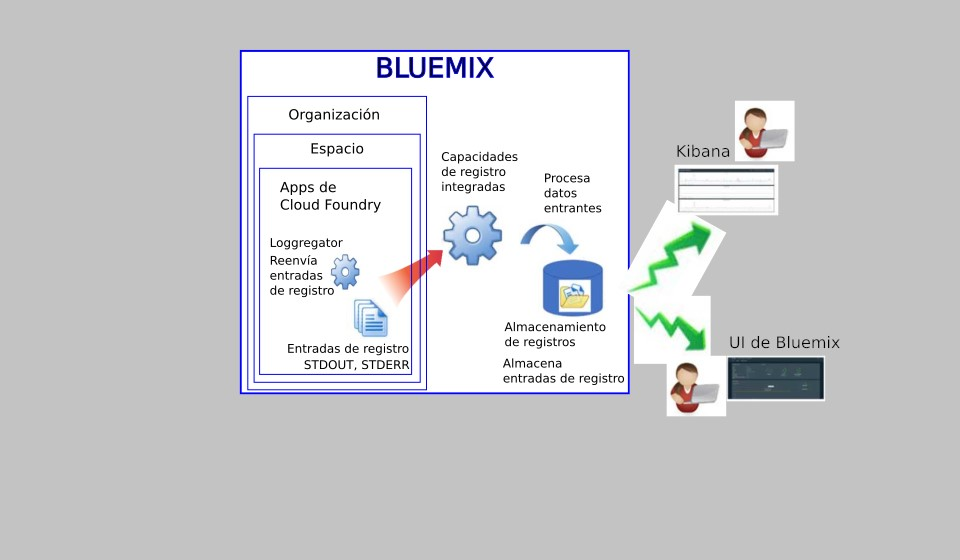

---

copyright:
  years: 2015, 2017

lastupdated: "2017-03-13"

---

{:shortdesc: .shortdesc}
{:new_window: target="_blank"}
{:codeblock: .codeblock}
{:screen: .screen}

# Registro para apps de Cloud Foundry en Bluemix
{: #logging_bluemix_cf_apps}

En {{site.data.keyword.Bluemix}}, puede ver, filtrar y analizar registros de Cloud Foundry (CF) mediante el panel de control de {{site.data.keyword.Bluemix_notm}}, Kibana y la interfaz de línea de mandatos. Además, puede dirigir los registros a una herramienta externa de gestión de registros. 
{:shortdesc}

Cuando ejecuta sus apps en una plataforma como servicio (PaaS) de nube como Cloud Foundry en {{site.data.keyword.Bluemix_notm}}, no puede utilizar SSH ni FTP en la infraestructura en la que se ejecutan las apps para acceder a los registros. La plataforma la controla el proveedor de la nube. Las apps de Cloud Foundry que se ejecutan en {{site.data.keyword.Bluemix_notm}} utilizan el componente Loggerator para reenviar los registros internos de la infraestructura de Cloud Foundry. El componente Loggregator selecciona automáticamente los datos de STDOUT y STDERR. Puede visualizar y analizar estos registros mediante el panel de control de {{site.data.keyword.Bluemix_notm}}, Kibana y la interfaz de línea de mandatos.

En la figura siguiente se muestra una vista de nivel alto del registro de las apps de Cloud Foundry en {{site.data.keyword.Bluemix_notm}}:

 
El registro de apps de Cloud Foundry se habilita automáticamente cuando se utiliza la infraestructura de Cloud Foundry para ejecutar las apps en {{site.data.keyword.Bluemix_notm}}. Para ver los registros de tiempo de ejecución de Cloud Foundry, debe grabar los registros en STDOUT y STDERR. Para obtener más información, consulte [Registro de aplicaciones en tiempo de ejecución mediante apps CF](cfapps/logging_writing_to_log_from_cf_app.html#logging_writing_to_log_from_cf_app).

{{site.data.keyword.Bluemix_notm}} conserva una cantidad limitada de información de registro. Cuando se registra información, la información antigua se sustituye por la nueva. Si tiene que cumplir con políticas de la organización o de la industria que requieren que conserve parte o toda la información de registro para realizar una auditoría o por otros motivos, puede guardar los registros en un host de registro externo, como un servicio de gestión de registros de terceros u otro host. Para obtener más información, consulte [Configuración de hosts de registro externo](logging_view_external.html#viewing_logs_external).

## Métodos para analizar los registros de app de CF
{: #logging_bluemix_cf_apps_log_methods}

Puede elegir cualquiera de los siguientes métodos para analizar los registros de la aplicación de Cloud Foundry:

* Analizar el registro en {{site.data.keyword.Bluemix_notm}} para ver la actividad más reciente de la aplicación.
    
    En {{site.data.keyword.Bluemix_notm}}, puede ver, filtrar y analizar registros desde el separador **Registro** disponible para cada aplicación de Cloud Foundry. Para obtener más información, consulte [Análisis de registros de apps de CF desde el panel de control de Bluemix](logging_view_dashboard.html#analyzing_logs_bmx_ui).
    
* Analizar registros en Kibana para realizar tareas avanzadas de análisis.
    
    En {{site.data.keyword.Bluemix}}, puede utilizar Kibana, una plataforma de visualización y análisis de código abierto, para supervisar, buscar, analizar y visualizar datos en diversos gráficos, como diagramas y tablas. Para obtener más información, consulte [Análisis de registros en Kibana](kibana4/logging_analyzing_logs_Kibana.html#analyzing_logs_Kibana).

* Analizar registros mediante la CLI para utilizar mandatos a fin de gestionar registros mediante programación.
    
    En {{site.data.keyword.Bluemix}}, puede ver, filtrar y analizar registros mediante la interfaz de línea de mandatos con el mandato **cf logs**. Para obtener más información, consulte [Análisis de registros de apps de Cloud Foundry desde la interfaz de línea de mandatos](logging_view_cli.html#analyzing_logs_cli).

## Orígenes de registros para apps de CF
{: #logging_bluemix_cf_apps_log_sources}

Para aplicaciones Cloud Foundry (CF), están disponibles los siguientes orígenes de registros: 
    
| Origen reg. | Nombre comp.  | Descripción | 
|------------|----------------|-------------|
| LGR | Loggregator | El componente LGR proporciona información sobre Cloud Foundry Loggregator, que reenvía registros desde dentro de Cloud Foundry. |
| RTR | Direccionador | El componente RTR proporciona información sobre las solicitudes HTTP enviadas a una aplicación. | 
| STG | Transferencia | El componente STG proporciona información sobre cómo se transfiere o se vuelve a transferir una aplicación. | 
| APP | Aplicación | El componente APP proporciona los registros procedentes de la aplicación. Aquí es donde se mostrarán los valores de stderr y stdout en el código. | 
| API | API de Cloud Foundry | El componente API proporciona información sobre las acciones internas resultantes de la solicitud de un usuario de cambiar el estado de una aplicación. | 
| DEA | Droplet Execution Agent | El componente DEA proporciona información sobre el inicio, detención o bloqueo de una aplicación.
  Este componente sólo está disponible si la aplicación se ha desplegado en la arquitectura de Cloud Foundry que se basa en DEA. | 
| CELL | Célula Diego | El componente CELL proporciona información sobre el inicio, detención o bloqueo de una aplicación.
  Este componente sólo está disponible si la aplicación se ha desplegado en la arquitectura de Cloud Foundry que se basa en Diego.|
| SSH | SSH | El componente SSH proporciona información cada vez que un usuario accede a una aplicación con el mandato **cf ssh**.
Este componente sólo está disponible si la aplicación se ha desplegado en la arquitectura de Cloud Foundry que se basa en Diego. |

En la figura siguiente se muestran los distintos componentes (orígenes de registro) de una arquitectura Cloud Foundry basada en Droplet Execution Agent (DEA):

de una arquitectura Cloud Foundry basada en Droplet Execution Agent (DEA)").

