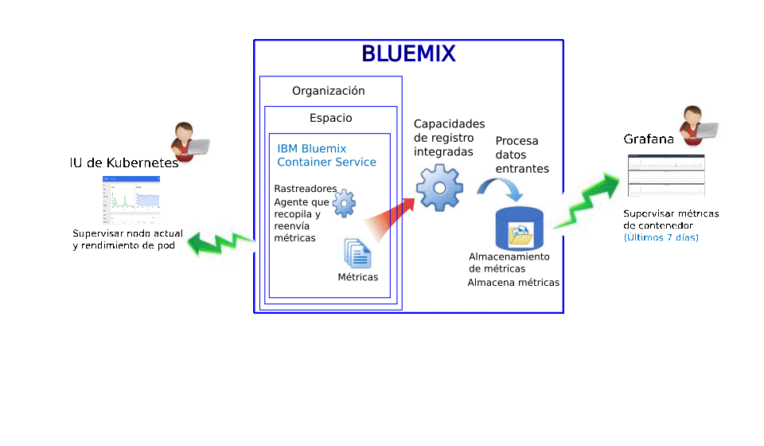
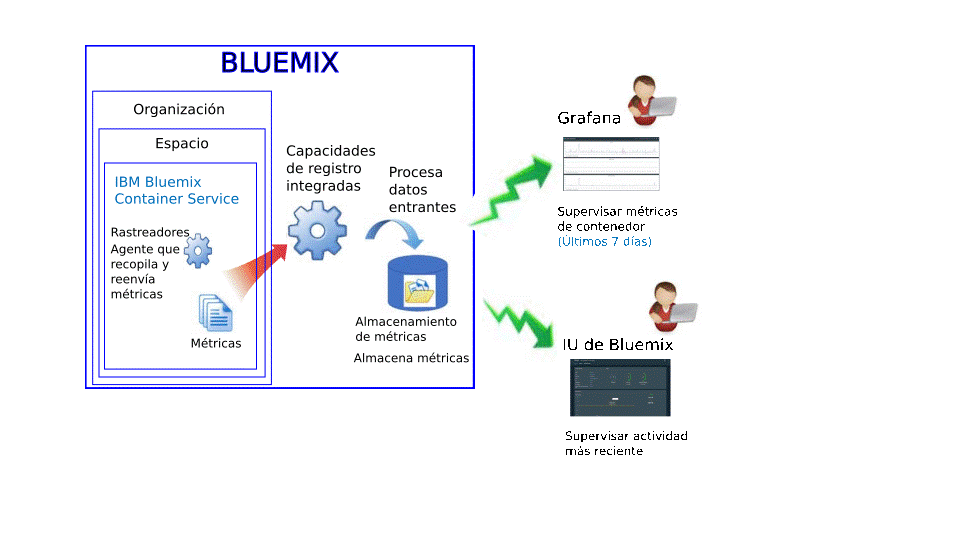

---

copyright:
  years: 2015, 2017

lastupdated: "2017-05-26"

---

{:shortdesc: .shortdesc}
{:new_window: target="_blank"}
{:codeblock: .codeblock}
{:screen: .screen}

# Supervisión del servicio IBM Bluemix Container
{: #monitoring_bmx_containers_ov}

En {{site.data.keyword.Bluemix}}, las métricas de contenedor se recopilan automáticamente desde fuera del contenedor, sin tener que instalar y mantener agentes dentro del contenedor. Utilice Grafana para visualizar métricas de contenedor. También puede utilizar la interfaz de usuario de Kubernetes para visualizar las métricas de los nodos (trabajadores) y pods.
{:shortdesc}

## Recopilación de métricas para un contenedor que se ejecuta en un clúster Kubernetes
{: #metrics_containers_kube_ov}

En {{site.data.keyword.Bluemix_notm}}, al desplegar las aplicaciones en un clúster Kubernetes, tenga en cuenta la información siguiente:

* En una cuenta de {{site.data.keyword.Bluemix_notm}}, puede tener una o más organizaciones.
* Cada organización puede tener uno o más espacios de {{site.data.keyword.Bluemix_notm}}. 
* Puede tener uno o varios clústeres Kubernetes en una organización.
* La recopilación de métricas se habilita automáticamente al crear un clúster Kubernetes. 
* Un clúster de Kubernetes es agnóstico con relación a los espacios de {{site.data.keyword.Bluemix_notm}}. Sin embargo, las métricas recopiladas para un clúster y sus recursos están asociadas a un espacio de {{site.data.keyword.Bluemix_notm}}. 
* Las métricas se recopilan para un contenedor tan pronto como se despliega el pod. 
* Las métricas se pueden visualizar en la interfaz de usuario de Kubernetes o Grafana. 
* Para visualizar datos de métricas de un clúster, debe configurar los paneles de control de Grafana para la región Pública de la nube donde se haya creado el clúster. 

Antes de crear un clúster, ya sea a través de la interfaz de usuario de {{site.data.keyword.Bluemix_notm}} o a través de la interfaz de línea de mandatos, debe iniciar una sesión en un espacio, una organización, una cuenta y una región específicos de {{site.data.keyword.Bluemix_notm}}. El espacio en donde ha iniciado una sesión es el espacio donde se recopilarán los datos de las métricas para el clúster y sus recursos. 

En la siguiente figura se muestra una vista de alto nivel de la supervisión para {{site.data.keyword.containershort}}:

El rastreador es un proceso que se ejecuta en el host y realiza una supervisión sin agente para las métricas. De forma predeterminada el rastreador recopila de forma constante las siguientes métricas de todos los contenedores: 

<table>
  <caption>Tabla 1. Métricas capturadas de forma predeterminada</caption>
  <tr>
    <th>Tipo de métrica</th>
    <th>Nombre de métrica</th>
    <th>Descripción</th>
  </tr>
  <tr>
    <td>Memoria</td>
    <td>*memory_current*</td>
    <td>Esta métrica informa de los bytes de memoria que el contenedor está utilizando actualmente. </td>
  </tr>
  <tr>
    <td>Memoria</td>
    <td>*memory_limit*</td>
    <td>Esta métrica informa de la cantidad de memoria que el contenedor puede intercambiar en disco respecto a los límites inferior y superior establecidos para un pod.    De forma predeterminada, los pods se ejecutan sin límites de memoria. Un pod puede consumir tanta memoria como la que haya en el trabajador en el que se ejecuta. Cuando se despliega un pod, se pueden establecer límites a la cantidad de memoria que dicho pod puede utilizar. </td>
  </tr>
  <tr>
    <td>CPU</td>
    <td>*cpu_usage*</td>
    <td>Esta métrica informa de los nanosegundos de tiempo de cpu en todos los núcleos.   Cuando la utilización de la CPU es elevada, podría presentarse algún tipo de retardo. Una utilización de CPU elevada indica la falta de potencia de proceso. </td>
  </tr>
  <tr>
    <td>CPU</td>
    <td>*cpu_usage_pct*</td>
    <td>Esta métrica informa sobre el tiempo de CPU que se utiliza como un porcentaje de la capacidad de la CPU.   
Cuando el porcentaje de utilización de CPU es elevado, podría presentarse algún tipo de retardo. Una utilización de CPU elevada indica la falta de potencia de proceso. </td>
  </tr>
  <tr>
    <td>CPU</td>
    <td>*cpu_num_cores*</td>
    <td>Esta métrica informa sobre el número de núcleos de CPU que están disponibles para el contenedor.</td>
  </tr>
</table>

## Recopilación de métricas para un contenedor gestionado en Bluemix
{: #metrics_containers_bmx_ov}

En la siguiente figura se muestra una vista de alto nivel de la supervisión para {{site.data.keyword.containershort}}:

De forma predeterminada el rastreador recopila de forma constante las siguientes métricas de todos los contenedores: 

* CPU
* Memoria
* Información de red

## Métricas de supervisión para un contenedor que se ejecuta en un clúster Kubernetes
{: #monitoring_metrics_kube}

Las métricas se recopilan y muestran tanto en la interfaz de usuario de Kubernetes como en Grafana: 

* Utilice Grafana, una plataforma de visualización y análisis de código abierto, para supervisar, buscar, analizar y visualizar sus métricas en diversos gráficos, como diagramas y tablas. 
 
    Grafana se puede iniciar desde un navegador. Para obtener más información, consulte [Navegación al panel de control de Grafana desde un navegador web](../grafana/navigating_grafana.html#launch_grafana_from_browser).
    
* Utilice la interfaz de usuario de Kubernetes para visualizar métricas para nodos y pods. Para obtener más información, consulte [Panel de control de interfaz de usuario web ](https://kubernetes.io/docs/tasks/access-application-cluster/web-ui-dashboard/){: new_window}.

## Supervisión de métricas para un contenedor gestionado en Bluemix
{: #monitoring_metrics_bmx}

Las métricas se recopilan y muestran tanto en la interfaz de usuario de {{site.data.keyword.Bluemix_notm}} como en Grafana: 

* Utilice Grafana, una plataforma de visualización y análisis de código abierto, para supervisar, buscar, analizar y visualizar sus métricas en diversos gráficos, como diagramas y tablas. 
 
    Puede iniciar Grafana desde la interfaz de usuario de {{site.data.keyword.Bluemix_notm}} o desde un navegador. Para obtener más información, consulte [Navegación al panel de control de Grafana](../grafana/navigating_grafana.html#navigating_grafana).
    

* Utilice la interfaz de usuario de {{site.data.keyword.Bluemix_notm}} para visualizar las métricas más recientes. 

    Para visualizar las métricas en la interfaz de usuario de {{site.data.keyword.Bluemix_notm}}, consulte [Análisis de métricas desde la consola de Bluemix](analyzing_metrics_bmx_ui.html#analyzing_metrics_bmx_ui).

## Retención de métricas
{: #metrics_retention}

Se recopila hasta un punto de datos por minuto. Las métricas de contenedor que no se hayan grabado en
un plazo de 7 días se suprimirán.
    

