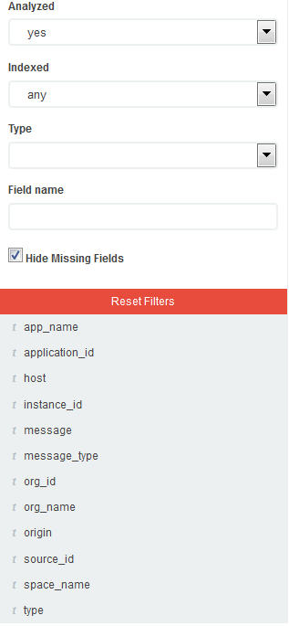

---

copyright:
  years: 2015, 2017

lastupdated: "2017-03-13"

---


{:shortdesc: .shortdesc}
{:new_window: target="_blank"}
{:codeblock: .codeblock}
{:screen: .screen}

# Filtrage de vos journaux d'après un texte spécifique dans la valeur d'une zone
{:#k4_filter_logs_spec_text}

Vous pouvez visualiser et rechercher des entrées incluant un texte spécifique dans la valeur d'une zone.
{:shortdesc}

**Remarque :** vous ne pouvez effectuer une recherche de texte libre que dans des zones chaîne analysées par l'analyseur Elasticsearch. 
    
Lorsque Elasticsearch analyse la valeur d'une zone de type chaîne, il décompose le texte d'après les limites de mot définies par l'organisme Unicode Consortium, supprime la ponctuation et convertit en minuscules tous les mots.
    
Pour rechercher des entrées contenant un texte spécifique dans une valeur de zone, procédez comme suit :

1. Examinez la page Discover de Kibana pour identifier le sous-ensemble de données qu'elle affiche. Pour plus d'informations, voir  [Identification des données affichées dans votre page Kibana Discover]((logging_kibana_analize_logs_interactively.html#k4_identify_data).

2. Identifiez les zones analysées par défaut dans ElasticSearch.

    Pour afficher la liste complète des zones analysées qui sont disponibles pour recherche et filtrage des données de journal, [rechargez la liste des zones](logging_kibana_analize_logs_interactively.html#kibana_discover_view_reload_fields). Ensuite, dans la liste des zones (*Fields list*) disponibles dans la page Discover, procédez comme suit :
    
    1. Cliquez sur l'icône Configurer . La section **Selected fields** (Zones sélectionnées) est affichée et vous permet de filtrer les zones.

        
    
    2. Pour identifier les zones analysées, sélectionnez **Yes** pour la zone de recherche **Analyzed** (Analysé).

        
    
        La liste des zones analysées s'affiche.
    
        
        
         
    3. Vérifiez si la zone dans laquelle vous désirez effectuer une recherche en texte libre est une zone analysée par défaut par ElasticSearch.
    
3. S'il s'agit d'une zone analysée, modifiez la requête afin de rechercher des entrées dans les journaux incluant ce texte libre dans la valeur d'une zone.

    
**Exemple**

Supposons que vous lancez Kibana pour une application Cloud Foundry (CF) depuis l'interface utilisateur de {{site.data.keyword.Bluemix}} et désirez rechercher un message spécifique comportant l'ID de message *CWWKT0016I:*, modifiez la recherche en incluant le texte libre.
    
1. Examinez la requête de recherche chargée et les données affichées sur la page Discover.
       
    
        
2. Pour rechercher l'ID de message *CWWKT0016I*, modifiez la requête de recherche et cliquez sur la touche **Entrée**:
    
    ```
	application_id:f52f6016-3aab-4b5c-aa2e-5493747cb978 AND message:"CWWKT0016I:"
	```
        
    
      
    
Le tableau affiche les entrées pour votre application CF où le texte *CWWKT0016I* fait partie de la valeur de la zone *message*.
    
     	
        
 
 
