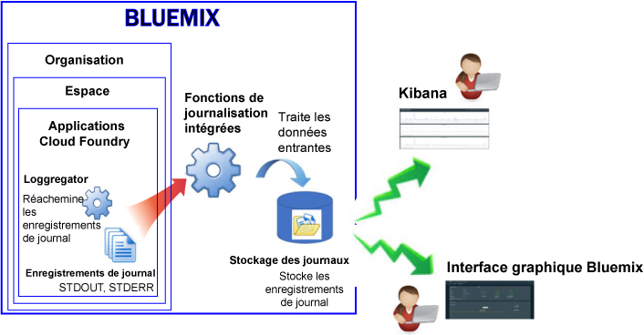

---

copyright:
  years: 2015, 2017

lastupdated: "2017-03-13"

---

{:shortdesc: .shortdesc}
{:new_window: target="_blank"}
{:codeblock: .codeblock}
{:screen: .screen}

# Journalisation des applications Cloud Foundry dans Bluemix
{: #logging_bluemix_cf_apps}

Dans {{site.data.keyword.Bluemix}}, vous pouvez visualiser, filtrer et analyser des journaux Cloud Foundry (CF) via le tableau de bord {{site.data.keyword.Bluemix_notm}}, Kibana, et l'interface de ligne de commande. En outre, vous pouvez compacter des enregistrements de journal dans un outil de gestion de journal externe. 
{:shortdesc}

Lorsque vous exécutez vos applications dans une plateforme sous forme de services cloud, telle que Cloud Foundry sur {{site.data.keyword.Bluemix_notm}}, vous ne pouvez pas ouvrir une session SSH ou FTP dans l'infrastructure sur laquelle vos applications s'exécutent pour accéder aux journaux. La plateforme est contrôlée par le fournisseur de cloud. Les applications Cloud Foundry qui s'exécutent sur {{site.data.keyword.Bluemix_notm}} utilisent le composant Loggrerator pour réacheminer des enregistrements de journal depuis l'infrastructure Cloud Foundry. Le composant Loggregator prélève automatiquement des données de sortie standard et d'erreur standard. Vous pouvez visualiser et analyser ces journaux via le tableau de bord {{site.data.keyword.Bluemix_notm}}, la plateforme Kibana et l'interface de ligne de commande.

La figure illustrée ci-dessous montre une vue générale de la journalisation des applications Cloud Foundry dans {{site.data.keyword.Bluemix_notm}} :

 
La journalisation des applications Cloud Foundry est activée automatiquement lorsque vous utilisez l'infrastructure Cloud Foundry pour exécuter vos applications sur {{site.data.keyword.Bluemix_notm}}. Pour consulter les journaux d'exécution de Cloud Foundry, vous devez consigner vos journaux dans les fichiers STDOUT et STDERR. Pour plus d'informations, voir [Journalisation d'application d'exécution via des applications CF](cfapps/logging_writing_to_log_from_cf_app.html#logging_writing_to_log_from_cf_app).

{{site.data.keyword.Bluemix_notm}} conserve une quantité limitée d'informations de journal. Lorsque des informations sont journalisées, les anciennes informations sont remplacées par les informations plus récentes. Si vous devez vous mettre en conformité avec des politiques d'organisation ou d'industrie qui nécessitent de conserver une partie ou la totalité des informations de journal à des fins d'audit ou autres, vous pouvez compacter vos journaux sur un hôte de journaux externe, par exemple, un service de gestion des
journaux tiers ou sur un autre hôte. Pour plus d'informations, voir [Configuration d'hôtes de journaux externes](logging_view_external.html#viewing_logs_external).

## Méthodes d'analyse de journaux d'application CF
{: #logging_bluemix_cf_apps_log_methods}

Vous pouvez choisir l'une des méthodes suivantes pour analyser les journaux de votre application Cloud Foundry :

* Analyser le journal dans {{site.data.keyword.Bluemix_notm}} pour visualiser la dernière activité de l'application.
    
    Dans {{site.data.keyword.Bluemix_notm}}, vous pouvez visualiser, filtrer et analyser des journaux via l'onglet **Journal** disponible pour chaque application Cloud Foundry. Pour plus d'informations, voir [Analyse des journaux d'application CF dans le tableau de bord Bluemix](logging_view_dashboard.html#analyzing_logs_bmx_ui).
    
* Analyser les journaux dans Kibana pour effectuer des tâches analytiques avancées.
    
    Dans {{site.data.keyword.Bluemix}}, vous pouvez utiliser la plateforme de visualisation et d'analyse open source Kibana pour surveiller, rechercher, analyser et visualiser des données dans différents graphiques, par exemple, des diagrammes et des tableaux. Pour plus d'informations, voir [Analyse des journaux dans Kibana](kibana4/logging_analyzing_logs_Kibana.html#analyzing_logs_Kibana).

* Analyser des journaux via l'interface de ligne de commande pour utiliser des commandes permettant de gérer des journaux à l'aide d'un programme.
    
    Dans {{site.data.keyword.Bluemix}}, vous pouvez visualiser, filtrer et analyser des journaux via l'interface de ligne de commande à l'aide de la commande **cf logs**. Pour plus d'informations, voir [Analyse des journaux d'application Cloud Foundry depuis l'interface de ligne de commande](logging_view_cli.html#analyzing_logs_cli).

## Sources de journal pour les applications CF
{: #logging_bluemix_cf_apps_log_sources}

Les sources de journal suivantes sont disponibles pour les applications Cloud Foundry (CF) :
    
| Source de journal | Nom du composant  | Description | 
|------------|----------------|-------------|
| LGR | Loggregator | Le composant LGR fournit des informations sur Cloud Foundry Loggregator, lequel réachemine des journaux depuis Cloud Foundry. |
| RTR | Router | Le composant RTR fournit des informations sur les requêtes HTTP adressées à une application. | 
| STG | Staging | Le composant STG fournit des informations sur la manière dont une application est constituée ou reconstituée. | 
| APP | Application | Le composant APP fournit des journaux issus de l'application. C'est là que la sortie standard et l'erreur standard de votre code apparaîtront. | 
| API | Cloud Foundry API | Le composant API fournit des informations sur les actions en interne résultant d'une demande utilisateur pour modifier l'état d'une application. | 
| DEA | Droplet Execution Agent | Le composant DEA fournit des informations sur le démarrage, l'arrêt ou la panne d'une application.   Ce composant est disponible uniquement si votre application est déployée dans l'architecture Cloud Foundry qui est basée sur DEA. | 
| CELL | Diego cell | Le composant CELL fournit des informations sur le démarrage, l'arrêt ou la panne d'une application.   Ce composant est disponible uniquement si votre application est déployée dans l'architecture Cloud Foundry qui est basée sur Diego.|
| SSH | SSH | Le composant SSH fournit des informations chaque fois qu'un utilisateur accède à une application via la commande **cf ssh**. Ce composant est disponible uniquement si votre application est déployée dans l'architecture Cloud Foundry qui est basée sur Diego. |

L'illustration suivante présente les différents composants (sources de journal) dans une architecture Cloud Foundry basée DEA (Droplet Execution Agent) :
 dans une architecture Cloud Foundry basée DEA (Droplet Execution Agent).")

