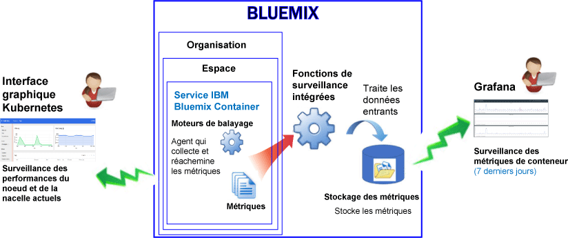
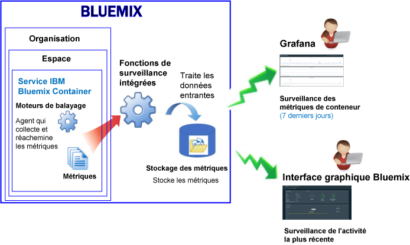

---

copyright:
  years: 2015, 2017

lastupdated: "2017-05-26"

---

{:shortdesc: .shortdesc}
{:new_window: target="_blank"}
{:codeblock: .codeblock}
{:screen: .screen}

# Surveillance du service IBM Bluemix Container
{: #monitoring_bmx_containers_ov}

Dans {{site.data.keyword.Bluemix}}, les métriques de conteneur sont collectées automatiquement depuis l'extérieur du conteneur, sans avoir à installer et à gérer des agents dans le conteneur. Vous pouvez utiliser Grafana pour visualiser des métriques de conteneur. Vous pouvez également utiliser l'interface utilisateur de Kubernetes pour visualiser des métriques sur les noeuds (agents) et les nacelles.
{:shortdesc}

## Collecte de métriques pour un conteneur opérant dans un cluster Kubernetes
{: #metrics_containers_kube_ov}

Dans {{site.data.keyword.Bluemix_notm}}, lorsque vous déployez des applications dans un cluster Kubernetes, prenez en compte les informations suivantes :

* Dans un compte {{site.data.keyword.Bluemix_notm}}, vous pouvez avoir 1 ou plusieurs organisations.
* Chaque organisation peut disposer d'un ou des plusieurs espaces {{site.data.keyword.Bluemix_notm}} .
* Vous pouvez avoir 1 ou plusieurs clusters Kubernetes dans une organisation.
* La collecte de métriques est automatiquement activée lorsque vous créez un cluster Kubernetes.
* Un cluster Kubernetes est indépendant des espaces {{site.data.keyword.Bluemix_notm}}. Toutefois, les métriques collectées pour un cluster et ses ressources portent sur un espace {{site.data.keyword.Bluemix_notm}} spécifique.
* Des métriques sont collectées pour un conteneur dès que la nacelle est déployée.
* Vous pouvez afficher les métriques dans Grafana ou dans l'interface utilisateur Kubernetes.
* Pour visualiser des données de métriques pour un cluster, vous devez configurer des tableaux de bord Grafana pour la région Cloud Public où le cluster est créé.

Avant de créer un cluster, que ce soit depuis l'interface utilisateur de {{site.data.keyword.Bluemix_notm}} ou via la ligne de commande, vous devez vous connecter à une région {{site.data.keyword.Bluemix_notm}}, un compte, une organisation et un espace spécifiques. L'espace auquel vous vous êtes connecté est celui pour lequel des données de métriques sur le cluster et ses ressources sont collectées.

Le diagramme suivant offre une vue d'ensemble de la surveillance pour {{site.data.keyword.containershort}} :

Le moteur de balayage est un processus qui s'exécute sur l'hôte et effectue une surveillance des métriques sans intervention d'agent. Il collecte par défaut en continu les métriques suivantes de tous les conteneurs :

<table>
  <caption>Tableau 1. Métriques capturées par défaut</caption>
  <tr>
    <th>Type de métrique</th>
    <th>Nom de la métrique</th>
    <th>Description</th>
  </tr>
  <tr>
    <td>Mémoire</td>
    <td>*memory_current*</td>
    <td>Cette métrique rend compte du nombre d'octets de mémoire utilisé actuellement par le conteneur. </td>
  </tr>
  <tr>
    <td>Mémoire</td>
    <td>*memory_limit*</td>
    <td>Cette métrique rend compte de la quantité de mémoire qu'un conteneur est autorisé à utiliser dans un fichier d'échange sur disque comparé aux limites plafond et plancher définies pour une nacelle.    Par défaut, les nacelles peuvent opèrent sans limites de mémoire. Une nacelle peut consommer autant de mémoire que celle disponible sur l'agent où elle s'exécute. Lorsque vous déployez une nacelle, vous pouvez fixer des limites quant à la quantité de mémoire qu'elle peut utiliser. </td>
  </tr>
  <tr>
    <td>UC</td>
    <td>*cpu_usage*</td>
    <td>Cette métrique rend compte du nombre de nanosecondes de temps d'UC sur tous les coeurs.   Lorsque l'utilisation de l'UC est élevée, vous pouvez rencontrer des délais. Une utilisation élevée de l'UC témoigne d'une capacité de traitement insuffisante.</td>
  </tr>
  <tr>
    <td>UC</td>
    <td>*cpu_usage_pct*</td>
    <td>Cette métrique rend compte du temps UC utilisé en pourcentage de la capacité de l'UC.   Lorsque le pourcentage d'utilisation de l'UC est élevé, vous pouvez rencontrer des délais. Une utilisation élevée de l'UC témoigne d'une capacité de traitement insuffisante.</td>
  </tr>
  <tr>
    <td>UC</td>
    <td>*cpu_num_cores*</td>
    <td>Cette métrique rend compte du nombre de coeurs d'UC disponible pour le conteneur.</td>
  </tr>
</table>

## Collecte de métriques pour un conteneur géré dans Bluemix
{: #metrics_containers_bmx_ov}

Le diagramme suivant offre une vue d'ensemble de la surveillance pour {{site.data.keyword.containershort}} :

Le moteur de balayage collecte par défaut en continu les métriques suivantes de tous les conteneurs :

* UC
* Mémoire
* Informations réseau

## Surveillance de métriques pour un conteneur opérant dans un cluster Kubernetes
{: #monitoring_metrics_kube}

Les métriques sont collectées et affichées à la fois dans l'interface utilisateur de Kubernetes et dans Grafana :

* Utilisez la plateforme de visualisation et d'analyse open source Grafana pour surveiller, rechercher, analyser et visualiser vos métriques dans différents graphiques, par exemple, dans des diagrammes et des tableaux. 
 
    Vous pouvez lancer Grafana depuis un navigateur. Pour plus d'informations, voir [Accès au tableau de bord Grafana depuis un navigateur Web](../grafana/navigating_grafana.html#launch_grafana_from_browser).
    
* Utilisez l'interface utilisateur de Kubernetes pour visualiser les métriques de noeuds et de nacelles. Pour plus d'informations, voir [Tableau de bord de l'interface utilisateur Web ](https://kubernetes.io/docs/tasks/access-application-cluster/web-ui-dashboard/){: new_window}.

## Collecte de métriques pour un conteneur géré dans Bluemix
{: #monitoring_metrics_bmx}

Les métriques sont collectées et affichées à la fois dans l'interface utilisateur de {{site.data.keyword.Bluemix_notm}} et dans Grafana :

* Utilisez la plateforme de visualisation et d'analyse open source Grafana pour surveiller, rechercher, analyser et visualiser vos métriques dans différents graphiques, par exemple, dans des diagrammes et des tableaux. 
 
    Vous pouvez lancer Grafana depuis l'interface utilisateur de {{site.data.keyword.Bluemix_notm}} ou depuis un navigateur. Pour plus d'informations, voir [Accès au tableau de bord Grafana](../grafana/navigating_grafana.html#navigating_grafana).
    

* Utilisez l'interface utilisateur de {{site.data.keyword.Bluemix_notm}} pour visualiser les métriques les plus récentes.

    Pour visualiser les métriques dans l'interface utilisateur de {{site.data.keyword.Bluemix_notm}}, voir [Analyse métriques depuis la console Bluemix](analyzing_metrics_bmx_ui.html#analyzing_metrics_bmx_ui).

## Conservation des métriques
{: #metrics_retention}

Jusqu'à un point de données par minute est collecté. Les métriques de conteneurs qui n'ont pas été actualisées pendant
7 jours sont supprimées.
    

