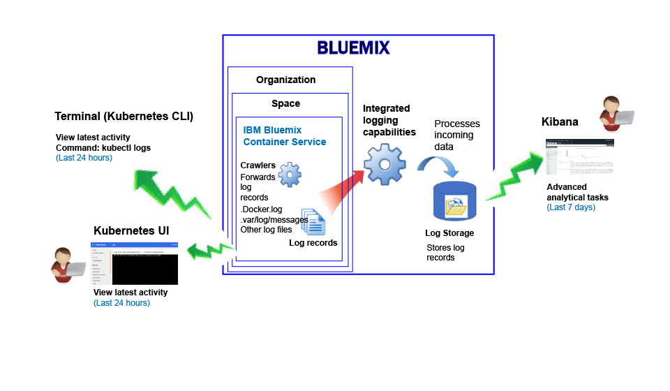
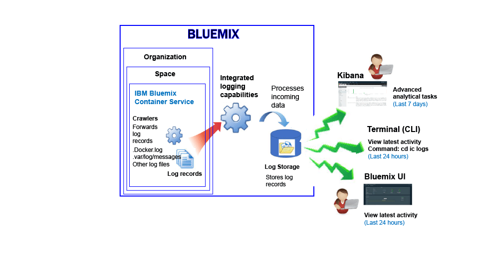

---

copyright:
  years: 2015, 2017

lastupdated: "2017-05-23"

---

{:shortdesc: .shortdesc}
{:new_window: target="_blank"}
{:codeblock: .codeblock}
{:screen: .screen}


# IBM Bluemix Container Service のロギング
{: #logging_containers_ov}

{{site.data.keyword.IBM}} 管理のクラウド・インフラストラクチャーにデプロイされている Docker コンテナー、および Kubernetes クラスターで実行されている Docker コンテナーのログを表示、フィルタリング、および分析できます。コンテナーのロギングは、{{site.data.keyword.Bluemix_notm}} または Kubernetes クラスターにコンテナーをデプロイした時に自動的に有効になります。
{:shortdesc}

コンテナーのログは、クローラーを使用して、コンテナーの外部からモニターおよび転送されます。データは、クローラーによって {{site.data.keyword.Bluemix_notm}} 内のマルチテナント Elasticsearch に送信されます。


## Kubernetes クラスターで実行されているコンテナーのログの収集
{: #logging_containers_ov_logs_collected_kubernetes}

以下の図は、{{site.data.keyword.containershort}} のロギングの概略を示しています。



{{site.data.keyword.Bluemix_notm}} では、Kubernetes クラスターにアプリケーションをデプロイする際に以下の情報を考慮してください。

* 1 つの {{site.data.keyword.Bluemix_notm}} アカウントで 1 つ以上の組織を持つことができます。 
* 各組織は、1 つ以上の {{site.data.keyword.Bluemix_notm}} スペースを持つことができます。 
* 1 つの組織内に 1 つ以上の Kubernetes クラスターを持つことができます。 
* ログの収集は、Kubernetes クラスターを作成した時に自動的に有効になります。 
* Kubernetes クラスターは、{{site.data.keyword.Bluemix_notm}} スペースに依存しません。ただし、クラスターとリソースのログ・データは、{{site.data.keyword.Bluemix_notm}} スペースに関連付けられています。
* アプリケーションのログ・データは、pod がデプロイされるとすぐに収集されます。
* クラスターのログ・データを分析するには、クラスターが作成されている Cloud Public 領域の Kibana ダッシュボードにアクセスする必要があります。

クラスターを作成する前に、[{{site.data.keyword.Bluemix_notm}} UI](../../../containers/cs_cluster.html#cs_cluster_ui) または[コマンド・ライン](../../../containers/cs_cluster.html#cs_cluster_cli)を使用して、特定の {{site.data.keyword.Bluemix_notm}} 領域、アカウント、組織、およびスペースにログインする必要があります。ログインしているスペースが、クラスターとリソースのロギング・データが収集されるスペースとなります。

デフォルトで、すべてのコンテナー・プロセスが STDOUT (標準出力) および STDERR (標準エラー) に出力する情報が収集されます。情報を STDOUT および STDERR に送信することが、コンテナーの情報を公開するための標準の Docker 規則です。 

コンテナーで実行されているアプリのログ・データを、JSON フォーマットで Docker ログ・コレクターに転送すると、JSON フィールドを使用して Kibana でログ・データを検索および分析することができます。詳しくは、『[カスタム・フィールドを Kibana 検索フィールドとして構成](logging_containers_ov.html#send_data_in_json)』を参照してください。

**注:** Kubernetes クラスターで作業する場合、名前空間 *ibm-system* および *kube-system* は予約済みです。これらの名前空間で使用可能なリソースの許可を作成、削除、または変更しないでください。これらの名前空間のログは、{{site.data.keyword.IBM_notm}} の使用を目的としています。


## Bluemix によって管理されているコンテナーのログの収集
{: #logging_containers_ov_logs_collected}

以下の図は、{{site.data.keyword.containershort}} のロギングの概略を示しています。



{{site.data.keyword.Bluemix_notm}} 管理のクラウド・インフラストラクチャーにデプロイされているコンテナーの場合、以下のログがデフォルトで収集されます。

<table>
  <caption>表 2. Bluemix 管理のクラウド・インフラストラクチャーにデプロイされているコンテナーで収集されるログ</caption>
  <tbody>
    <tr>
      <th align="center">ログ</th>
      <th align="center">説明</th>
    </tr>
    <tr>
      <td align="left" width="30%">/var/log/messages</td>
      <td align="left" width="70%"> デフォルトでは、Docker メッセージは、コンテナーの /var/log/messages フォルダーに保管されます。このログには、システム・メッセージが含まれます。
      </td>
    </tr>
    <tr>
      <td align="left">./docker.log</td>
      <td align="left">このログは、Docker ログです。<br> Docker ログ・ファイルはコンテナー内にファイルとして保管されることはありませんが、収集されます。このログ・ファイルがデフォルトで収集されるのは、それがコンテナーの stdout (標準出力) 情報と stderr (標準エラー) 情報の公開に関する標準 Docker 規則であるためです。すべてのコンテナー・プロセスが STDOUT または STDERR に出力する情報が収集されます。
      </td>
     </tr>
  </tbody>
</table>

追加ログを収集するには、コンテナーの作成時にログ・ファイルへのパスを指定した **LOG_LOCATIONS** 環境変数を追加します。複数のログ・ファイルをコンマで区切って追加できます。詳しくは、『[コンテナーからの非デフォルト・ログ・データの収集](logging_containers_other_logs.html#logging_containers_collect_data)』を参照してください。


##  カスタム・フィールドを Kibana 検索フィールドとして構成 
{: #send_data_in_json}

デフォルトで、コンテナーのロギングは自動的に有効になります。Docker ログ・ファイルのすべての項目は、Kibana で `message` フィールドに表示されます。コンテナー・ログ項目の一部である特定のフィールドを使用して、Kibana でデータをフィルター操作および分析する必要がある場合は、有効な JSON フォーマットの出力を送信するようにアプリケーションを構成します。

以下の情報を考慮してください。

* Kubernetes クラスターにデプロイされているコンテナーの場合、JSON フォーマットでメッセージを STDOUT (標準出力) および STDERR (標準エラー) に記録します。

    メッセージで使用可能な各フィールドは構文解析されて、その値に一致するタイプのフィールドに変換されます。例えば、以下の JSON メッセージの各フィールドをご覧ください。
    
    ```
    {"field1":"string type",
        "field2":123,
        "field3":false,
        "field4":"4567"
    }
    ```
    
    これらの各フィールドは、以下のように、フィルター操作と検索に使用できるフィールドとして使用可能です。
    
    * `field1` は、ストリング型の `field1_str` として構文解析されます。
    * `field2` は、整数型の `field1_int` として構文解析されます。
    * `field3` は、ブール型の `field3_bool` として構文解析されます。
    * `field4` は、ストリング型の `field4_str` として構文解析されます。
    
* {{site.data.keyword.Bluemix_notm}} 管理のクラウド・インフラストラクチャーにデプロイされているコンテナーの場合、以下のステップを完了して、コンテナーのログ項目を構文解析して個別のフィールドに変換します。

    1. メッセージをファイルに記録します。 
    2. コンテナーから分析に使用できるデフォルト以外のログのリストにログ・ファイルを追加します。詳しくは、『[コンテナーからの非デフォルト・ログ・データの収集](logging_containers_other_logs.html#logging_containers_collect_data)』を参照してください。 
    
   メッセージをファイルに記録し、メッセージが有効な JSON であると判別されると、フィールドが構文解析され、メッセージ内の各フィールドに対して新しいフィールドが作成されます。Kibana でのフィルター操作およびソートに使用できるのは、ストリング型のフィールド値のみになります。


## Kubernetes クラスターで実行されているコンテナーのコンテナー・ログの表示
{: #logging_containers_ov_methods_view_kube}

以下のいずれかの方法を使用して、Kubernetes pod 内のコンテナーの最新ログを表示することができます。

* Kubernetes UI を使用してログを表示します。それぞれの pod について選択し、ログにアクセスすることができます。詳しくは、『[Web UI ダッシュボード ](https://kubernetes.io/docs/tasks/access-application-cluster/web-ui-dashboard/){: new_window}』を参照してください。

* Kubernetes CLI コマンド [kubectl logs ](http://vishh.github.io/docs/user-guide/kubectl/kubectl_logs/){: new_window} を使用してログを表示します。 

長期間のログを表示するには、Kibana を使用できます。データ保存期間ポリシーについて詳しくは、[ログの保存](logging_containers_ov.html#logging_containers_ov_log_retention)情報を確認してください。


## Bluemix によって管理されているコンテナーのコンテナー・ログの表示
{: #logging_containers_ov_methods_view_bmx}

{{site.data.keyword.Bluemix_notm}} 管理のクラウド・インフラストラクチャーにデプロイされているコンテナーの最新ログは、以下のいずれかの方法を使用して表示できます。

* {{site.data.keyword.Bluemix_notm}} UI を介してログを表示して、コンテナーの最新のアクティビティーをモニターします。
    
    各コンテナーに対して使用可能な**「モニターおよびログ (Monitoring and logs)」**のタブを使用してログの表示、フィルタリング、および分析を行うことができます。詳しくは、『[Bluemix ダッシュボードからのログの分析](../logging_view_dashboard.html#analyzing_logs_bmx_ui)』を参照してください。
    
    
* {site.data.keyword.containershort}} CLI を使用してログを表示します。コマンドを使用して、プログラマチックにログを管理します。
    
    **cf ic logs** コマンドを使用することによって、ログの表示、フィルター操作、および分析をコマンド・ライン・インターフェースを介して行うことができます。詳しくは、『[コマンド・ライン・インターフェースからのログの分析](../logging_view_cli.html#analyzing_logs_cli)』を参照してください。


## コンテナー・ログの分析
{: #logging_containers_ov_methods}

コンテナー・ログ・データを分析するには、Kibana を使用して高度な分析タスクを実行します。分析および視覚化のためのオープン・ソース・プラットフォームである Kibana を使用して、さまざまなグラフ (図表や表など) でデータのモニター、検索、分析、および視覚化を行うことができます。詳しくは、『[Kibana でのログの分析](../kibana4/analyzing_logs_Kibana.html#analyzing_logs_Kibana)』を参照してください。


## ログ保持期間
{: #logging_containers_ov_log_retention}

ログの保存に関する以下の情報を考慮してください。

* スペースごとに 1 日に最大で 1 GB のデータが保管されます。1 GB の上限を超えるログは破棄されます。上限割り当ては、毎日午前 12:30 (UTC) にリセットされます。 

    サポートに連絡することで、上限を引き上げることができます。サポート・チケットで、上限引き上げ要求の対象となるスペース ID、新しい上限サイズ、および要求の理由を含めてください。

* 7 GB までのデータを最大 7 日間検索可能です。ログ・データは、データが 7 GB に達するか 7 日が過ぎると、ロールオーバーします (先入れ先出し)。

## チュートリアル: Kubernetes クラスターにデプロイされているアプリのログを Kibana で分析
{: #tutorial1}

Kibana を使用した、Kubernetes クラスターにデプロイされているコンテナーのログの分析方法を学習するには、[チュートリアル: Kubernetes クラスターにデプロイされているアプリのログを Kibana で分析](tutorials/kibana_tutorial_1.html#kibana_tutorial_1)を参照してください。


