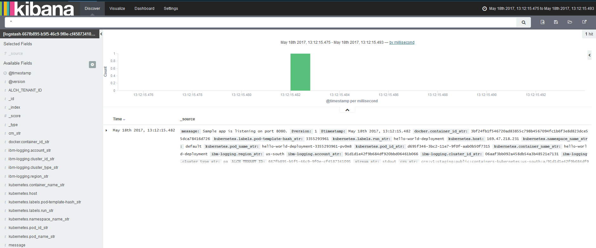

---

copyright:
  years: 2015, 2017

lastupdated: "2017-05-23"

---


{:shortdesc: .shortdesc}
{:new_window: target="_blank"}
{:codeblock: .codeblock}
{:screen: .screen}


# Kubernetes クラスターにデプロイされたアプリに関する Kibana でのログの分析
{: #kibana_tutorial_1}

Kibana を使ってみましょう。ここでは、Kubernetes クラスターにデプロイされたアプリに関するコンテナー・ログの検索方法および分析方法を説明します。
{:shortdesc}

**注:** このチュートリアルを完了するためには、各ステップからリンクされているチュートリアルを実行してください。

## 前提条件
{: #prereq}

1. Kubernetes クラスターの作成、クラスターへのアプリケーションのデプロイを実行でき、Kibana での高度な分析のための Bluemix でのログの照会を実行できる権限を持つ、Bluemix アカウントのメンバーまたは所有者になります。

2. コマンド・ラインから Kubernetes クラスターの管理およびアプリのデプロイを実行できる端末セッションを用意します。このチュートリアルの例では Ubuntu Linux システムを使用しています。

3. コマンド・ラインから IBM Bluemix Container サービスを管理できるようにするため、ご使用の Ubuntu システムに [CLI プラグインをインストールします](../../../../containers/cs_cli_install.html#cs_cli_install_steps)。 


## ステップ 1: Bluemix で Kubernetes を稼働中にする
{: #step1}

以下のステップを実行します。

1. [Kubernetes クラスターを作成します](../../../../containers/cs_cluster.html#cs_cluster_ui)。

2. Linux ターミナルで[クラスター・コンテキストをセットアップします](../../../../containers/cs_cli_install.html#cs_cli_configure)。コンテキストを設定すると、Kubernetes クラスターを管理し、Kubernetes クラスターにアプリケーションをデプロイできるようになります。

## ステップ 2: Kubernetes クラスターにアプリをデプロイする
{: #step2}

Kubernetes クラスター内でサンプル・アプリをデプロイし、実行します。[演習 1 の手順を実行](../../../../containers/cs_tutorials.html#cs_apps_tutorial)してください。

このアプリは、以下のような Hello World node js アプリです。

```
var express = require('express')
var app = express()

app.get('/', function(req, res) {
  res.send('Hello world! Your app is up and running in a cluster!\n')
})
app.listen(8080, function() {
  console.log('Sample app is listening on port 8080.')
})
```

アプリがデプロイされたら、アプリが STDOUT (標準出力) および STDERR (標準エラー出力) に送信するすべてのログ項目のログ収集が自動的に有効になります。 

このサンプル・アプリでは、ブラウザーでアプリをテストすると、アプリはメッセージ `Sample app is listening on port 8080.` を標準出力に書き込みます。


## ステップ 3: Kibana でログ・データを分析する
{: #step3}

1. ブラウザーから Kibana を起動します。 

    あるクラスターのログ・データを分析するには、そのクラスターが作成されたクラウド・パブリック地域の Kibana にアクセスする必要があります。 
    
    前のステップで Kubernetes クラスターを作成した地域に基づいて、正しい URL を選択してください。

    <table>
      <caption>表 1. Kibana を起動するための URL </caption>
        <tr>
          <th>地域</th>
          <th>URL</th>
         </tr>
         <tr>
           <td>米国南部</td>
           <td>https://logging.ng.bluemix.net/ </td>
          </tr>
          <tr>
            <td>英国</td>
            <td>https://logging.eu-gb.bluemix.net/ </td>
           </tr>
           <tr>
             <td>フランクフルト</td>
             <td>https://logging.eu-de.bluemix.net/ </td>
           </tr>
    </table>
    
    次に、ブラウザーで該当する URL を起動して Kibana を開きます。
    
2. **「Discover」**ページで、表示されるイベントを確認します。 

    Hello-World サンプル・アプリケーションは 1 つのイベントを生成します。
    
    
    
    *「Available fields」*セクションには、フィールドのリストが表示されます。これらのフィールドを使用して、新しい照会を定義したり、ページに表示される表にリストされる項目をフィルター操作したりできます。
    
    以下の表に、新しい検索照会を定義するために使用できる共通フィールドを示します。この表には、サンプル・アプリによって生成されるイベントに対応するサンプル値も含まれています。
    
     <table>
              <caption>表 2. コンテナー・ログの共通フィールド</caption>
               <tr>
                <th align="center">フィールド</th>
                <th align="center">説明</th>
                <th align="center">例</th>
              </tr>
              <tr>
                <td>*docker.container_id_str*</td>
                <td> このフィールドの値は、Kubernetes クラスターのポッドでアプリを実行するコンテナーの GUID に対応します。</td>
                <td></td>
              </tr>
              <tr>
                <td>*ibm-containers.region_str*</td>
                <td>このフィールドの値は、このログ項目が収集される {{site.data.keyword.Bluemix_notm}} 地域に対応します。</td>
                <td>us-south</td>
              </tr>
              <tr>
                <td>*kubernetes.container_name_str*</td>
                <td>このフィールドの値は、コンテナーの名前を示します。</td>
                <td>hello-world-deployment</td>
              </tr>
              <tr>
                <td>*kubernetes.host*</td>
                <td>このフィールドの値は、インターネットからアプリにアクセスするために使用できるパブリック IP を示します。</td>
                <td>xxx.xx.xxx.xxx</td>
              </tr>
              <tr>
                <td>*kubernetes.labels.label_name*</td>
                <td>ラベル・フィールドはオプションです。ラベルはなくてもよく、複数あってもかまいません。各ラベルは接頭部 `kubernetes.labels.` で始まり、*label_name* が続きます。</td>
                <td>サンプル・アプリでは、次の 2 つのラベルがあります。<br>* *kubernetes.labels.pod-template-hash_str* = 3355293961 <br>* *kubernetes.labels.run_str* =	hello-world-deployment  </td>
              </tr>
              <tr>
                <td>*kubernetes.namespace_name_str*</td>
                <td>このフィールドの値は、ポッドが実行されている Kubernetes 名前空間を示します。</td>
                <td>default</td>
              </tr>
              <tr>
                <td>*kubernetes.pod_id_str*</td>
                <td>このフィールドの値は、コンテナーが稼働しているポッドの GUID に対応します。</td>
                <td>d695f346-xxxx-xxxx-xxxx-aab0b50f7315</td>
              </tr>
              <tr>
                <td>*kubernetes.pod_name_str*</td>
                <td>このフィールドの値は、ポッド名を示します。</td>
                <td>hello-world-deployment-3xxxxxxx1-xxxxx8</td>
              </tr>
              <tr>
                <td>*message*</td>
                <td>これは、アプリケーションによってログに記録される完全なメッセージです。</td>
                <td>Sample app is listening on port 8080.</td>
              </tr>
        </table>
    
    
    
3. *「Discover」*ページでデータをフィルター操作します。  

    分析に使用できるすべての項目が表で示されます。リストされる項目は、*「Search」*バーに表示される検索照会に対応します。`*` は、このページに対して構成された期間内のすべての項目を表示する場合に使用される文字です。 
    
    例えば、Kubernetes 名前空間によってデータをフィルター操作するために、*「Search」*バーの照会を変更するとします。この場合、次のようにしてカスタム・フィールド *kubernetes.namespace_name_str* に基づくフィルターを追加します。
    
    1. **「Available fields」**セクションで、フィールド *kubernetes.namespace_name_str* を選択します。このフィールドの有効な値のサブセットが表示されます。    
    
    2. 値 **default** を選択します。これは、前のステップでサンプル・アプリをデプロイした名前空間です。
    
        値を選択すると、*「Search」*バーにフィルターが追加され、表には、選択したばかりの基準に一致する項目のみが表示されるようになります。     
    
    
    
    フィルターの編集シンボルを選択して、検索する名前空間の名前を変更できます。   
    
    
    
    以下の照会が表示されます。
    
    ```{
        "query": {
          "match": {
            "kubernetes.namespace_name_str": {
              "query": "default",
              "type": "phrase"
            }
          }
        }
      }
    ```
    
    別の名前空間 *mynamespace1* にある項目を検索するには、照会を次のように変更します。
    
    ```{
        "query": {
          "match": {
            "kubernetes.namespace_name_str": {
              "query": "mynamespace1",
              "type": "phrase"
            }
          }
        }
      }
    ```
    

    データが何も表示されない場合は、時間フィルターを変更してみてください。詳しくは、『[時間フィルターの設定](../../kibana4/k4_filter_logs.html#set_time_filter)』を参照してください。
    


詳しくは、『[Kibana でのログのフィルタリング](../../kibana4/k4_filter_logs.html#k4_filter_logs)』を参照してください。

