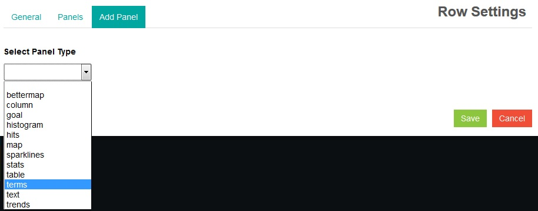

---

copyright:
  years: 2016, 2017
lastupdated: "2017-02-07"

---

{:new_window: target="_blank"}
{:shortdesc: .shortdesc}
{:screen:.screen}
{:codeblock:.codeblock}

# Kibana での照会からの表とグラフの作成
{: #logging_kibana_tables_graphs}

Kibana を使用して、照会のグラフと表を作成し、ログ・データを視覚化して結果を比較します。Kibana ダッシュボードには、Cloud Foundry アプリの**「ログ」**タブからアクセスできます。
{:shortdesc}

Kibana ダッシュボードは、一連の行でレイアウトされ、各行には 1 つ以上のパネルが含まれます。データのグラフィカル表現を表示するためのパネルを構成できます。照会を使用して、表示するデータを決定します。グラフまたは表を作成するには、まずブランク行を作成し、その後、パネルを作成する必要があります。CF アプリの**「ログ」**タブから Kibana ダッシュボードにアクセスすると、ヒストグラムと表の 2 つのパネルがダッシュボードに自動的に表示されます。

Kibana ダッシュボードにグラフまたは表を追加するには、以下のタスクを行います。

1. Cloud Foundry アプリの**「ログ」**タブにアクセスするには、{{site.data.keyword.Bluemix_notm}} **「アプリ」**ダッシュボードの**「Cloud Foundry アプリ」**表でアプリ名をクリックし、**「ログ」**タブをクリックします。アプリのログが表示されます。

2. アプリの Kibana ダッシュボード表示にアクセスするには、**「詳細ビュー」**  をクリックします。Kibana ダッシュボードが表示されます。

3. Kibana ダッシュボードで、ダッシュボードの下部にスクロールし、**「ADD A ROW」**  をクリックし、追加するパネルの行を作成します。「Dashboard Settings」ペインが表示されます。 
	
	
	
	「Add Row」ペインで、**「Title」**フィールドに行の名前を入力し、**「Create Row」**をクリックします。新しい行が追加されます。行の順序は、行タイトルの横にある**上矢印**または**下矢印**のアイコンをクリックして調整できます。行の順序を設定したら、**「Save」**をクリックします。Kibana ダッシュボードに空の行が作成されます。

4. **「Add panel to empty row」**をクリックしてパネルを追加します。「Row Settings」ペインが表示されます。

    
	
	**「Select Panel Type」**ドロップダウン・リストから**「table」**、**「histogram」**、**「terms」**などのさまざまなパネル・タイプを選択できます。**「terms」**を選択し、照会を基に棒グラフ、円グラフ、または表を作成します。「Row Settings」ペインにさまざまな構成オプションが表示されます。
	
	
	
	パネルを構成します。グラフィカル表示の**「Title (タイトル)」**を入力します。ドロップダウン・リストからパネルの**「Span」**を選択します。**「Span」**は、ダッシュボードにおけるパネルの幅を決定します。「Parameters」セクションで、**「Field」**の内容を削除し、有効なログ・フィールド (例えば、`instance_id` など) を入力します。 

5. 「View Options」セクションで、**「Style」**ドロップダウン・リストから**「bar」**、**「pie」**、または**「table」**を選択することで、棒グラフ、円グラフ、または表を選びます。「Queries」セクションで、**「Queries」**ドロップダウン・リストから**「selected」**を選択し、ダッシュボードの照会によるログ・データを使用します。最後に**「Save」**をクリックします。ダッシュボードに新しいパネルが表示されます。

	
	
6. このパネルに表が表示されるように変更するには、**「Configure」**アイコン  をクリックします。「Terms Settings」ペインが表示されます。 

	
	
	**「Panel」**タブをクリックし、**「Style」**ドロップダウン・リストから**「table」**を選択します。**「Save」**をクリックしてパネルを更新し、ダッシュボードに戻ります。

7. 行とパネルをダッシュボードにさらに追加します。完了したら、**「Save」**アイコンをクリックしてこのダッシュボードへの変更を保存します。

    **注:** スペースを含む名前でダッシュボードを保存しようとすると、保存されません。スペースを含まない名前を入力し、**「Save」**アイコンをクリックしてください。

     

