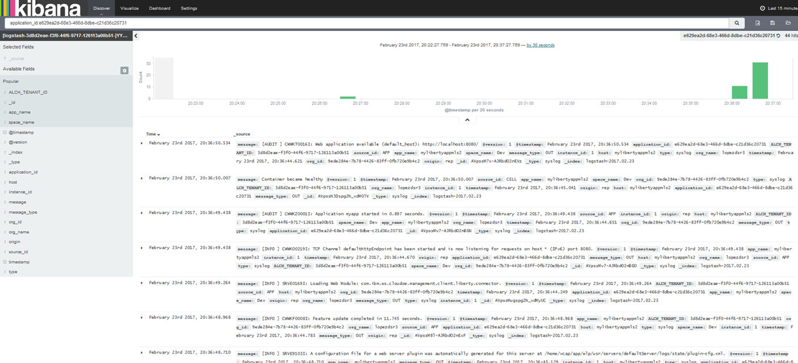
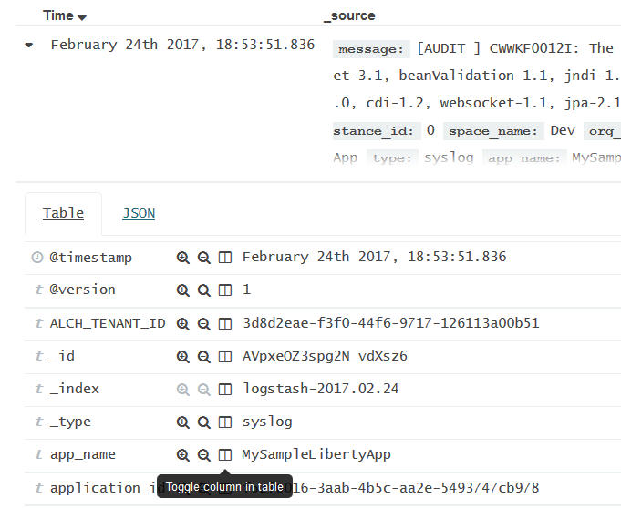
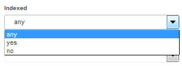

---

copyright:
  years: 2015, 2017

lastupdated: "2017-04-06"

---

{:shortdesc: .shortdesc}
{:new_window: target="_blank"}
{:codeblock: .codeblock}
{:screen: .screen}

# Kibana でのログの対話式分析
{:#kibana_analize_logs_interactively}

「Discover」ページで、{{site.data.keyword.Bluemix}} ログを対話式に表示および分析できます。Lucene 照会言語を使用して、そのデータをフィルタリングする検索照会を定義できます。検索照会ごとに、フィルターを適用して、分析で使用可能な項目を詳細化できます。検索を将来再使用するために保存できます。
{:shortdesc}

{{site.data.keyword.Bluemix_notm}} では、デフォルトで、{{site.data.keyword.Bluemix_notm}} UI から Kibana を起動したときに「Discover」ページに表示されるデータ・セットは、Kibana を起動した Cloud Foundry (CF) アプリケーションまたはコンテナーの項目のみを表示するように構成されています。「Discover」ページで表示されるデータのサブセットを確認する方法について詳しくは、『[「Discover」ページで表示されているデータの識別](logging_kibana_analize_logs_interactively.html#k4_identify_data)』を参照してください。

以下の表では、{{site.data.keyword.Bluemix_notm}} から Kibana を起動したときのリソースごとのデフォルト照会を示します。

| リソース | デフォルトの Kibana 検索照会 |
|---------------|---------------|
| CF アプリケーション   | `application_id:<app_GUID>`    |
| 単一 Docker コンテナー | `instance:<instance_GUID>`    |
| 2 つのインスタンスが含まれたコンテナー・グループ | `instance:<instance_GUID> OR instance:<instance_GUID>` |
{: caption="表 1. デフォルトの検索照会" caption-side="top"}

**注:** 
* {{site.data.keyword.Bluemix_notm}} UI から Kibana を起動するたびに、表示できるデータは、デフォルトで事前定義されていて、索引パターンに基づいた照会に対応します。
* 「Discover」ページでは、最新の項目に対応する最大 500 件の項目が表示されます。この値は、「Settings」ページで変更できます。

ブラウザーから Kibana を起動すると、「Discover」ページに表示されるデータには、ログインしているスペースで使用可能なすべてのログ・データが含まれます。ページは、特定のコンテナーやアプリに制限されません。

「Discover」ページには、データを対話式に分析できるようにカスタマイズ可能なヒストグラムおよび表が含まれます。 

「Discover」ページで表をカスタマイズするために以下のいずれかのタスクを実行できます。

| タスク | 説明 | 
|------|-------------|
| [フィールド列の追加](logging_kibana_analize_logs_interactively.html#kibana_discover_add_fields_to_table) | メッセージ全体ではなく、分析に必要な特定のデータを表示するためにフィールドを追加します。 |
| [フィールド列の並べ替え](logging_kibana_analize_logs_interactively.html#kibana_discover_rearrange_fields_in_table) | 表内のフィールドの位置を必要な位置に移動します。 |
| [項目の表示](logging_kibana_analize_logs_interactively.html#kibana_discover_view_entry_in_table) | 表内の項目を展開して、フィールド別または JSON として解析された項目の詳細を表示します。 |
| [フィールド列の削除](logging_kibana_analize_logs_interactively.html#kibana_discover_remove_fields_from_table) | 分析用にビュー内で不要になったフィールドを削除します。 |
| [索引フィールドの値による項目の配列](logging_kibana_analize_logs_interactively.html#kibana_discover_sort_by_table) | 分析しやすいように項目を再配列します。 |
| [データの自動最新表示](logging_kibana_analize_logs_interactively.html#kibana_discover_view_refresh_interval) | 最新の項目を使用して、表内に表示されるデータを最新表示します。デフォルトでは、最新表示は **OFF** です。 |
{: caption="表 2. 表をカスタマイズするタスク" caption-side="top"}

 

以下の図では、「Discover」ページ内の表のサンプルを示します。

他の検索を定義できます。詳しくは、『[カスタム検索照会の定義によるログのフィルタリング](k4_filter_queries.html#k4_filter_queries)』を参照してください。新規検索を定義すると、ヒストグラムおよび表に表示されるデータが、自動的に更新されます。

新規検索を定義するには、始めにデフォルト検索照会を使用してから、以下のタスクを実行して検索を詳細化します。

* フィールド・フィルターを適用して、表示できるデータ・セットを詳細化します。各フィルターを切り替えたり、ページにピン留めしたり、必要に応じて有効または無効にしたり、値を含める/除外するように構成できます。詳しくは、『[Kibana でのログのフィルタリング](logging_kibana_filtering_logs.html#kibana_filtering_logs)』を参照してください。

    **ヒント:** 「Discover」ページで、表示されるはずのフィールドが*フィールド・リスト* で見つからない場合、またはリストされているフィールドの横にある拡大鏡が無効になっている場合は、「Settings」ページで索引パターンを最新表示することで、フィールドのリストを再ロードしてください。詳しくは、『[フィールド・リストの再ロード](logging_kibana_analize_logs_interactively.html#kibana_discover_view_reload_fields)』を参照してください。

    例えば、CF アプリに複数のインスタンスが含まれている場合、特定の 1 つのインスタンスのデータを分析したいことがあります。分析する特定のインスタンス ID 値のフィールド・フィルターを定義できます。 
    
* 時間ベースのデータ用に*時間ピッカー* をカスタマイズします。照会の絶対時間範囲、相対時間範囲を定義したり、一連の事前定義の値から選択したりすることができます。詳しくは、『[時間フィルターの設定](logging_kibana_set_time_filter.html#set_time_filter)』を参照してください。

分析するデータ・サブセットを定義した検索を構成した後に、後から再使用するためにその検索を保存できます。

「Discover」ページで定義した検索について、以下のいずれかのタスクを実行できます。

| タスク | 説明 |
|------|-------------|
| [検索の保存](logging_kibana_filtering_logs.html#k4_save_search) | 後から再使用するために検索を保存します。  |
| [検索の削除](logging_kibana_filtering_logs.html#k4_delete_search) | 不要になった検索を削除します。 |
| [検索のエクスポート](logging_kibana_filtering_logs.html#k4_export_search) | 検索を共有するためにエクスポートします。  |
| [検索の再ロード](logging_kibana_filtering_logs.html#k4_reload_search)  | データ・セットを分析するために既存の検索を再度アップロードします。 |
| [検索のデータの最新表示](logging_kibana_filtering_logs.html#k4_refresh_search) | 検索で表示されるデータの自動最新表示を構成します。  |
| [検索のインポート](logging_kibana_filtering_logs.html#k4_import_search) | 検索をインポートします。  |
{: caption="表 3. 検索を操作するタスク" caption-side="top"}

 

「Discover」ページでは、以下のように、統計を確認することもできます。
* フィールドごとに統計を確認できます。 
* 構成した `@timestamp` に従って、ヒストグラムで統計を確認できます。

詳しくは、『[フィールド・データ統計の表示](logging_kibana_analize_logs_interactively.html#kibana_discover_view_fields_stats)』を参照してください。

**注:** 表およびヒストグラムで表示されるデータは、静的です。最新の項目を表示し続ける場合は、最新表示間隔を設定する必要があります。 

## 表へのフィールド列の追加
{: #kibana_discover_add_fields_to_table}

デフォルトでは、「Discover」ページでデータを分析するために使用可能な表には、以下のフィールドが含まれています。
* **time:** このフィールドは、項目がいつ {{site.data.keyword.Bluemix_notm}} でキャプチャーおよび記録されたのかを示します。
* **_source:** このフィールドには、項目の元データが含まれます。

以下のいずれかのオプションを選択して、フィールド列を表に追加できます。

* ページで使用可能なフィールド・リストからフィールド列を追加します。

    1. 「Discover」ページで、`「Selected Fields」`セクションでフィールドを識別します。
    2. フィールド・リスト内のフィールドの上にマウスを移動します。
    
        
    
    3. フィールドを追加するには、**「Add」**をクリックします。
    
 * 展開された項目の表ビューからフィールド列を追加します。

    1. 表内の項目を展開します。
    2. 表ビューで、追加するフィールドを識別します。
    
        
    
    3. **「Toggle Column in table」**アイコン  をクリックします。
    

**注:** 1 つのフィールド列を表に初めて追加すると、表で表示される *_source* フィールド列は非表示です。*_source* フィールドでは、各ログ項目の各フィールドの値が表示されます。列を表に追加した後に表内のログ項目の他のフィールド値を表示するには、各項目の表ビュー・タブまたは JSON タブを表示します。

例えば、*application_id* フィールドを表に追加した場合、表は以下のように変更されます。

## データの自動最新表示
{: #kibana_discover_view_refresh_interval}

デフォルトでは、{{site.data.keyword.Bluemix_notm}} において*自動最新表示* の期間は **OFF** に設定されており、Kibana で表示できるデータは、Kibana の起動後の過去 15 分間に対応します。15 分間は、事前構成されている時間フィルターに対応しています。これは、別の期間を設定することで変更できます。詳しくは、『[時間フィルターの設定](logging_kibana_set_time_filter.html#set_time_filter)』を参照してください。

*自動最新表示* の期間を設定するには、以下のステップを実行します。

1. 「Discover」ページのメニュー・バーで時間ピッカー  をクリックします。

2. 自動最新表示ボタン  を選択します。

3. 最新表示間隔を選択します。

    

一時停止ボタン  をクリックして、最新表示間隔を一時停止できます。 

## 「Discover」ページで表示されているデータの識別
{:#k4_identify_data}

Kibana を使用して {{site.data.keyword.Bluemix_notm}} ログを分析した場合、表示できるデータは、Kibana をどのように起動したか、構成されている索引パターン、および適用したカスタム照会とフィルターによって異なります。

「Discover」ページの表およびヒストグラムで使用可能なデータを識別するには、以下の情報を考慮してください。

1. 「Settings」ページの索引パターンを確認します。

    索引パターンは、Kibana ページに項目を表示するためにデフォルトで適用される検索照会を定義します。デフォルトでは、索引パターンは事前構成されており、{{site.data.keyword.Bluemix_notm}} スペースで使用可能なすべてのデータに設定されています。以下に例を示します。

    * Kibana を {{site.data.keyword.Bluemix_notm}} UI から (つまり、Cloud Foundry (CF) アプリケーションやコンテナーなどの特定のリソースの UI ページの「*Log*」セクションから) 起動した場合、適用される索引パターンには、スペースで使用可能なすべての項目が含まれます。
    
    * Kibana をブラウザーから起動した場合、適用される索引パターンには、ログインしている、Kibana で表示されるスペースで使用可能なすべての項目が含まれます。
        
2. 「Discover」ページで照会を確認します。  

    「Discover」ページで表示される照会は、分析用にデフォルトで使用可能な項目をフィルタリングするために使用されます。例えば次のようにします。

    * 検索バーにストリングを入力すると、照会によって、すべてのフィールドでそのストリングがスキャンされます。
    
    * 照会が `application_id:<GUID>` (*GUID* は CF アプリの ID) に設定されている場合、表示できる項目は、索引パターンで構成されているスペース内の当該 CF アプリで使用可能なすべての項目に対応します。
    
    * 照会が `instance_id:<GUID>` (*GUID* はコンテナー・インスタンスの ID) に設定されている場合、表示できる項目は、索引パターンで構成されているスペース内の当該コンテナーで使用可能なすべての項目に対応します。
    
    * 照会が `instance_id:<GUID> AND instance_id:<GUID>` (*GUID* はコンテナー・インスタンスの ID) に設定されている場合、表示できる項目は、索引パターンで構成されているスペース内の当該コンテナー・グループで使用可能なすべての項目に対応します。
   
    * 照会が `*` に設定されている場合、データは、索引パターンで構成されているスペースで使用可能なすべての項目に設定されます。
    
    * 照会が `application_id:<GUID> AND message:"MY_search_text"` (*GUID* は CF アプリの ID、*My_search_text* は検索するストリング) に設定されている場合、表示できる項目は、索引パターンで構成されているスペースで使用可能な当該 CF アプリ項目の message フィールドに *My_search_text* が含まれているすべての項目に対応します。
    
3. 「Discover」ページで照会に適用されるフィールド・フィルターを確認します。

    フィールドの値に基づいて項目を切り替える 0 個以上のフィールド・フィルターを定義できます。例えば、フィールド・フィルターが有効になっている場合、表示できる項目は、そのフィールドの値が一致している項目に対応します。
    

## 索引フィールドの値による項目の配列 
{: #kibana_discover_sort_by_table}

索引付けられているフィールドの表内の項目のみをソートできます。

索引付けられているフィールドを判別するには、以下のステップを実行します。

1. 「Discover」ページで、構成アイコン  をクリックします。ページの**「Selected fields」**セクションでフィールドをフィルタリングできるセクションが表示されます。

    
    
2. 索引付けられるフィールドを指定するには、検索フィールド**「Indexed」**で**「Yes」**を選択します。

    
    
 索引フィールドのリストが表示されます。
 
 
  	
 
索引フィールドの値によって表内の項目をソートするには、以下のステップを実行します。 

1. データのソート基準とする、表内のフィールドの名前の上にマウスを移動します。各種アクション・ボタンが表示されます。
2. データのソート基準とするフィールドのソート・ボタンをクリックします。フィールド・ソート・アイコンをもう一度クリックすると、ソート順が逆になります。

**注:** 時間フィールドでソートした場合、デフォルトでは、項目は、日時の降順にソートされます。最も新しい項目が最初に表示されます。

## 表内のフィールド列の並べ替え
{: #kibana_discover_rearrange_fields_in_table}

表内のフィールド列を並べ替えることができます。移動する列のヘッダーの上にマウスを移動し、**「Move column to the left」**ボタンまたは**「Move column to the right」**ボタンをクリックします。
 

## フィールド・リストの再ロード
{: #kibana_discover_view_reload_fields}

Kibana で表示されるフィールドのリストを再ロードするには、以下のステップを実行します。

1. 「Settings」ページを選択します。

    「Settings」ページを選択すると、「*Indices*」タブが開きます。
   
2. Elasticsearch によって記録されたすべてのフィールドおよびフィールドの関連コア・タイプを表示するように索引パターンを選択します。 

3. *「Reload field list」*ボタン  をクリックして、索引パターン・フィールドを再ロードします。 

フィールドのリストが取得されます。

## 表からのフィールド列の削除
{: #kibana_discover_remove_fields_from_table}

表からフィールドを削除する場合は、以下のステップを実行します。

1. 表で、表ビューから削除するフィールドを識別します。
2. **「Remove column」**をクリックします。
    
    

## 表内の項目の表示
{: #kibana_discover_view_entry_in_table}

表内の項目のデータを表示するには、分析する項目の展開ボタン  をクリックします。 

 	

次に、以下のいずれかのオプションを選択してデータを表示します。

* 表形式でデータを表示するには、**「Table」**をクリックします。表形式の分析用に使用可能な各フィールドの値を表示できます。フィールドごとに、フィルター・ボタンおよび切り替えボタンもあります。
* データを JSON 形式で表示するには、**「JSON」**をクリックします。

## フィールド・データ統計の表示
{: #kibana_discover_view_fields_stats}

「Discover」ページで、*フィールド・リスト* および*ヒストグラム* 内の各フィールドの統計を表示できます。 

フィールド・リストでは、以下の情報を表示できます。
* 表内の、特定のフィールドを含んでいる項目の数。
* 上位 5 位までの値。
* 各値を含んでいる項目のパーセンテージ。

ヒストグラムでは、以下の情報を表示できます。
* 特定の時間範囲内の項目の数。

ヒストグラムで統計を表示するには、タイム・スタンプをクリックして、その期間の統計を確認します。以下に例を示します。 

   	
 	
フィールド・リストでフィールドに関する統計を表示するには、名前をクリックします。以下に例を示します。

