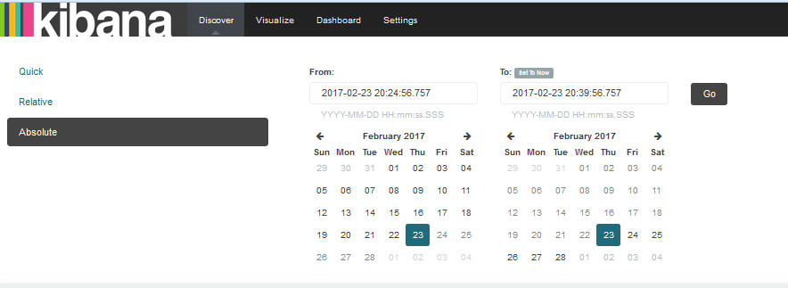

---

copyright:
  years: 2015, 2017

lastupdated: "2017-03-13"

---

{:shortdesc: .shortdesc}
{:new_window: target="_blank"}
{:codeblock: .codeblock}
{:screen: .screen}

# 時間フィルターの設定
{: #set_time_filter}

*時間ピッカー* を構成して、特定の期間内の {{site.data.keyword.Bluemix}} ログを表示およびフィルタリングします。
{:shortdesc}

「Discover」ページで*時間ピッカー* を構成できます。デフォルトでは、過去 15 分間に設定されています。 

特定の時間が含まれた項目を検索するには、以下のステップを実行します。

1. 「Discover」ページのメニュー・バーで時間ピッカー  をクリックします。

2. 時間間隔をセットアップします。 

    以下の時間間隔タイプのいずれかを定義できます。
    
    * Quick: これは事前定義の時間間隔であり、ごく一般的に使用される相対時間間隔と絶対時間間隔の両方が含まれています (例えば、*Today* や *This Month*)。 
    
        
    
    * Relative: これは、開始日時と終了日時を指定できる時間間隔です。時間単位で表すことができます。
    
        
    
    * Absolute: これは、開始日から終了日までの時間間隔です。
    
        
      

時間間隔を構成すると、Kibana で表示されるデータが、その時間範囲内の項目に対応します。

