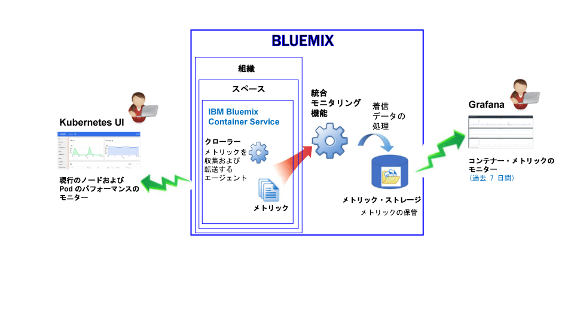
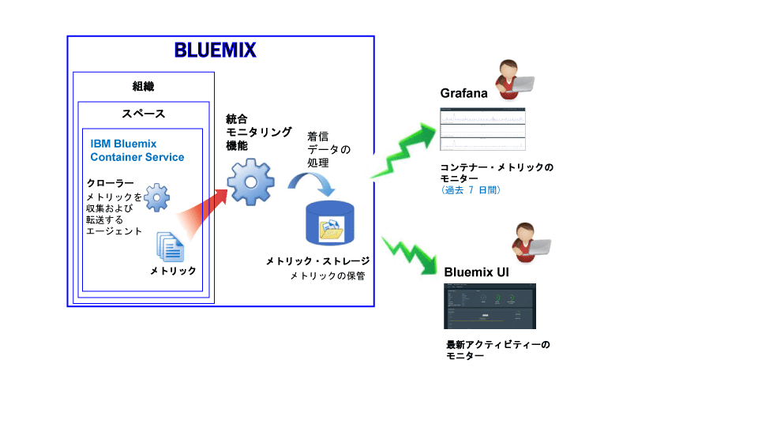

---

copyright:
  years: 2015, 2017

lastupdated: "2017-05-26"

---

{:shortdesc: .shortdesc}
{:new_window: target="_blank"}
{:codeblock: .codeblock}
{:screen: .screen}

# IBM Bluemix Container Service のモニター
{: #monitoring_bmx_containers_ov}

{{site.data.keyword.Bluemix}} では、コンテナーのメトリックがコンテナー外部から自動的に収集されるので、コンテナー内部にエージェントをインストールして保守する必要がありません。
Grafana を使用して、コンテナーのメトリックを視覚化できます。Kubernetes UI を使用して、ノード (ワーカー) およびポッドのメトリックを表示することもできます。
{:shortdesc}

## Kubernetes クラスター内で実行しているコンテナーのメトリックの収集
{: #metrics_containers_kube_ov}

{{site.data.keyword.Bluemix_notm}} では、Kubernetes クラスターにアプリケーションをデプロイする際に以下の情報を考慮してください。

* 1 つの {{site.data.keyword.Bluemix_notm}} アカウントで 1 つ以上の組織を持つことができます。
* 各組織は 1 つ以上の {{site.data.keyword.Bluemix_notm}} スペースを持つことができます。
* 1 つの組織内に 1 つ以上の Kubernetes クラスターを持つことができます。
* Kubernetes クラスターを作成すると、メトリックの収集は自動的に有効になります。
* Kubernetes クラスターは {{site.data.keyword.Bluemix_notm}} スペースに依存しません。ただし、1 つのクラスターとそのリソースに関して収集されるメトリックは、1 つの {{site.data.keyword.Bluemix_notm}} スペースに関連付けられます。
* コンテナーのメトリックの収集は、ポッドがデプロイされるとすぐに行われます。
* メトリックは Grafana または Kubernetes UI で表示できます。
* クラスターのメトリック・データを視覚化するには、そのクラスターが作成されたクラウド・パブリック地域用の Grafana ダッシュボードを構成する必要があります。

クラスターを作成する前に、{{site.data.keyword.Bluemix_notm}} UI またはコマンド・ラインを使用して、特定の {{site.data.keyword.Bluemix_notm}} 地域、アカウント、組織、およびスペースにログインする必要があります。ログインするスペースは、クラスターおよびそのリソースのメトリック・データが収集されるスペースです。

以下の図は、{{site.data.keyword.containershort}} のモニタリングの概要図を示します。

クローラーは、ホストで稼働しているプロセスであり、メトリックに関するエージェントレス・モニタリングを実行します。クローラーは、デフォルトでは、すべてのコンテナーから以下のメトリックを常に収集します。

<table>
  <caption>表 1. デフォルトで収集されるメトリック</caption>
  <tr>
    <th>メトリック・タイプ</th>
    <th>メトリック名</th>
    <th>説明</th>
  </tr>
  <tr>
    <td>メモリー</td>
    <td>*memory_current*</td>
    <td>このメトリックは、コンテナーが現在使用しているメモリーのバイト数を報告します。</td>
  </tr>
  <tr>
    <td>メモリー</td>
    <td>*memory_limit*</td>
    <td>このメトリックは、ポッドに対して設定された最大限度および最小限度と比べて、コンテナーがディスクにスワップすることを許可されるメモリー量について報告します。   デフォルトでは、ポッドはメモリー限度なしで実行されます。ポッドは、実行場所であるワーカーにあるのと同じメモリー量を消費できます。ポッドをデプロイするときに、ポッドが使用できるメモリー量の限度を設定できます。</td>
  </tr>
  <tr>
    <td>CPU</td>
    <td>*cpu_usage*</td>
    <td>このメトリックは、すべてのコアでの CPU 時間 (ナノ秒) を報告します。  CPU 使用量が大きい場合、遅延が生じることがあります。CPU 使用量が大きいということは、処理能力が不十分であることを示します。</td>
  </tr>
  <tr>
    <td>CPU</td>
    <td>*cpu_usage_pct*</td>
    <td>このメトリックは、使用 CPU 時間を CPU の能力に占めるパーセンテージで報告します。  CPU 使用量のパーセンテージが大きい場合、遅延が生じることがあります。CPU 使用量が大きいということは、処理能力が不十分であることを示します。</td>
  </tr>
  <tr>
    <td>CPU</td>
    <td>*cpu_num_cores*</td>
    <td>このメトリックは、コンテナーに使用可能な CPU コアの数について報告します。</td>
  </tr>
</table>

## Bluemix で管理されているコンテナーのメトリックの収集
{: #metrics_containers_bmx_ov}

以下の図は、{{site.data.keyword.containershort}} のモニタリングの概要図を示します。

クローラーは、デフォルトでは、すべてのコンテナーから以下のメトリックを常に収集します。

* CPU
* メモリー
* ネットワーク情報

## Kubernetes クラスター内で実行しているコンテナーのメトリックのモニター
{: #monitoring_metrics_kube}

メトリックは収集され、Kubernetes UI および Grafana の両方で表示されます。

* 分析および視覚化のためのオープン・ソース・プラットフォームである Grafana を使用して、メトリックのモニター、検索、分析、および視覚化を、さまざまなグラフ (図表や表など) を用いて行うことができます。
 
    ブラウザーから Grafana を起動できます。詳しくは、『[Web ブラウザーから Grafana ダッシュボードへのナビゲート](../grafana/navigating_grafana.html#launch_grafana_from_browser)』を参照してください。
    
* Kubernetes UI を使用して、ノードおよびポッドのメトリックを表示できます。詳しくは、「[Web UI ダッシュボード ](https://kubernetes.io/docs/tasks/access-application-cluster/web-ui-dashboard/){: new_window}」を参照してください。

## Bluemix で管理されているコンテナーのメトリックのモニター
{: #monitoring_metrics_bmx}

メトリックは収集され、{{site.data.keyword.Bluemix_notm}} UI および Grafana の両方で表示されます。

* 分析および視覚化のためのオープン・ソース・プラットフォームである Grafana を使用して、メトリックのモニター、検索、分析、および視覚化を、さまざまなグラフ (図表や表など) を用いて行うことができます。
 
    Grafana は、{{site.data.keyword.Bluemix_notm}} UI またはブラウザーから起動できます。詳しくは、『[Grafana ダッシュボードへのナビゲート](../grafana/navigating_grafana.html#navigating_grafana)』を参照してください。
    

* {{site.data.keyword.Bluemix_notm}} UI を使用して、最新メトリックを表示できます。

    {{site.data.keyword.Bluemix_notm}} UI でメトリックを表示するには、『[Bluemix コンソールからのメトリックの分析](analyzing_metrics_bmx_ui.html#analyzing_metrics_bmx_ui)』を参照してください。

## メトリックの保存
{: #metrics_retention}

収集されるのは、1 分間につき最大 1 データ・ポイントです。7 日以内に書き込まれなかったコンテナー・メトリックは削除されます。
    

