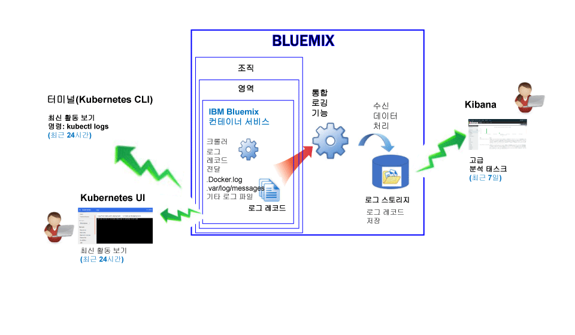
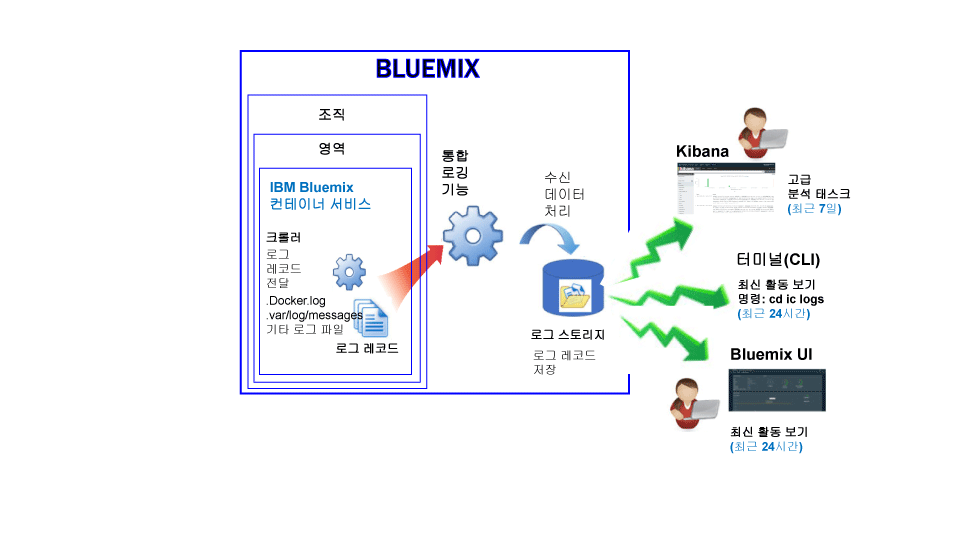

---

copyright:
  years: 2015, 2017

lastupdated: "2017-05-23"

---

{:shortdesc: .shortdesc}
{:new_window: target="_blank"}
{:codeblock: .codeblock}
{:screen: .screen}


# IBM Bluemix 컨테이너 서비스에 대한 로깅
{: #logging_containers_ov}

{{site.data.keyword.IBM}} 관리 클라우드 인프라에 배치된 Docker 컨테이너와 Kubernetes 클러스터에서 실행되는 Docker 컨테이너의 로그를 보고, 필터링하고 분석할 수 있습니다. 컨테이너의 로깅은 컨테이너를 {{site.data.keyword.Bluemix_notm}} 또는 Kubernetes 클러스터에 배치할 때 자동으로 사용으로 설정됩니다.
{:shortdesc}

크롤러를 사용하여 컨테이너 외부에서 컨테이너 로그를 모니터하고 전달합니다. 데이터는 크롤러가
{{site.data.keyword.Bluemix_notm}}의 다중 테넌트 Elasticsearch에 전달합니다.


## Kubernetes 클러스터에서 실행되는 컨테이너의 로그 수집
{: #logging_containers_ov_logs_collected_kubernetes}

다음 그림은 {{site.data.keyword.containershort}}의 로깅에 대한 상위 레벨 보기를 보여줍니다. 



{{site.data.keyword.Bluemix_notm}}에서 Kubernetes 클러스터에 애플리케이션을 배치할 때는 다음 정보를 고려하십시오. 

* {{site.data.keyword.Bluemix_notm}} 계정에서는 1개 이상의 조직을 보유할 수 있습니다.  
* 각 조직에는 1개 이상의 {{site.data.keyword.Bluemix_notm}} 영역이 있을 수 있습니다.  
* 조직에는 1개 이상의 Kubernetes 클러스터가 있을 수 있습니다.  
* 로그 수집은 Kubernetes 클러스터를 작성할 때 자동으로 사용으로 설정됩니다.  
* Kubernetes 클러스터는 {{site.data.keyword.Bluemix_notm}} 영역에 구속되지 않습니다. 하지만 클러스터 및 해당 리소스의 로그 데이터는 {{site.data.keyword.Bluemix_notm}} 영역과 연관됩니다. 
* 포드가 배치되는 즉시 애플리케이션의 로그 데이터가 수집됩니다. 
* 클러스터의 로그 데이터를 분석하려면 클러스터가 작성된 클라우드 퍼블릭 지역에 대한 Kibana 대시보드에 액세스해야 합니다. 

클러스터를 작성하려면 먼저 [{{site.data.keyword.Bluemix_notm}} UI](../../../containers/cs_cluster.html#cs_cluster_ui) 또는 [명령행](../../../containers/cs_cluster.html#cs_cluster_cli)을 통해 특정 {{site.data.keyword.Bluemix_notm}} 지역, 계정, 조직 및 영역에 로그인해야 합니다. 사용자가 로그인하는 영역이 클러스터 및 해당 리소스의 로깅 데이터가 수집되는 영역입니다. 

기본적으로 컨테이너 프로세스가 stdout(표준 출력) 및 stderr(표준 오류)에 출력하는 정보가 수집됩니다. stdout 및 stderr으로의 정보 전송은 컨테이너의 정보 노출에 대한 표준 Docker 규칙입니다.  

컨테이너에서 실행되는 앱의 로그 데이터를 JSON 형식으로 Docker 로그 콜렉터에 전달하는 경우에는 JSON 필드를 사용하여 Kibana에서 로그 데이터를 검색하고 분석할 수 있습니다. 자세한 정보는 [사용자 정의 필드를 Kibana 검색 필드로 구성](logging_containers_ov.html#send_data_in_json)을 참조하십시오. 

**참고:** Kubernetes 클러스터에 대해 작업하는 경우 네임스페이스 *ibm-system* 및 *kube-system*은 예약되어 있습니다. 이러한 네임스페이스에서 사용 가능한 리소스의 권한을 작성하거나, 삭제하거나, 수정하거나 변경하지 마십시오. 이러한 네임스페이스에 대한 로그는 {{site.data.keyword.IBM_notm}}용입니다. 


## Bluemix에서 관리되는 컨테이너의 로그 수집
{: #logging_containers_ov_logs_collected}

다음 그림은 {{site.data.keyword.containershort}}의 로깅에 대한 상위 레벨 보기를 보여줍니다. 



기본적으로 다음 로그는 {{site.data.keyword.Bluemix_notm}} 관리 클라우드 인프라에 배치된 컨테이너에 대해 수집됩니다. 

<table>
  <caption>표 2. Bluemix 관리 클라우드 인프라에 배치된 컨테이너에 대해 수집되는 로그</caption>
  <tbody>
    <tr>
      <th align="center">로그</th>
      <th align="center">설명</th>
    </tr>
    <tr>
      <td align="left" width="30%">/var/log/messages</td>
      <td align="left" width="70%"> 기본적으로 Docker 메시지는 컨테이너의 /var/log/messages 폴더에 저장됩니다. 이 로그에는 시스템 메시지가 들어 있습니다.
      </td>
    </tr>
    <tr>
      <td align="left">./docker.log</td>
      <td align="left">이 로그는 Docker 로그입니다. <br> Docker 로그 파일은 컨테이너 내의 파일로서 저장되지는 않지만, 그래도 이 파일은 수집됩니다. 컨테이너의 stdout(표준 출력)과 stderr(표준 오류) 정보를 노출하는 표준 Docker 규칙이므로 이 로그 파일이 기본적으로 수집됩니다. 컨테이너 프로세스가 stdout 또는 stderr에 출력하는 정보가 수집됩니다.
      </td>
     </tr>
  </tbody>
</table>

추가 로그를 수집하려면 컨테이너를 작성할 때 로그 파일의 경로와 함께 **LOG_LOCATIONS** 환경 변수를 추가하십시오. 여러 로그 파일을 쉼표로 구분하여 추가할 수 있습니다. 자세한 정보는 [컨테이너에서 기본이 아닌 로그 데이터 수집](logging_containers_other_logs.html#logging_containers_collect_data)을 참조하십시오.


##  사용자 정의 필드를 Kibana 검색 필드로 구성 
{: #send_data_in_json}

기본적으로 로깅은 컨테이너에 대해 자동으로 사용으로 설정됩니다. Docker 로그 파일의 모든 항목은 Kibana에서 필드 `message`에 표시됩니다. 컨테이너 로그 항목의 일부인 특정 필드를 사용하여 Kibana에서 데이터를 필터링하고 분석해야 하는 경우에는 유효한 JSON 형식화된 출력을 전송하도록 애플리케이션을 구성하십시오. 

다음 정보를 고려하십시오. 

* Kubernetes 클러스터에 배치된 컨테이너의 경우, 메시지를 JSON 형식으로 stdout(표준 출력) 및 stderr(표준 오류)에 로그하십시오. 

    메시지에서 사용 가능한 각 필드는 값에 적합한 필드 유형으로 구문 분석됩니다. 예를 들어, 다음 JSON 메시지의 각 필드는, 
    
    ```
    {"field1":"string type",
        "field2":123,
        "field3":false,
        "field4":"4567"
    }
    ```
    
    다음과 같이 필터링 및 검색에 사용할 수 있는 필드로 사용 가능합니다. 
    
    * `field1`은 문자열 유형의 `field1_str`로 구문 분석됩니다. 
    * `field2`는 정수 유형의 `field1_int`로 구문 분석됩니다. 
    * `field3`은 부울 유형의 `field3_bool`로 구문 분석됩니다. 
    * `field4`는 문자열 유형의 `field4_str`로 구문 분석됩니다. 
    
* {{site.data.keyword.Bluemix_notm}} 관리 클라우드 인프라에 배치된 컨테이너의 경우, 다음 단계를 완료하여 컨테이너 로그 항목을 개별 필드로 구문 분석하십시오. 

    1. 메시지를 파일에 로그하십시오.  
    2. 컨테이너에서 분석에 사용할 수 있는 기본이 아닌 로그 목록에 로그 파일을 추가하십시오. 자세한 정보는 [컨테이너에서 기본이 아닌 로그 데이터 수집](logging_containers_other_logs.html#logging_containers_collect_data)을 참조하십시오. 
    
   메시지를 파일에 로그하며 메시지가 유효한 JSON으로 판별되는 경우, 필드가 구문 분석되며 메시지 내의 각 필드에 대해 새 필드가 작성됩니다. Kibana에서는 필터링하고 정렬하는 데 문자열 유형 필드 값만 사용할 수 있습니다. 


## Kubernetes 클러스터에서 실행되는 컨테이너의 컨테이너 로그 보기
{: #logging_containers_ov_methods_view_kube}

다음 방법 중 하나를 사용하여 Kubernetes 포드에 있는 컨테이너에 대한 최신 로그를 볼 수 있습니다. 

* Kubernetes UI를 통해 로그를 봅니다. 각 포드를 선택하여 해당 로그에 액세스할 수 있습니다. 자세한 정보는 [Web UI 대시보드 ](https://kubernetes.io/docs/tasks/access-application-cluster/web-ui-dashboard/){: new_window}를 참조하십시오. 

* Kubernetes CLI 명령 [kubectl logs ](http://vishh.github.io/docs/user-guide/kubectl/kubectl_logs/){: new_window}를 사용하여 로그를 봅니다.  

오랜 기간에 대한 로그를 보려는 경우에는 Kibana를 사용할 수 있습니다. 데이터 보존 기간 정책에 대해 알아보려면 [로그 보존](logging_containers_ov.html#logging_containers_ov_log_retention) 정보를 확인하십시오. 


## Bluemix에서 관리되는 컨테이너의 컨테이너 로그 보기
{: #logging_containers_ov_methods_view_bmx}

다음 방법 중 하나를 사용하여 {{site.data.keyword.Bluemix_notm}} 관리 클라우드 인프라에 배치된 컨테이너에 대한 최신 로그를 볼 수 있습니다. 

* {{site.data.keyword.Bluemix_notm}} UI를 통해 로그를 보고 컨테이너의 최신 활동을 모니터합니다. 
    
    각 컨테이너에 사용 가능한 **모니터링 및 로그** 탭을 통해 로그를 보고 필터링하며 분석할 수 있습니다. 자세한 정보는 [Bluemix 대시보드에서 로그 분석](../logging_view_dashboard.html#analyzing_logs_bmx_ui)을 참조하십시오.
    
    
* {site.data.keyword.containershort}} CLI를 사용하여 로그를 봅니다. 로그를 프로그래밍 방식으로 관리하려면 명령을 사용하십시오. 
    
    **cf ic logs** 명령을 사용하여 명령행 인터페이스를 통해 로그를 보고 필터링하고 분석할 수 있습니다. 자세한 정보는 [명령행 인터페이스에서 로그 분석](../logging_view_cli.html#analyzing_logs_cli)을 참조하십시오.


## 컨테이너 로그 분석
{: #logging_containers_ov_methods}

컨테이너 로그 데이터를 분석하려면 Kibana를 사용하여 고급 분석 태스크를 수행하십시오. 오픈 소스 분석 및 시각화 플랫폼인 Kibana를 사용하여 데이터를 모니터링하고 검색하고 분석하고 다양한 그래프(예: 차트와 테이블)로 시각화할 수 있습니다. 자세한 정보는 [Kibana에서 로그 분석](../kibana4/analyzing_logs_Kibana.html#analyzing_logs_Kibana)을 참조하십시오.


## 로그 보존
{: #logging_containers_ov_log_retention}

로그 보존에 대한 다음 정보를 고려하십시오.

* 데이터 영역당 최대 1GB가 매일 저장됩니다. 1GB 상한을 초과하는 로그는 버립니다. 상한 할당은 협정 세계시(UTC)로 매일 오전 12:30에
재설정됩니다. 

    지원 센터에 문의하여 상한을 늘릴 수 있습니다. 지원 티켓에 상한 증가 요청을 할 영역 ID, 새로운 상한 크기 및 요청 이유를 포함시키십시오.

* 최대 7일 동안 최대 7GB의 데이터를 검색할 수 있습니다. 7GB의 데이터에 도달하거나 7일이 지나면 로그 데이터가 롤오버됩니다(선입선출).

## 튜토리얼: Kubernetes 클러스터에 배치된 앱에 대한 Kibana에서의 로그 분석
{: #tutorial1}

Kibana를 사용하여 Kubernetes 클러스터에 배치된 컨테이너의 로그를 분석하는 방법을 알아보려면 [튜토리얼: Kubernetes 클러스터에 배치된 앱에 대한 Kibana에서의 로그 분석](tutorials/kibana_tutorial_1.html#kibana_tutorial_1)을 참조하십시오. 


