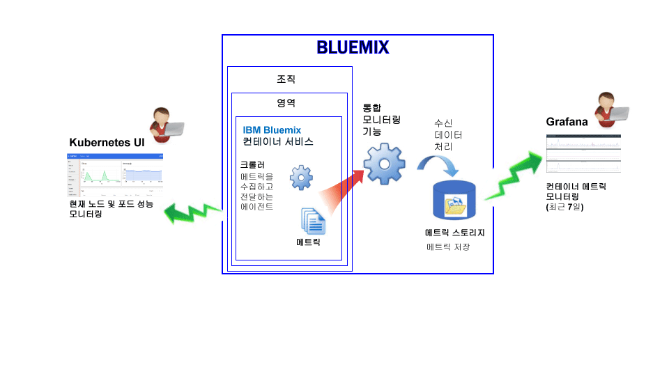
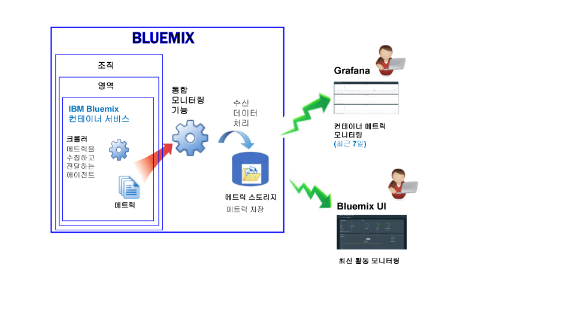

---

copyright:
  years: 2015, 2017

lastupdated: "2017-05-26"

---

{:shortdesc: .shortdesc}
{:new_window: target="_blank"}
{:codeblock: .codeblock}
{:screen: .screen}

# IBM Bluemix 컨테이너 서비스 모니터링
{: #monitoring_bmx_containers_ov}

{{site.data.keyword.Bluemix}}에서는 컨테이너 내부에 에이전트를 설치하고 유지보수하지 않아도 컨테이너 외부에서 자동으로 컨테이너 메트릭이 수집됩니다.
Grafana를 사용하여 컨테이너 메트릭을 시각화할 수 있습니다. Kubernetes UI를 사용하여 노드(작업자) 및 포드의 메트릭을 볼 수도 있습니다.
{:shortdesc}

## Kubernetes 클러스터에서 실행되는 컨테이너의 메트릭 수집
{: #metrics_containers_kube_ov}

{{site.data.keyword.Bluemix_notm}}에서 Kubernetes 클러스터에 애플리케이션을 배치할 때는 다음 정보를 고려하십시오. 

* {{site.data.keyword.Bluemix_notm}} 계정에서는 1개 이상의 조직을 보유할 수 있습니다. 
* 각 조직에는 1개 이상의 {{site.data.keyword.Bluemix_notm}} 영역이 있을 수 있습니다. 
* 조직에는 1개 이상의 Kubernetes 클러스터가 있을 수 있습니다. 
* 메트릭 수집은 Kubernetes 클러스터를 작성할 때 자동으로 사용으로 설정됩니다. 
* Kubernetes 클러스터는 {{site.data.keyword.Bluemix_notm}} 영역에 구속되지 않습니다. 하지만 클러스터 및 해당 리소스에 대해 수집된 메트릭은 {{site.data.keyword.Bluemix_notm}} 영역과 연관됩니다. 
* 포드가 배치되는 즉시 컨테이너의 메트릭이 수집됩니다. 
* 메트릭은 Grafana 또는 Kubernetes UI에서 볼 수 있습니다. 
* 클러스터의 메트릭 데이터를 시각화하려면 클러스터가 작성된 클라우드 퍼블릭 지역의 Grafana 대시보드에 액세스해야 합니다. 

클러스터를 작성하려면 먼저 {{site.data.keyword.Bluemix_notm}} UI 또는 명령행을 통해 특정 {{site.data.keyword.Bluemix_notm}} 지역, 계정, 조직 및 영역에 로그인해야 합니다. 사용자가 로그인하는 영역이 클러스터 및 해당 리소스의 메트릭 데이터가 수집되는 영역입니다. 

다음 그림은 {{site.data.keyword.containershort}}의 모니터링에 대한 상위 레벨 보기를 보여줍니다. 

크롤러는 호스트에서 실행되며 메트릭에 대한 에이전트 없는 모니터링을 수행하는 프로세스입니다. 크롤러는 기본적으로 모든 컨테이너에 대해 다음 메트릭을 지속적으로 수집합니다. 

<table>
  <caption>표 1. 기본적으로 캡처되는 메트릭</caption>
  <tr>
    <th>메트릭 유형</th>
    <th>메트릭 이름</th>
    <th>설명</th>
  </tr>
  <tr>
    <td>메모리</td>
    <td>*memory_current*</td>
    <td>이 메트릭은 컨테이너에서 현재 사용 중인 메모리(바이트)를 보고합니다. </td>
  </tr>
  <tr>
    <td>메모리</td>
    <td>*memory_limit*</td>
    <td>이 메트릭은 컨테이너가 디스크로 스왑할 수 있도록 허용된 메모리 양을 포드에 대해 설정된 최대 및 최소 한계와 비교하여 보고합니다.    기본적으로 포드는 무제한의 메모리 한계로 실행됩니다. 포드는 자신이 실행 중인 작업자만큼의 메모리를 이용할 수 있습니다. 포드를 배치할 때는 포드가 사용할 수 있는 메모리의 양을 제한할 수 있습니다. </td>
  </tr>
  <tr>
    <td>CPU</td>
    <td>*cpu_usage*</td>
    <td>이 메트릭은 모든 코어의 CPU 시간(나노초(ns))을 보고합니다.   CPU 사용량이 높은 경우에는 지연이 발생할 수 있습니다. 높은 CPU 사용량은 처리 능력이 충분하지 않음을 나타냅니다. </td>
  </tr>
  <tr>
    <td>CPU</td>
    <td>*cpu_usage_pct*</td>
    <td>이 메트릭은 사용되는 CPU 시간을 CPU 용량의 백분율로 보고합니다.   CPU 사용량 백분율이 높은 경우에는 지연이 발생할 수 있습니다. 높은 CPU 사용량은 처리 능력이 충분하지 않음을 나타냅니다. </td>
  </tr>
  <tr>
    <td>CPU</td>
    <td>*cpu_num_cores*</td>
    <td>이 메트릭은 컨테이너에서 사용 가능한 CPU 코어의 수를 보고합니다. </td>
  </tr>
</table>

## Bluemix에서 관리되는 컨테이너의 메트릭 수집
{: #metrics_containers_bmx_ov}

다음 그림은 {{site.data.keyword.containershort}}의 모니터링에 대한 상위 레벨 보기를 보여줍니다. 

크롤러는 기본적으로 모든 컨테이너에 대해 다음 메트릭을 지속적으로 수집합니다. 

* CPU
* 메모리
* 네트워크 정보

## Kubernetes 클러스터에서 실행되는 컨테이너의 메트릭 모니터링
{: #monitoring_metrics_kube}

메트릭은 Kubernetes UI 및 Grafana 둘 다에서 수집되어 표시됩니다. 

* 메트릭을 모니터하고, 검색하고, 분석하고, 다양한 그래프(예: 차트 및 표)로 시각화하려면 오픈 소스 분석 및 시각화 플랫폼인 Grafana를 사용하십시오. 
 
    Grafana는 브라우저에서 시작할 수 있습니다. 자세한 정보는 [웹 브라우저에서 Grafana 대시보드로 이동](../grafana/navigating_grafana.html#launch_grafana_from_browser)을 참조하십시오.
    
* 노드 및 포드의 메트릭을 보려면 Kubernetes UI를 사용하십시오. 자세한 정보는 [Web UI 대시보드 ](https://kubernetes.io/docs/tasks/access-application-cluster/web-ui-dashboard/){: new_window}를 참조하십시오. 

## Bluemix에서 관리되는 컨테이너의 메트릭 모니터링
{: #monitoring_metrics_bmx}

메트릭은 {{site.data.keyword.Bluemix_notm}} UI 및 Grafana 둘 다에서 수집되어 표시됩니다. 

* 메트릭을 모니터하고, 검색하고, 분석하고, 다양한 그래프(예: 차트 및 표)로 시각화하려면 오픈 소스 분석 및 시각화 플랫폼인 Grafana를 사용하십시오. 
 
    Grafana는 {{site.data.keyword.Bluemix_notm}} UI 또는 브라우저에서 시작할 수 있습니다. 자세한 정보는 [Grafana 대시보드로 이동](../grafana/navigating_grafana.html#navigating_grafana)을 참조하십시오. 
    

* 최신 메트릭을 보려면 {{site.data.keyword.Bluemix_notm}} UI를 사용하십시오. 

    메트릭을 {{site.data.keyword.Bluemix_notm}} UI에서 보려는 경우에는 [Bluemix 콘솔에서 메트릭 분석](analyzing_metrics_bmx_ui.html#analyzing_metrics_bmx_ui)을 참조하십시오. 

## 메트릭 보존
{: #metrics_retention}

분당 최대 한 개의 데이터 점이 수집됩니다. 7일 내에 작성되지 않은 컨테이너 메트릭은 삭제됩니다. 
    

