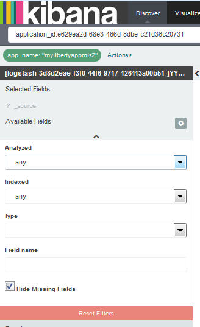

---

copyright:
  years: 2015, 2017

lastupdated: "2017-03-13"

---


{:shortdesc: .shortdesc}
{:new_window: target="_blank"}
{:codeblock: .codeblock}
{:screen: .screen}

# Filtrando seus logs para um texto específico em um valor de campo
{:#k4_filter_logs_spec_text}

Visualize e procure por entradas que incluam um texto específico no valor de um campo.{:shortdesc}

**Aviso:** é possível fazer uma procura de texto livre somente de campos de sequência
que forem analisados pelo analisador Elasticsearch. 
    
Quando o Elasticsearch analisa o valor de um campo de sequência, ele divide o texto em limites de
palavras, conforme definido pelo Consórcio de Unicode, remove a pontuação e coloca todas as
palavras em letras minúsculas.
    
Conclua as etapas a seguir para procurar por entradas que incluam texto específico em um valor de campo:

1. Consulte a página Descobrir do Kibana para ver qual subconjunto de seus dados é exibido. Para
obter mais informações, consulte
[Identificando os dados que são
exibidos em sua página Descobrir do Kibana]((logging_kibana_analize_logs_interactively.html#k4_identify_data).

2. Identifique os campos que são analisados no ElasticSearch por padrão.

    Para exibir a lista completa de campos analisados que estão disponíveis para procura e filtragem
de dados de log,
[recarregue a
lista de campos](logging_kibana_analize_logs_interactively.html#kibana_discover_view_reload_fields). Em seguida, na Lista de campos que está disponível na página Descobrir,
conclua as etapas a seguir:
    
    1. Clique no ícone de configuração . A seção **Campos selecionados**, na qual é possível

filtrar campos, é exibida.

        

    
    2. Para identificar os campos que estiverem analisados, selecione **Sim** para o
campo de procura **Analisados**.

        
    
        A lista de campos analisados é mostrada. 
    
        
        
         
    3. Verifique se o campo no qual deseja procurar por texto livre é um campo que é analisado pelo
ElasticSearch por padrão.
    
3. Se o campo for analisado, modifique a consulta para procurar por entradas nos logs que incluam esse
texto livre como parte do valor de um campo.

    
**Exemplo**

Se você ativar o Kibana para um aplicativo Cloud Foundry (CF) na IU do
{{site.data.keyword.Bluemix}} e desejar procurar por uma mensagem específica que inclua o ID de
mensagem *CWWKT0016I:*, modifique a procura para incluir o texto livre.
    
1. Verifique a consulta de procura que é carregada e os dados que são exibidos na página Descobrir. 
       
    
        
2. Para procurar pelo ID de mensagem *CWWKT0016I*, modifique a consulta de procura e
pressione **Enter**:
    
    ```
	application_id:f52f6016-3aab-4b5c-aa2e-5493747cb978 AND message:"CWWKT0016I:" 
	```
        
    
      
    
A tabela mostra as entradas para seu app CF no qual o texto *CWWKT0016I* faz parte do valor
no campo *mensagem*.
    
 	
        
 
 
