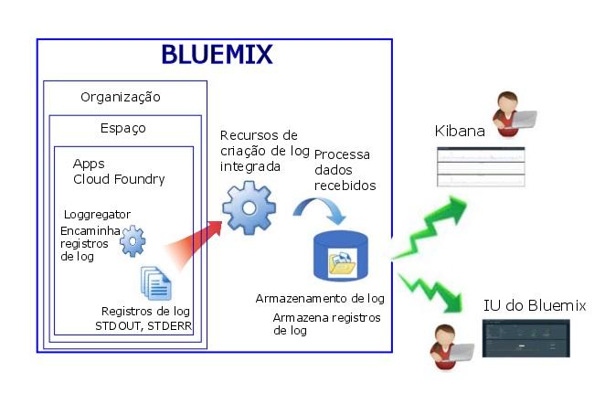

---

copyright:
  years: 2015, 2017

lastupdated: "2017-03-13"

---

{:shortdesc: .shortdesc}
{:new_window: target="_blank"}
{:codeblock: .codeblock}
{:screen: .screen}

# Criação de log para apps Cloud Foundry no Bluemix
{: #logging_bluemix_cf_apps}

No {{site.data.keyword.Bluemix}}, é possível visualizar, filtrar e analisar logs do
Cloud Foundry (CF) por meio do painel do {{site.data.keyword.Bluemix_notm}}, do Kibana e da interface da linha de
comandos. Além disso, é possível transmitir registros de log para uma ferramenta de gerenciamento de log externo. 
{:shortdesc}

Ao executar seus apps em uma plataforma como serviço (PaaS) de nuvem, como Cloud Foundry no {{site.data.keyword.Bluemix_notm}}, não é possível usar SSH ou FTP na infraestrutura na qual seus apps estão em execução para acessar os logs. A plataforma é controlada pelo provedor em nuvem. Os apps Cloud Foundry em execução no {{site.data.keyword.Bluemix_notm}} usam o componente Loggerator para encaminhar os registros de log de dentro da infraestrutura do Cloud Foundry. O Loggregator seleciona automaticamente os dados STDOUT e STDERR. É possível visualizar e analisar esses logs por meio do painel do {{site.data.keyword.Bluemix_notm}}, Kibana e da interface da linha de comandos.

A figura a seguir mostra uma visualização de alto nível de criação de log de apps Cloud Foundry no {{site.data.keyword.Bluemix_notm}}:

 
A criação de log de apps Cloud Foundry é ativada automaticamente ao usar a infraestrutura do Cloud Foundry para executar seus apps no {{site.data.keyword.Bluemix_notm}}. 
Para visualizar os logs de tempo de execução do Cloud Foundry, deve-se gravar os logs em STDOUT e STDERR. Para obter mais informações, veja [Criação de log do aplicativo de tempo de execução por meio de apps CF](cfapps/logging_writing_to_log_from_cf_app.html#logging_writing_to_log_from_cf_app).

O {{site.data.keyword.Bluemix_notm}} mantém uma quantia limitada de informação de log. Quando as informações são
registradas, as informações antigas são substituídas pelas informações mais novas. Caso precise obedecer às políticas organizacionais ou de segmento de mercado que requeiram que você guarde todas ou parte das informações de log para auditoria ou outros propósitos, será possível transmitir seus logs para um host do log externo, como um serviço de gerenciamento de log de terceiro ou outro host. Para obter mais informações, veja [Configurando hosts do log externo](logging_view_external.html#viewing_logs_external).

## Métodos para analisar logs de app CF
{: #logging_bluemix_cf_apps_log_methods}

É possível escolher qualquer um dos métodos a seguir para analisar os logs de seu aplicativo Cloud Foundry:

* Analise o log no {{site.data.keyword.Bluemix_notm}} para visualizar a atividade mais recente do aplicativo.
    
    No {{site.data.keyword.Bluemix_notm}}, é possível visualizar, filtrar e analisar logs por meio do painel da guia **Log** que está disponível para cada aplicativo Cloud Foundry. Para obter mais informações, veja [Analisando logs do app CF no painel do Bluemix](logging_view_dashboard.html#analyzing_logs_bmx_ui).
    
* Analise os logs no Kibana para executar tarefas analíticas avançadas.
    
    No {{site.data.keyword.Bluemix}}, é possível usar o Kibana, uma plataforma de software livre para análise de dados e visualização, para monitorar, procurar, analisar e visualizar seus dados em uma variedade de gráficos, por exemplo, diagramas e tabelas. Para obter mais informações, veja [Analisando logs no Kibana](kibana4/logging_analyzing_logs_Kibana.html#analyzing_logs_Kibana).

* Analise os logs por meio da CLI para usar comandos para gerenciar logs programaticamente.
    
    No {{site.data.keyword.Bluemix}}, é possível visualizar, filtrar e analisar logs por meio da interface da linha de comandos usando o comando **cf logs**. Para obter mais informações, veja [Analisando logs do app Cloud Foundry na interface da linha de comandos](logging_view_cli.html#analyzing_logs_cli).

## Origens de log para apps CF
{: #logging_bluemix_cf_apps_log_sources}

Para aplicativos Cloud Foundry (CF), as origens de log a seguir estão disponíveis:
    
| Origem de log | Component name | Descrição | 
|------------|----------------|-------------|
| LGR | Loggregator | O componente LGR fornece informações sobre o Cloud Foundry Loggregator, que
encaminha os logs de dentro do Cloud Foundry. |
| RTR | Roteador | O componente RTR fornece informações sobre solicitações de HTTP para um
aplicativo. | 
| STG | Temporariedade | O componente STG fornece informações sobre como um aplicativo é montado
ou remontado. | 
| APLICATIVO | Aplicativo | O componente APP fornece logs do aplicativo. É neste local que o stderr e o stdout aparecerão em seu código. | 
| API | Cloud Foundry API | O componente API fornece informações sobre as ações
internas que resultam da solicitação de um usuário para mudar o estado de um aplicativo. | 
| DEA | Droplet Execution Agent | O componente DEA fornece informações sobre o
início, a parada ou o travamento de um aplicativo.
  Esse componente estará disponível somente se seu aplicativo for implementado na arquitetura Cloud Foundry que é baseada no DEA. | 
| CÉLULA | Célula Diego | O componente CELL fornece informações sobre o início, a parada ou o
travamento de um aplicativo.
  Esse componente estará disponível somente se seu aplicativo for implementado na arquitetura Cloud Foundry que é baseada no Diego.|
| SSH | SSH | O componente SSH fornece informações cada vez que um usuário acessa um aplicativo usando o
comando **cf ssh**.
Esse componente estará disponível somente se seu aplicativo for implementado na arquitetura Cloud Foundry que é baseada no Diego. |

A figura a seguir mostra os diferentes componentes (origens de log) em uma arquitetura Cloud Foundry que é
baseada no Droplet Execution Agent (DEA):  em uma arquitetura Cloud Foundry que é baseada no Droplet Execution Agent (DEA).")

