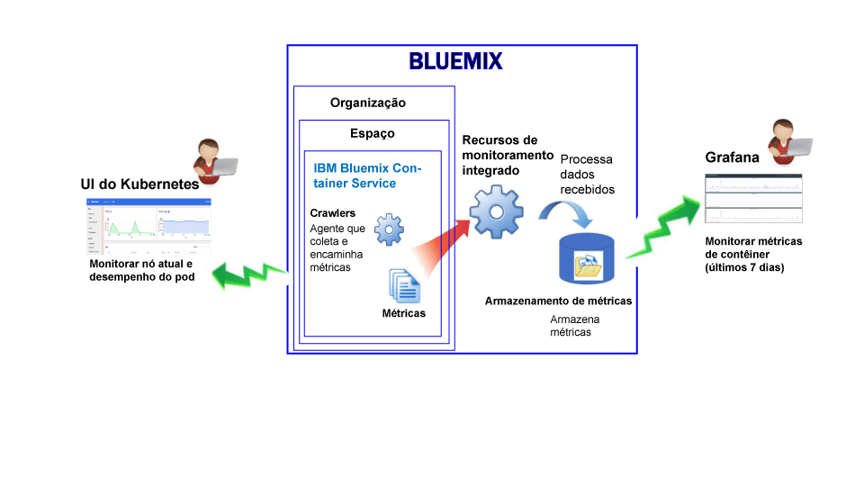
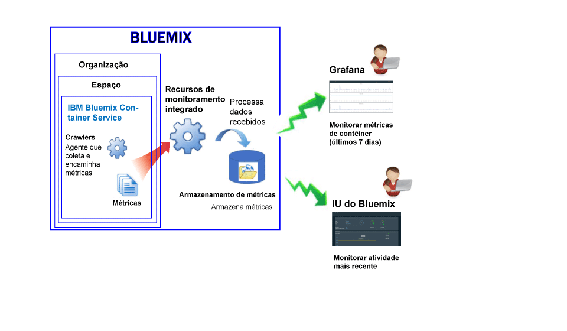

---

copyright:
  years: 2015, 2017

lastupdated: "2017-05-26"

---

{:shortdesc: .shortdesc}
{:new_window: target="_blank"}
{:codeblock: .codeblock}
{:screen: .screen}

# Monitoramento para o IBM Bluemix Container Service
{: #monitoring_bmx_containers_ov}

No {{site.data.keyword.Bluemix}}, as métricas do contêiner são coletadas automaticamente de fora
do contêiner, sem precisar instalar e manter agentes dentro do contêiner. É possível usar o Grafana para visualizar as métricas do contêiner. Também é possível usar a UI do Kubernetes para visualizar métricas para nós (trabalhadores) e pods.
{:shortdesc}

## Coletando métricas para um contêiner que é executado em um cluster do Kubernetes
{: #metrics_containers_kube_ov}

No {{site.data.keyword.Bluemix_notm}}, ao implementar aplicativos em um cluster do Kubernetes, considere as informações a seguir:

* Em uma conta do {{site.data.keyword.Bluemix_notm}}, é possível ter 1 ou mais organizações.
* Cada organização pode ter 1 ou mais espaço do {{site.data.keyword.Bluemix_notm}}.
* É possível ter 1 ou mais clusters do Kubernetes em uma organização.
* A coleção de métricas é ativada automaticamente quando você cria um cluster do Kubernetes.
* Um cluster do Kubernetes é agnóstico de espaços do {{site.data.keyword.Bluemix_notm}}. No entanto, as métricas coletadas para um cluster e seus recursos são associadas a um espaço do {{site.data.keyword.Bluemix_notm}}.
* As métricas são coletadas para um contêiner assim que o pod é implementado.
* É possível visualizar métricas em Grafana ou na UI do Kubernetes.
* Para visualizar dados de métrica para um cluster, deve-se configurar os painéis do Grafana para a região Pública de Nuvem na qual o cluster é criado.

Antes de criar um cluster, por meio da UI do {{site.data.keyword.Bluemix_notm}} ou por meio da linha de comandos, deve-se efetuar login em uma região, uma conta, uma organização e um espaço específico do {{site.data.keyword.Bluemix_notm}}. O espaço no qual você está com login efetuado é o espaço no qual os dados de métrica para o cluster e seus recursos são coletados.

A figura a seguir mostra uma visualização de alto nível de monitoramento para o {{site.data.keyword.containershort}}:

O crawler é um processo que está em execução no host e executa o monitoramento sem agente para métricas. O crawler coleta constantemente as métricas a seguir de todos os contêineres por padrão:

<table>
  <caption>Tabela 1.  As métricas capturadas por padrão</caption>
  <tr>
    <th>Tipo de métrica</th>
    <th>Nome da Métrica</th>
    <th>Descrição</th>
  </tr>
  <tr>
    <td>Memória</td>
    <td>*memory_current*</td>
    <td>Esta métrica relata os bytes de memória que o contêiner está usando atualmente. </td>
  </tr>
  <tr>
    <td>Memória</td>
    <td>*memory_limit*</td>
    <td>Esta métrica relata a quantia de memória que um contêiner é permitido trocar em disco em comparação com os limites máximo e mínimo configurados para um pod.   Por padrão, os pods são executados com limites de memória ilimitada. Um pod pode consumir tanta memória quanto houver no trabalhador no qual ele está em execução. Ao implementar um pod, é possível configurar limites para a quantia de memória que um pod pode usar. </td>
  </tr>
  <tr>
    <td>CPU</td>
    <td>*cpu_usage*</td>
    <td>Esta métrica relata os nanossegundos de tempo de CPU em todos os núcleos.   Quando o uso de CPU está alto, você pode experimentar atrasos. O uso alto de CPU indica energia de processamento insuficiente.</td>
  </tr>
  <tr>
    <td>CPU</td>
    <td>*cpu_usage_pct*</td>
    <td>Esta métrica relata o tempo de CPU que é usado como uma porcentagem da capacidade da CPU.   Quando a porcentagem de uso de CPU está alta, você pode experimentar atrasos. O uso alto de CPU indica energia de processamento insuficiente.</td>
  </tr>
  <tr>
    <td>CPU</td>
    <td>*cpu_num_cores*</td>
    <td>Esta métrica relata o número de núcleos da CPU que estão disponíveis para o contêiner.</td>
  </tr>
</table>

## Coletando métricas para um contêiner gerenciado no Bluemix
{: #metrics_containers_bmx_ov}

A figura a seguir mostra uma visualização de alto nível de monitoramento para o {{site.data.keyword.containershort}}:

O crawler coleta constantemente as métricas a seguir de todos os contêineres por padrão:

* CPU
* Memória
* Informações de rede

## Monitorando métricas para um contêiner que é executado em um cluster do Kubernetes
{: #monitoring_metrics_kube}

As métricas são coletadas e exibidas na UI do Kubernetes e no Grafana:

* Use o Grafana, uma plataforma de visualização e análise de software livre para monitorar, procurar, analisar e visualizar suas métricas em uma variedade de gráficos, por exemplo, gráficos e tabelas.
 
    É possível ativar o Grafana em um navegador. Para obter mais informações, veja [Navegando para o painel do Grafana por meio de um navegador da web](../grafana/navigating_grafana.html#launch_grafana_from_browser).
    
* Use a UI do Kubernetes para visualizar métricas para os nós e pods. Para obter mais informações, veja [Painel da UI da web ](https://kubernetes.io/docs/tasks/access-application-cluster/web-ui-dashboard/){: new_window}.

## Monitoramento métricas para um contêiner gerenciado no Bluemix
{: #monitoring_metrics_bmx}

As métricas são coletadas e exibidas na UI do {{site.data.keyword.Bluemix_notm}} e no Grafana:

* Use o Grafana, uma plataforma de visualização e análise de software livre para monitorar, procurar, analisar e visualizar suas métricas em uma variedade de gráficos, por exemplo, gráficos e tabelas.
 
    É possível ativar o Grafana por meio da UI do {{site.data.keyword.Bluemix_notm}} ou de um navegador. Para obter mais informações, veja [Navegando para o painel do Grafana](../grafana/navigating_grafana.html#navigating_grafana).
    

* Use a UI do {{site.data.keyword.Bluemix_notm}} para visualizar as métricas mais recentes.

    Para visualizar as métricas na UI do {{site.data.keyword.Bluemix_notm}}, veja [Analisando métricas por meio do console do Bluemix](analyzing_metrics_bmx_ui.html#analyzing_metrics_bmx_ui).

## Retenção de métricas
{: #metrics_retention}

Até um ponto de dados por minuto é coletado. As métricas do contêiner que não foram gravadas em sete dias são excluídas.
    

