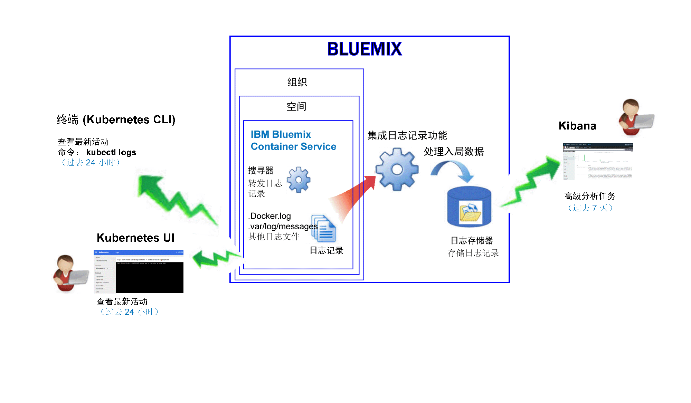
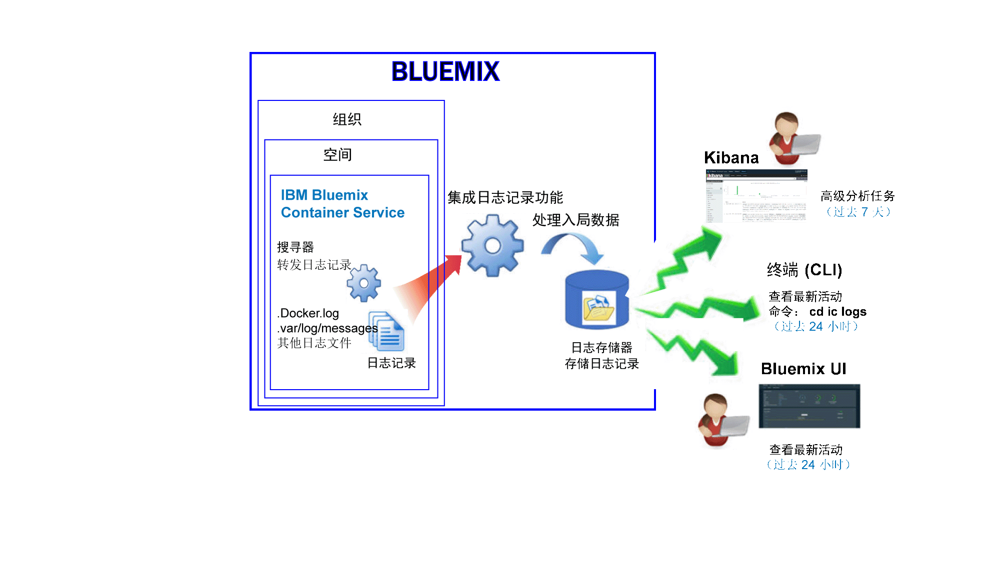

---

copyright:
  years: 2015, 2017

lastupdated: "2017-05-23"

---

{:shortdesc: .shortdesc}
{:new_window: target="_blank"}
{:codeblock: .codeblock}
{:screen: .screen}


# 对 IBM Bluemix Container Service 进行日志记录
{: #logging_containers_ov}

您可以查看、过滤和分析在 {{site.data.keyword.IBM}} 受管云基础架构中部署的 Docker 容器的日志，以及在 Kubernetes 集群中运行的 Docker 容器的日志。在 {{site.data.keyword.Bluemix_notm}} 或 Kubernetes 集群中部署容器时，系统会自动启用对相应容器的日志记录。
{:shortdesc}

容器日志使用搜寻器从容器外部进行监视和转发。搜寻器会将数据发送到 {{site.data.keyword.Bluemix_notm}} 中的多租户 Elasticsearch。


## 收集在 Kubernetes 集群中运行的容器的日志
{: #logging_containers_ov_logs_collected_kubernetes}

下图显示了 {{site.data.keyword.containershort}} 的日志记录的高级别视图：



在 {{site.data.keyword.Bluemix_notm}} 中，当您在 Kubernetes 集群中部署应用程序时，请考虑以下信息：

* 在 {{site.data.keyword.Bluemix_notm}} 帐户中，您可以具有 1 个或多个组织。 
* 每个组织可以具有 1 个或多个 {{site.data.keyword.Bluemix_notm}} 空间。 
* 在组织中，您可以具有 1 个或多个 Kubernetes 集群。 
* 在您创建 Kubernetes 集群时，系统会自动启用日志的收集。 
* Kubernetes 集群是 {{site.data.keyword.Bluemix_notm}} 空间的诊断。但是，集群及其资源的日志数据却与 {{site.data.keyword.Bluemix_notm}} 空间相关联。
* 在部署 Pod 时，系统会为应用程序收集日志数据。
* 要分析集群的日志数据，您必须在创建集群的云公共区域中访问 Kibana 仪表板。

在您创建集群之前，通过 [{{site.data.keyword.Bluemix_notm}} UI](../../../containers/cs_cluster.html#cs_cluster_ui) 或[命令行](../../../containers/cs_cluster.html#cs_cluster_cli)，您必须登录到特定 {{site.data.keyword.Bluemix_notm}} 区域、帐户、组织和空间。您所登录的空间是收集集群及其资源的日志记录数据的空间。

缺省情况下，会收集任何容器进程打印到 stdout（标准输出）和 stderr（标准错误）的信息。将信息发送到 stdout 和 stderr 是用于公开容器信息的标准 Docker 约定。 

如果您将在容器中运行的应用程序的日志数据，以 JSON 格式转发到 Docker 日志收集器中，那么您可以使用 JSON 字段，在 Kibana 中搜索和分析日志数据。有关更多信息，请参阅[将定制字段配置为 Kibana 搜索字段](logging_containers_ov.html#send_data_in_json)。

**注：**当您使用 Kubernetes 集群时，系统会保留 *ibm-system* 和 *kube-system* 名称空间。请勿创建、删除、修改或更改这些名称空间中可用的资源的许可权。这些名称空间的日志供 {{site.data.keyword.IBM_notm}} 使用。


## 收集 Bluemix 管理的容器的日志
{: #logging_containers_ov_logs_collected}

下图显示了 {{site.data.keyword.containershort}} 的日志记录的高级别视图：



缺省情况下，系统会为在 {{site.data.keyword.Bluemix_notm}} 受管云基础架构中部署的容器收集以下日志：

<table>
  <caption>表 2. 为在 Bluemix 受管云基础架构中部署的容器收集的日志</caption>
  <tbody>
    <tr>
      <th align="center">日志</th>
      <th align="center">描述</th>
    </tr>
    <tr>
      <td align="left" width="30%">/var/log/messages</td>
      <td align="left" width="70%"> 缺省情况下，Docker 消息会存储在容器的 /var/log/messages 文件夹中。此日志包含系统消息。</td>
    </tr>
    <tr>
      <td align="left">./docker.log</td>
      <td align="left">此日志是 Docker 日志。<br> Docker 日志文件并不存储为容器内部的文件，但无论如何都会进行收集。缺省情况下会收集此日志文件，因为这是用于公开容器的 stdout（标准输出）和 stderr（标准错误）信息的标准 Docker 约定。收集任何容器进程打印到 stdout 或 stderr 的信息。</td>
     </tr>
  </tbody>
</table>

要收集其他日志，请在创建容器时添加带有日志文件路径的 **LOG_LOCATIONS** 环境变量。可以添加多个日志文件，各文件之间用逗号分隔。有关更多信息，请参阅[从容器收集非缺省日志数据](logging_containers_other_logs.html#logging_containers_collect_data)。


##  将定制字段配置为 Kibana 搜索字段 
{: #send_data_in_json}

缺省情况下，系统会针对容器自动启用日志记录。Docker 日志文件中的每个条目都会显示在 Kibana 的 `message` 字段中。如果您需要使用作为容器日志条目一部分的特定字段，在 Kibana 中过滤和分析数据，请配置应用程序以发送有效的 JSON 格式的输出。

请考虑以下信息：

* 对于在 Kubernetes 集群中部署的容器，以 JSON 格式将消息记录到 stdout（标准输出）和 stderr（标准错误）。

    消息中可用的每个字段都会解析为与值相匹配的字段类型。例如，以下 JSON 消息中的每个字段：
    
    ```
    {"field1":"string type",
        "field2":123,
        "field3":false,
        "field4":"4567"
    }
    ```
    
    可用作您可用于过滤和搜索的字段：
    
    * `field1` 解析为字符串类型的 `field1_str`。
    * `field2` 解析为整数类型的 `field1_int`。
    * `field3` 解析为布尔类型的 `field3_bool`。
    * `field4` 解析为字符串类型的 `field4_str`。
    
* 对于在 {{site.data.keyword.Bluemix_notm}} 受管云基础架构中部署的容器，请完成以下步骤，以将容器日志条目解析到各自的字段中：

    1. 将消息记录到文件。 
    2. 将日志文件添加到容器中可供分析的非缺省日志的列表。有关更多信息，请参阅[从容器收集非缺省日志数据](logging_containers_other_logs.html#logging_containers_collect_data)。 
    
   如果您将消息记录到文件且系统确定消息是有效的 JSON，那么会对该字段进行解析，并会为消息中的每个字段创建新字段。在 Kibana 中，只有字符串类型的字段值可用于过滤和排序


## 查看在 Kubernetes 集群中运行的容器的容器日志
{: #logging_containers_ov_methods_view_kube}

您可以使用以下任何方法，来查看 Kubernetes Pod 中容器的最新日志：

* 通过 Kubernetes UI 查看日志。对于每个 Pod，您可以选择它并访问其日志。有关更多信息，请参阅 [Web UI 仪表板 ](https://kubernetes.io/docs/tasks/access-application-cluster/web-ui-dashboard/){: new_window}。

* 使用 Kubernetes CLI 命令 [kubectl logs](http://vishh.github.io/docs/user-guide/kubectl/kubectl_logs/){: new_window} 查看日志。 

要查看长期日志，您可以使用 Kibana。请检查[日志保留时间](logging_containers_ov.html#logging_containers_ov_log_retention)信息，以了解数据保留期策略。


## 查看 Bluemix 管理的容器的容器日志
{: #logging_containers_ov_methods_view_bmx}

您可以使用以下任何方法，来查看在 {{site.data.keyword.Bluemix_notm}} 受管云基础架构中部署的容器的最新日志：

* 通过 {{site.data.keyword.Bluemix_notm}} UI 查看日志，以监视容器的最新活动。
    
    可以通过可用于每个容器的**监视和日志**选项卡来查看、过滤和分析日志。有关更多信息，请参阅[通过 Bluemix 仪表板分析日志](../logging_view_dashboard.html#analyzing_logs_bmx_ui)。
    
    
* 使用 {site.data.keyword.containershort}} CLI 查看日志。使用命令以编程方式管理日志。
    
    可以通过命令行界面使用 **cf ic logs** 命令来查看、过滤和分析日志。有关更多信息，请参阅[通过命令行界面分析日志](../logging_view_cli.html#analyzing_logs_cli)。


## 分析容器日志
{: #logging_containers_ov_methods}

要分析容器日志数据，请使用 Kibana 执行高级分析任务。可以使用 Kibana（一种开放式源代码分析和可视化平台）通过各种图形（例如，图表和表）来对数据进行监视、搜索、分析和可视化。有关更多信息，请参阅[在 Kibana 中分析日志](../kibana4/analyzing_logs_Kibana.html#analyzing_logs_Kibana)。


## 日志保留时间
{: #logging_containers_ov_log_retention}

请考虑有关日志保留时间的以下信息：

* 每天每个空间最多存储 1 GB 的数据。超过该 1 GB 上限的任何日志都会被废弃。每天中午 12:30 UTC 会重置分配的上限。 

    可以通过联系支持人员来提高上限。在支持凭单中，包含用于提高上限的请求的空间标识、新的上限大小以及请求的原因。

* 可搜索最长 7 天最多 7 GB 的数据。达到 7 GB 数据或超过 7 天后，日志数据会进行滚动式覆盖（先进先出）。

## 教程：在 Kibana 中分析在 Kubernetes 集群中部署的应用程序的日志
{: #tutorial1}

要了解如何使用 Kibana 分析在 Kubernetes 集群中部署的应用程序的日志，请参阅[教程：在 Kibana 中分析在 Kubernetes 集群中部署的应用程序的日志](tutorials/kibana_tutorial_1.html#kibana_tutorial_1)。


