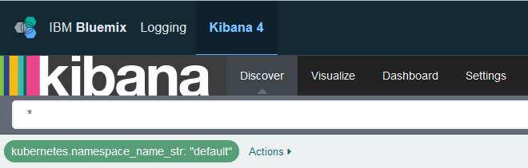

---

copyright:
  years: 2015, 2017

lastupdated: "2017-05-23"

---


{:shortdesc: .shortdesc}
{:new_window: target="_blank"}
{:codeblock: .codeblock}
{:screen: .screen}


# 在 Kibana 中分析在 Kubernetes 集群中部署的应用程序的日志
{: #kibana_tutorial_1}

开始使用 Kibana。了解如何针对在 Kubernetes 集群中部署的应用程序搜索并分析容器日志。
{:shortdesc}

**注：**要完成此教程，请完成从不同步骤链接的教程。

## 先决条件
{: #prereq}

1. 作为 Bluemix 帐户的成员或所有者，具有在 Bluemix 中创建 Kubernetes 集群、将应用程序部署至集群，以及查询日志的许可权，可在 Kibana 中进行高级分析。

2. 具有终端会话，您可以从中管理 Kubernetes 集群并从命令行部署应用程序。此教程的示例供 Ubuntu Linux 系统使用。

3. 在 Ubuntu 系统中[安装 CLI 插件](../../../../containers/cs_cli_install.html#cs_cli_install_steps)，以从命令行管理 IBM Bluemix Container Service。 


## 步骤 1：在 Bluemix 中快速入门和熟悉运用 Kubernetes
{: #step1}

请完成以下步骤：

1. [创建 Kubernetes 集群](../../../../containers/cs_cluster.html#cs_cluster_ui)。

2. 在 Linux 终端中[设置集群上下文](../../../../containers/cs_cli_install.html#cs_cli_configure)。设置上下文后，您可以管理 Kubernetes 集群并在 Kubernetes 集群中部署应用程序。

## 步骤 2：在 Kubernetes 集群中部署应用程序
{: #step2}

在 Kubernetes 集群中部署并运行样本应用程序。[完成第 1 课的步骤](../../../../containers/cs_tutorials.html#cs_apps_tutorial)。

应用程序是 Hello World 节点 js 应用程序：

```
var express = require('express')
var app = express()

app.get('/', function(req, res) {
  res.send('Hello world! Your app is up and running in a cluster!\n')
})
app.listen(8080, function() {
  console.log('Sample app is listening on port 8080.')
})
```

部署应用程序时，会针对应用程序发送到 stdout（标准输出）和 stderr（标准错误）的任何日志条目，自动启用日志收集。 

在此样本应用程序中，当您在浏览器中测试应用程序时，应用程序会将以下消息写入 stdout：`样本应用程序正在侦听 8080 端口。`


## 步骤 3：在 Kibana 中分析日志数据
{: #step3}

1. 通过浏览器启动 Kibana。 

    要分析集群的日志数据，您必须在创建集群的云公共区域中访问 Kibana。 
    
    根据您在上一步中创建 Kubernetes 集群的区域，选择正确的 URL：

    <table>
      <caption>表 1. 用于启动 Kibana 的 URL</caption>
        <tr>
          <th>区域</th>
          <th>URL</th>
         </tr>
         <tr>
           <td>美国南部</td>
           <td>https://logging.ng.bluemix.net/ </td>
          </tr>
          <tr>
            <td>英国</td>
            <td>https://logging.eu-gb.bluemix.net/ </td>
           </tr>
           <tr>
             <td>法兰克福</td>
             <td>https://logging.eu-de.bluemix.net/ </td>
           </tr>
    </table>
    
    然后，通过浏览器启动 URL 以打开 Kibana。
    
2. 在**发现**页面中，查看显示的事件。 

    样本 Hello-World 应用程序将生成一个事件。
    
    
    
    在*可用字段*部分中，您可以查看可用于定义新查询或过滤页面上所显示表中列出的条目的字段列表。
    
    下表列出可用于定义新搜索查询的常用字段。该表还包括对应于样本应用程序所生成事件的样本值：
    
     <table>
              <caption>表 2. 容器日志的常用字段</caption>
               <tr>
                <th align="center">字段</th>
                <th align="center">描述</th>
                <th align="center">示例</th>
              </tr>
              <tr>
                <td>*docker.container_id_str*</td>
                <td> 此字段的值对应于在 Kubernetes 集群 Pod 中运行应用程序的容器的 GUID。</td>
                <td></td>
              </tr>
              <tr>
                <td>*ibm-containers.region_str*</td>
                <td>此字段的值对应于收集日志条目的 {{site.data.keyword.Bluemix_notm}} 区域。</td>
                <td>us-south</td>
              </tr>
              <tr>
                <td>*kubernetes.container_name_str*</td>
                <td>此字段的值通知容器的名称。</td>
                <td>hello-world-deployment</td>
              </tr>
              <tr>
                <td>*kubernetes.host*</td>
                <td>此字段的值通知可用于从因特网访问应用程序的公共 IP。</td>
                <td>xxx.xx.xxx.xxx</td>
              </tr>
              <tr>
                <td>*kubernetes.labels.label_name*</td>
                <td>标签字段是可选的。您可以具有 0 个或更多标签。每个标签以前缀 `kubernetes.labels.` 开头，后接 *label_name*。</td>
                <td>在样本应用程序中，您可以看到 2 个标签：<br>* *kubernetes.labels.pod-template-hash_str* = 3355293961 <br>* *kubernetes.labels.run_str* =	hello-world-deployment  </td>
              </tr>
              <tr>
                <td>*kubernetes.namespace_name_str*</td>
                <td>此字段的值通知 Pod 运行所在的 Kubernetes 名称空间。</td>
                <td>缺省值</td>
              </tr>
              <tr>
                <td>*kubernetes.pod_id_str*</td>
                <td>此字段的值对应于运行容器的 Pod 的 GUID。</td>
                <td>d695f346-xxxx-xxxx-xxxx-aab0b50f7315</td>
              </tr>
              <tr>
                <td>*kubernetes.pod_name_str*</td>
                <td>此字段的值通知 Pod 名称。</td>
                <td>hello-world-deployment-3xxxxxxx1-xxxxx8</td>
              </tr>
              <tr>
                <td>*message*</td>
                <td>这是应用程序所记录的完整消息。</td>
                <td>样本应用程序正在侦听 8080 端口。</td>
              </tr>
        </table>
    
    
    
3. 过滤*发现*页面中的数据。  

    在表中，您可以查看可用于分析的所有条目。所列出的条目对应于在*搜索*栏中显示的搜索查询。`*` 字符用于显示为页面所配置的一段时间内的所有条目。 
    
    例如，要按 Kubernetes 名称空间过滤数据，请修改*搜索*栏查询。根据定制字段 *kubernetes.namespace_name_str* 添加过滤器：
    
    1. 在**可用字段**部分中，选择 *kubernetes.namespace_name_str* 字段。此时将显示该字段的可用值子集。    
    
    2. 选择值 **default**。这是您在上一步部署样本应用程序的名称空间。
    
        在您选择值后，*搜索栏*中会添加一个过滤器，而该表将仅显示与您刚刚所选条件匹配的条目。     
    
    
    
    您可以选择过滤器的编辑符号，以修改搜索的名称空间名称。   
    
    
    
    以下查询将显示：
    
    ```{
        "query": {
          "match": {
            "kubernetes.namespace_name_str": {
              "query": "default",
              "type": "phrase"
            }
          }
        }
      }
    ```
    
    要在不同的名称空间（如 *mynamespace1*）中搜索条目，请修改查询：
    
    ```{
        "query": {
          "match": {
            "kubernetes.namespace_name_str": {
              "query": "mynamespace1",
              "type": "phrase"
            }
          }
        }
      }
    ```
    

    如果您看不到任何数据，请尝试更改时间过滤器。有关更多信息，请参阅[设置时间过滤器](../../kibana4/k4_filter_logs.html#set_time_filter)。
    


有关更多信息，请参阅[在 Kibana 中过滤日志](../../kibana4/k4_filter_logs.html#k4_filter_logs)。

