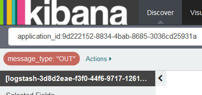

---

copyright:
  years: 2015, 2017

lastupdated: "2017-03-13"

---

{:shortdesc: .shortdesc}
{:new_window: target="_blank"}
{:codeblock: .codeblock}
{:screen: .screen}

# 按消息类型过滤 CF 应用程序日志
{:#k4_filter_cf_logs_by_msg_type}

可以在 Kibana 中按消息类型查看和过滤 Cloud Foundry 日志。
{:shortdesc}

要搜索包含特定消息类型的条目，请完成以下步骤：

1. 查看 Kibana 的“发现”页面，以确定它显示的数据子集。有关更多信息，请参阅[确定在 Kibana 的“发现”页面中显示的数据](logging_kibana_analize_logs_interactively.html#k4_identify_data)。

2. 在*字段列表*中，选择 **message_type** 字段。

    下图显示了在 CF 应用程序的日志中针对 *message_type* 字段找到的值：
    
         

3. 要添加过滤器以搜索包含特定 *message_type* 的条目，请选择该值的放大按钮 。

    例如，要添加过滤器以包含 message_type 值为 *OUT* 的日志条目，请选择*字段列表*部分中可用于值 *OUT* 的“放大镜”按钮 。下图显示了用于已启用 message_type 值 *OUT* 的过滤器。
    
    

    要添加过滤器以搜索不包含特定 *message_type* 的条目，请选择该值的放大按钮 。
    
    例如，要添加过滤器以排除 message_type 为 *OUT* 的日志条目，请选择*字段列表*部分中可用于值 *CELL* 的“放大镜”按钮 。下图显示了排除 message_type 值 *OUT* 的条目的过滤器。

    

