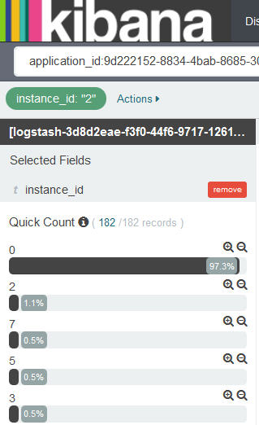

---

copyright:
  years: 2015, 2017

lastupdated: "2017-03-01"

---

{:shortdesc: .shortdesc}
{:new_window: target="_blank"}
{:codeblock: .codeblock}
{:screen: .screen}

# 按实例标识过滤日志
{:#k4_filter_logs_by_instance_id}

按实例标识查看和过滤 {{site.data.keyword.Bluemix}} 日志。
{:shortdesc}

要在 Kibana 仪表板上按实例标识查看和过滤日志，请完成以下步骤：

1. 查看 Kibana 的“发现”页面，以确定它显示的数据子集。有关更多信息，请参阅[确定在 Kibana 的“发现”页面中显示的数据](logging_kibana_analize_logs_interactively.html#k4_identify_data)。

2. 在*字段列表*中，选择以下其中一个字段来搜索特定实例标识：

    * **instance_ID**：此字段列出 Cloud Foundry 应用程序的日志中可用的不同实例标识。 
    * **instance**：此字段列出容器组的所有实例的不同 GUID。 

    例如，下图显示了 CF 应用程序实例的不同值：
    
    
   
3. 要添加过滤器以搜索特定日志类型，请选择要分析的日志类型的放大按钮 。

   例如，要添加过滤器以包含 CF 应用程序实例 *2* 的条目，请选择“字段列表”部分中可用于值 *2* 的“放大镜”按钮 。下图显示了包含实例 *2* 的条目的过滤器。
    
    

    要添加过滤器以搜索不包含特定实例标识的条目，请选择该值的放大按钮 。

     例如，要添加过滤器以排除 CF 应用程序实例 *2* 的条目，请选择“字段列表”部分中可用于值 *2* 的“放大镜”按钮 。下图显示了排除实例 *2* 的条目的过滤器。
     
      

