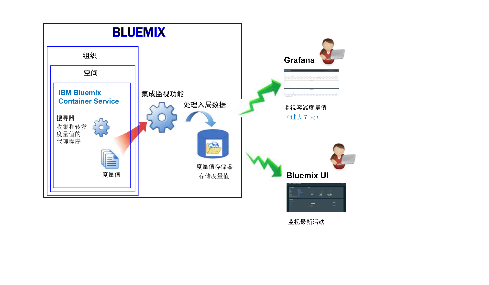

---

copyright:
  years: 2015, 2017

lastupdated: "2017-05-26"

---

{:shortdesc: .shortdesc}
{:new_window: target="_blank"}
{:codeblock: .codeblock}
{:screen: .screen}

# 监视 IBM Bluemix Container Service
{: #monitoring_bmx_containers_ov}

在 {{site.data.keyword.Bluemix}} 中，会从容器外部自动收集容器度量值，而不必在容器内部安装和维护代理程序。
您可以使用 Grafana 对容器度量值进行可视化。您还可以使用 Kubernetes UI 来查看节点（工作程序）和 Pod 的度量值。
{:shortdesc}

## 收集在 Kubernetes 集群中运行的容器的度量值
{: #metrics_containers_kube_ov}

在 {{site.data.keyword.Bluemix_notm}} 中，当您在 Kubernetes 集群中部署应用程序时，请考虑以下信息：

* 在 {{site.data.keyword.Bluemix_notm}} 帐户中，您可以具有 1 个或多个组织。
* 每个组织可以具有 1 个或多个 {{site.data.keyword.Bluemix_notm}} 空间。
* 在组织中，您可以具有 1 个或多个 Kubernetes 集群。
* 在您创建 Kubernetes 集群时，会自动启用度量值的收集。
* Kubernetes 集群独立于 {{site.data.keyword.Bluemix_notm}} 空间。但是，为集群及其资源收集的度量值却与 {{site.data.keyword.Bluemix_notm}} 空间相关联。
* 在部署 Pod 时，系统会为容器收集度量值。
* 您可以在 Grafana 或在 Kubernetes UI 中查看度量值。
* 要可视化集群的度量值数据，您必须在创建集群的云公共区域中配置 Grafana 仪表板。

在您创建集群之前，通过 {{site.data.keyword.Bluemix_notm}} UI 或命令行，您必须登录到特定 {{site.data.keyword.Bluemix_notm}} 区域、帐户、组织和空间。您所登录的空间是收集集群及其资源的度量值数据的空间。

下图显示了 {{site.data.keyword.containershort}} 的监视的高级别视图：

搜寻器是在主机中运行的进程，对度量值进行无代理监视。缺省情况下，搜寻器会持续从所有容器中收集以下度量值：

<table>
  <caption>表 1. 缺省情况下捕获的度量值</caption>
  <tr>
    <th>度量值类型</th>
    <th>度量值名称</th>
    <th>描述</th>
  </tr>
  <tr>
    <td>内存</td>
    <td>*memory_current*</td>
    <td>此度量值报告容器目前使用的内存字节数。</td>
  </tr>
  <tr>
    <td>内存</td>
    <td>*memory_limit*</td>
    <td>此度量值报告与为 Pod 设置的最大和最小限制相比，允许容器交换到磁盘的内存量。   缺省情况下，Pod 在无内存限制的情况下运行。Pod 可以消耗与其运行所在的工作程序上一样多的内存。当您部署 Pod 时，您可以设置 Pod 可以使用的内存量限制。</td>
  </tr>
  <tr>
    <td>CPU</td>
    <td>*cpu_usage*</td>
    <td>此度量值报告所有核心中 CPU 时间的纳秒数。  当 CPU 使用率高时，您可能会经历延迟。高 CPU 使用率表示处理能力不足。</td>
  </tr>
  <tr>
    <td>CPU</td>
    <td>*cpu_usage_pct*</td>
    <td>此度量值以 CPU 容量的百分比来报告使用的 CPU 时间。  当 CPU 使用率的百分比高时，您可能会经历延迟。高 CPU 使用率表示处理能力不足。</td>
  </tr>
  <tr>
    <td>CPU</td>
    <td>*cpu_num_cores*</td>
    <td>此度量值报告可用于容器的 CPU 核心数。</td>
  </tr>
</table>

## 收集在 Bluemix 中受管的容器的度量值
{: #metrics_containers_bmx_ov}

下图显示了 {{site.data.keyword.containershort}} 的监视的高级别视图：

缺省情况下，搜寻器会持续从所有容器中收集以下度量值：

* CPU
* 内存
* 网络信息

## 监视在 Kubernetes 集群中运行的容器的度量值
{: #monitoring_metrics_kube}

在 Kubernetes UI 和 Grafana 中收集和显示度量值：

* 使用 Kibana（一种开放式源代码分析和可视化平台）通过各种图形（例如，图表和表）来对度量值进行监视、搜索、分析和可视化。
 
    您可以通过浏览器启动 Grafana。有关更多信息，请参阅[通过 Web 浏览器导航至 Grafana 仪表板](../grafana/navigating_grafana.html#launch_grafana_from_browser)。
    
* 使用 Kubernetes UI，查看节点和 Pod 的度量值。
有关更多信息，请参阅 [Web UI 仪表板 ](https://kubernetes.io/docs/tasks/access-application-cluster/web-ui-dashboard/){: new_window}。

## 监视在 Bluemix 中受管的容器的度量值
{: #monitoring_metrics_bmx}

在 {{site.data.keyword.Bluemix_notm}} UI 和 Grafana 中收集和显示度量值：

* 使用 Kibana（一种开放式源代码分析和可视化平台）通过各种图形（例如，图表和表）来对度量值进行监视、搜索、分析和可视化。
 
    可以通过 {{site.data.keyword.Bluemix_notm}} UI 或通过浏览器启动 Grafana。有关更多信息，请参阅[导航至 Grafana 仪表板](../grafana/navigating_grafana.html#navigating_grafana)。
    

* 使用 {{site.data.keyword.Bluemix_notm}} UI，查看最新的度量值。

    要在 {{site.data.keyword.Bluemix_notm}} UI 中查看度量值，请参阅[从 Bluemix 控制台分析度量值](analyzing_metrics_bmx_ui.html#analyzing_metrics_bmx_ui)。

## 度量值保留时间
{: #metrics_retention}

每分钟最多可收集一个数据点。将删除 7 天内未写入的容器度量值。
    

