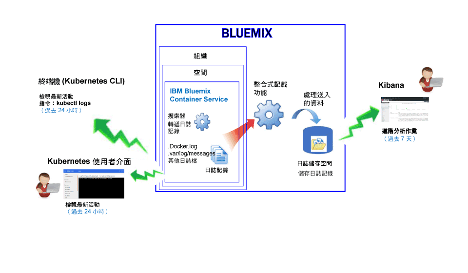
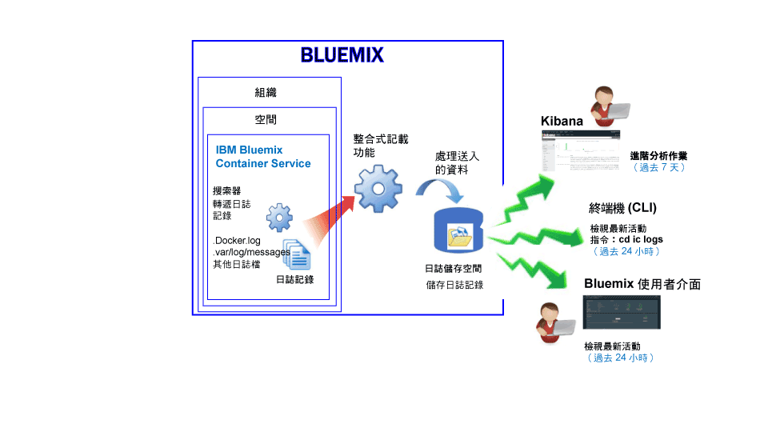

---

copyright:
  years: 2015, 2017

lastupdated: "2017-05-23"

---

{:shortdesc: .shortdesc}
{:new_window: target="_blank"}
{:codeblock: .codeblock}
{:screen: .screen}


# IBM Bluemix Container Service 的記載功能
{: #logging_containers_ov}

您可以針對在 {{site.data.keyword.IBM}} 所管理雲端基礎架構中部署的 Docker 容器，以及在 Kubernetes 叢集中執行的 Docker 容器，來檢視、過濾及分析 Docker 容器的日誌。在 {{site.data.keyword.Bluemix_notm}} 或 Kubernetes 叢集中部署容器時，會自動啟用容器的記載功能。
{:shortdesc}

您可以使用搜索器，從容器外部監視及轉遞容器日誌。搜索器會將資料傳送至 {{site.data.keyword.Bluemix_notm}} 中的多方承租戶 Elasticsearch。


## 收集在 Kubernetes 叢集中執行的容器的日誌
{: #logging_containers_ov_logs_collected_kubernetes}

下圖顯示 {{site.data.keyword.containershort}} 的高階記載視圖：



在 {{site.data.keyword.Bluemix_notm}} 中，當您在 Kubernetes 叢集中部署應用程式時，請考量下列資訊：

* 在 {{site.data.keyword.Bluemix_notm}} 帳戶中，您可以有一個以上的組織。 
* 每一個組織都可以有一個以上的 {{site.data.keyword.Bluemix_notm}} 空間。 
* 在組織中，您可以有一個以上的 Kubernetes 叢集。 
* 當您建立 Kubernetes 叢集時，會自動啟用日誌的收集。 
* Kubernetes 叢集與 {{site.data.keyword.Bluemix_notm}} 空間無關。不過，叢集及其資源的日誌資料都會與 {{site.data.keyword.Bluemix_notm}} 空間相關聯。
* 只要部署 Pod，就會收集應用程式的日誌資料。
* 若要分析叢集的日誌資料，您必須存取在其中建立叢集的「雲端公用」地區的 Kibana 儀表板。

在您建立叢集之前，必須透過 [{{site.data.keyword.Bluemix_notm}} 使用者介面](../../../containers/cs_cluster.html#cs_cluster_ui)或[指令行](../../../containers/cs_cluster.html#cs_cluster_cli)登入特定 {{site.data.keyword.Bluemix_notm}} 地區、帳戶、組織及空間。您所登入的空間是收集叢集及其資源的記載資料的空間。

預設會收集任何容器處理程序列印到 stdout（標準輸出）及 stderr（標準錯誤）的資訊。將資訊傳送到 stdout 及 stderr 是公開容器資訊的標準 Docker 使用慣例。 

如果您將容器中所執行應用程式的日誌資料以 JSON 格式轉遞至 Docker 日誌收集程式，則可以使用 JSON 欄位來搜尋及分析 Kibana 中的日誌資料。如需相關資訊，請參閱[將自訂欄位配置為 Kibana 搜尋欄位](logging_containers_ov.html#send_data_in_json)。

**附註：**當您使用 Kubernetes 叢集時，會保留名稱空間 *ibm-system* 及 *kube-system*。請不要建立、刪除、修改或變更這些名稱空間中可用資源的許可權。這些名稱空間的日誌適用於 {{site.data.keyword.IBM_notm}} 使用。


## 收集 Bluemix 所管理容器的日誌
{: #logging_containers_ov_logs_collected}

下圖顯示 {{site.data.keyword.containershort}} 的高階記載視圖：



預設會收集 {{site.data.keyword.Bluemix_notm}} 所管理雲端基礎架構中所部署容器的下列日誌：

<table>
  <caption>表 2. 針對 Bluemix 所管理雲端基礎架構中所部署的容器收集的日誌</caption>
  <tbody>
    <tr>
      <th align="center">日誌</th>
      <th align="center">說明</th>
    </tr>
    <tr>
      <td align="left" width="30%">/var/log/messages</td>
      <td align="left" width="70%"> 依預設，Docker 訊息儲存在容器的 /var/log/messages 資料夾中。此日誌包括系統訊息。
      </td>
    </tr>
    <tr>
      <td align="left">./docker.log</td>
      <td align="left">此日誌是 Docker 日誌。<br> Docker 日誌檔未儲存為容器內部的檔案，但仍然會予以收集。預設會收集此日誌檔，因為它是標準 Docker 使用慣例，用來公開容器的 stdout（標準輸出）及 stderr（標準錯誤）資訊。會收集任何容器處理程序列印到 stdout 或 stderr 的資訊。
      </td>
     </tr>
  </tbody>
</table>

若要收集其他日誌，請在建立容器時，新增 **LOG_LOCATIONS** 環境變數，並包含日誌檔的路徑。您可以新增多個日誌檔，以逗點將其隔開。如需相關資訊，請參閱[收集容器中的非預設日誌資料](logging_containers_other_logs.html#logging_containers_collect_data)。


##  將自訂欄位配置為 Kibana 搜尋欄位 
{: #send_data_in_json}

預設會自動啟用容器的記載功能。Docker 日誌檔中的每個項目都會顯示在 Kibana 的欄位 `message` 中。如果您需要使用為容器日誌項目一部分的特定欄位來過濾及分析 Kibana 中的資料，請配置應用程式來傳送有效的 JSON 格式化輸出。

請考量下列資訊：

* 針對 Kubernetes 叢集中所部署的容器，將訊息以 JSON 格式記載到 stdout（標準輸出）及 stderr（標準錯誤）。

    訊息中可用的每一個欄位都會剖析成符合值的欄位類型。例如，下列 JSON 訊息中的每一個欄位：
    
    ```
    {"field1":"string type",
        "field2":123,
        "field3":false,
        "field4":"4567"
    }
    ```
    
    作為可用於過濾及搜尋的欄位：
    
    * `field1` 剖析為 string 類型的 `field1_str`。
    * `field2` 剖析為 integer 類型的 `field1_int`。
    * `field3` 剖析為 boolean 類型的 `field3_bool`。
    * `field4` 剖析為 string 類型的 `field4_str`。
    
* 針對 {{site.data.keyword.Bluemix_notm}} 所管理雲端基礎架構中所部署的容器，完成下列步驟，以將容器日誌項目剖析為個別欄位：

    1. 將訊息記載到檔案。 
    2. 將日誌檔新增至來自容器可供分析的非預設日誌清單。如需相關資訊，請參閱[收集容器中的非預設日誌資料](logging_containers_other_logs.html#logging_containers_collect_data)。 
    
   如果您將訊息記載到檔案，而且將訊息判斷為有效的 JSON，則會剖析欄位，並為訊息中的每一個欄位建立新欄位。在 Kibana 中，只能過濾及排序 string 類型欄位值。


## 檢視在 Kubernetes 叢集中執行的容器的容器日誌
{: #logging_containers_ov_methods_view_kube}

您可以使用下列任何一種方法，在 Kubernetes Pod 中檢視容器的最新日誌：

* 透過 Kubernetes 使用者介面來檢視日誌。針對每一個 Pod，您可以選取它，並存取其日誌。如需相關資訊，請參閱 [Web 使用者介面儀表板 ](https://kubernetes.io/docs/tasks/access-application-cluster/web-ui-dashboard/){: new_window}。

* 使用 Kubernetes CLI 指令 [kubectl logs ](http://vishh.github.io/docs/user-guide/kubectl/kubectl_logs/){: new_window}，來檢視日誌。 

若要檢視長期日誌，您可以使用 Kibana。請檢查[日誌保留](logging_containers_ov.html#logging_containers_ov_log_retention)資訊，以瞭解資料保留期間原則。


## 檢視 Bluemix 所管理容器的容器日誌
{: #logging_containers_ov_methods_view_bmx}

您可以使用下列任何一種方法，檢視 {{site.data.keyword.Bluemix_notm}} 所管理雲端基礎架構中所部署容器的最新日誌：

* 透過 {{site.data.keyword.Bluemix_notm}} 使用者介面來檢視日誌，以監視容器的最新活動。
    
    您可以透過每一個容器都有的**監視及日誌**標籤來檢視、過濾及分析日誌。如需相關資訊，請參閱[從 Bluemix 儀表板分析日誌](../logging_view_dashboard.html#analyzing_logs_bmx_ui)。
    
    
* 使用 {site.data.keyword.containershort}} CLI 來檢視日誌。請使用指令，以程式設計方式管理日誌。
    
    您可以透過指令行介面，使用 **cf ic logs** 指令來檢視、過濾及分析日誌。如需相關資訊，請參閱[從指令行介面分析日誌](../logging_view_cli.html#analyzing_logs_cli)。


## 分析容器日誌
{: #logging_containers_ov_methods}

若要分析容器日誌資料，請使用 Kibana 來執行進階分析作業。您可以使用 Kibana（一種開放程式碼分析與視覺化平台），以各種圖形（例如圖表和表格）來監視、搜尋、分析及視覺化您的資料。如需相關資訊，請參閱[在 Kibana 中分析日誌](../kibana4/analyzing_logs_Kibana.html#analyzing_logs_Kibana)。


## 日誌保留
{: #logging_containers_ov_log_retention}

請考量下列關於日誌保留的資訊：

* 每個空間每天最多可儲存 1 GB 資料。超過 1 GB 上限的任何日誌都會被捨棄。上限配額會在每天凌晨 12:30（世界標準時間）重設。 

    您可以聯絡支援中心來增加上限。請在支援問題單中，附上增加上限要求的空間 ID、新的大小上限，以及要求的理由。

* 可搜尋最多 7 天、最多 7 GB 的資料。達到 7 GB 資料或在 7 天之後，日誌資料就會輪替（先進先出）。

## 指導教學：針對 Kubernetes 叢集中所部署的應用程式，在 Kibana 中分析日誌
{: #tutorial1}

若要瞭解如何使用 Kibana 來分析 Kubernetes 叢集中所部署容器的日誌，請參閱[指導教學：針對 Kubernetes 叢集中所部署的應用程式，在 Kibana 中分析日誌](tutorials/kibana_tutorial_1.html#kibana_tutorial_1)。


