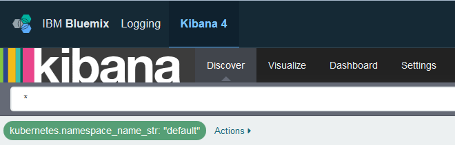

---

copyright:
  years: 2015, 2017

lastupdated: "2017-05-23"

---


{:shortdesc: .shortdesc}
{:new_window: target="_blank"}
{:codeblock: .codeblock}
{:screen: .screen}


# 針對 Kubernetes 叢集中所部署的應用程式，在 Kibana 中分析日誌
{: #kibana_tutorial_1}

請開始使用 Kibana。瞭解如何搜尋及分析 Kubernetes 叢集中所部署應用程式的容器日誌。
{:shortdesc}

**附註：**若要完成此指導教學，請完成從不同步驟鏈結的指導教學。

## 必要條件
{: #prereq}

1. 成為 Bluemix 帳戶的成員或擁有者，而 Bluemix 帳戶具有許可權可以建立 Kubernetes 叢集、將應用程式部署至叢集，並查詢 Bluemix 中的日誌以在 Kibana 中進行進階分析。

2. 具有一個終端機階段作業，您可以從中管理 Kubernetes 叢集，並從指令行部署應用程式。此指導教學中的範例是針對 Ubuntu Linux 系統所提供。

3. 在 Ubuntu 系統中[安裝 CLI 外掛程式](../../../../containers/cs_cli_install.html#cs_cli_install_steps)，以從指令行管理 IBM Bluemix Container 服務。 


## 步驟 1：在 Bluemix 中開始進行 Kubernetes
{: #step1}

請完成下列步驟：

1. [建立 Kubernetes 叢集](../../../../containers/cs_cluster.html#cs_cluster_ui)。

2. 在 Linux 終端機中，[設定叢集環境定義](../../../../containers/cs_cli_install.html#cs_cli_configure)。設定環境定義之後，您可以管理 Kubernetes 叢集，並在 Kubernetes 叢集中部署應用程式。

## 步驟 2：在 Kubernetes 叢集中部署應用程式
{: #step2}

在 Kubernetes 叢集中部署及執行範例應用程式。[完成課程 1 的步驟](../../../../containers/cs_tutorials.html#cs_apps_tutorial)。

應用程式是 Hello World node js 應用程式：

```
var express = require('express')
var app = express()

app.get('/', function(req, res) {
  res.send('Hello world! Your app is up and running in a cluster!\n')
})
app.listen(8080, function() {
  console.log('Sample app is listening on port 8080.')
})
```

部署應用程式時，會針對應用程式傳送到 stdout（標準輸出）及 stderr（標準錯誤）的任何日誌項目，自動啟用日誌收集。 

在此範例應用程式中，當您在瀏覽器中測試應用程式時，應用程式會將下列訊息寫入至 stdout：`Sample app is listening on port 8080.`


## 步驟 3：在 Kibana 中分析日誌資料
{: #step3}

1. 從瀏覽器啟動 Kibana。 

    若要分析叢集的日誌資料，您必須在建立叢集的雲端「公用」地區中存取 Kibana。 
    
    根據在前一個步驟中建立 Kubernetes 叢集的地區，選擇正確 URL：

    <table>
      <caption>表 1. 啟動 Kibana 的 URL</caption>
        <tr>
          <th>地區</th>
          <th>URL</th>
         </tr>
         <tr>
           <td>美國南部</td>
           <td>https://logging.ng.bluemix.net/ </td>
          </tr>
          <tr>
            <td>英國</td>
            <td>https://logging.eu-gb.bluemix.net/ </td>
           </tr>
           <tr>
             <td>法蘭克福</td>
             <td>https://logging.eu-de.bluemix.net/ </td>
           </tr>
    </table>
    
    然後，從瀏覽器啟動 URL 來開啟 Kibana。
    
2. 在**探索**頁面中，查看所顯示的事件。 

    範例 Hello-World 應用程式會產生一個事件。
    
    
    
    在*可用欄位*區段中，您可以看到一份欄位清單，而這些欄位可以用來定義新查詢，或過濾頁面上所顯示表格中所列的項目。
    
    下表列出您可用來定義新搜尋查詢的一般欄位。此表格也包括範例值，而這些值對應至範例應用程式所產生的事件：
    
     <table>
              <caption>表 2. 容器日誌的一般欄位</caption>
               <tr>
                <th align="center">欄位</th>
                <th align="center">說明</th>
                <th align="center">範例</th>
              </tr>
              <tr>
                <td>*docker.container_id_str*</td>
                <td> 此欄位的值對應至在 Kubernetes 叢集的 Pod 中執行應用程式的容器 GUID。</td>
                <td></td>
              </tr>
              <tr>
                <td>*ibm-containers.region_str*</td>
                <td>此欄位的值對應至收集日誌項目的 {{site.data.keyword.Bluemix_notm}} 地區。</td>
                <td>us-south</td>
              </tr>
              <tr>
                <td>*kubernetes.container_name_str*</td>
                <td>此欄位的值會通知容器名稱。</td>
                <td>hello-world-deployment</td>
              </tr>
              <tr>
                <td>*kubernetes.host*</td>
                <td>此欄位的值會通知可用來從網際網路存取應用程式的公用 IP。</td>
                <td>xxx.xx.xxx.xxx</td>
              </tr>
              <tr>
                <td>*kubernetes.labels.label_name*</td>
                <td>標籤欄位是選用的。您可以有 0 個以上的標籤。每一個標籤的開頭都是字首 `kubernetes.labels`，後接 *label_name*。</td>
                <td>在範例應用程式中，您可以看到 2 個標籤：<br>* *kubernetes.labels.pod-template-hash_str* = 3355293961 <br>* *kubernetes.labels.run_str* =	hello-world-deployment  </td>
              </tr>
              <tr>
                <td>*kubernetes.namespace_name_str*</td>
                <td>此欄位的值會通知在其中執行 Pod 的 Kubernetes 名稱空間。</td>
                <td>預設值</td>
              </tr>
              <tr>
                <td>*kubernetes.pod_id_str*</td>
                <td>此欄位的值對應至在其中執行容器的 Pod 的 GUID。</td>
                <td>d695f346-xxxx-xxxx-xxxx-aab0b50f7315</td>
              </tr>
              <tr>
                <td>*kubernetes.pod_name_str*</td>
                <td>此欄位的值會通知 Pod 名稱。</td>
                <td>hello-world-deployment-3xxxxxxx1-xxxxx8</td>
              </tr>
              <tr>
                <td>*message*</td>
                <td>這是應用程式所記載的完整訊息。</td>
                <td>範例應用程式會接聽埠 8080。</td>
              </tr>
        </table>
    
    
    
3. 在*探索*頁面中，過濾資料。  

    在表格中，您可以看到所有可用於分析的項目。列出的項目對應至*搜尋* 列中所顯示的查詢。`*` 是字元，用來顯示一段時間內針對頁面所配置的所有項目。 
    
    例如，若要依 Kubernetes 名稱空間過濾資料，請修改*搜尋* 列查詢。請根據自訂欄位 *kubernetes.namespace_name_str* 來新增過濾器：
    
    1. 在**可用欄位**區段中，選取欄位 *kubernetes.namespace_name_str*。即會顯示欄位的可用值子集。    
    
    2. 選取值 **default**。這是您在前一個步驟中部署範例應用程式的名稱空間。
    
        在您選取值之後，會將過濾器新增至*搜尋列*，而且表格只會顯示符合剛剛所選取準則的項目。     
    
    
    
    您可以選取濾器的編輯符號，以修改所搜尋的名稱空間名稱。   
    
    
    
    會顯示下列查詢：
    
    ```{
        "query": {
          "match": {
            "kubernetes.namespace_name_str": {
              "query": "default",
              "type": "phrase"
            }
          }
        }
      }
    ```
    
    若要搜尋不同名稱空間（例如 *mynamespace1*）中的項目，請修改查詢：
    
    ```{
        "query": {
          "match": {
            "kubernetes.namespace_name_str": {
              "query": "mynamespace1",
              "type": "phrase"
            }
          }
        }
      }
    ```
    

    如果您看不到任何資料，請嘗試變更時間過濾器。如需相關資訊，請參閱[設定時間過濾器](../../kibana4/k4_filter_logs.html#set_time_filter)。
    


如需相關資訊，請參閱[在 Kibana 中過濾日誌](../../kibana4/k4_filter_logs.html#k4_filter_logs)。

