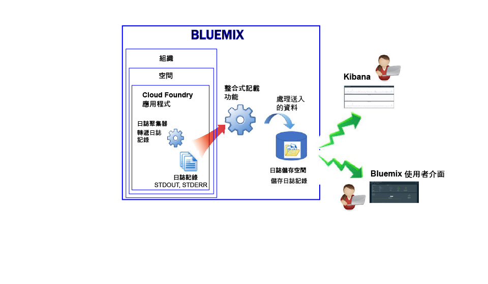

---

copyright:
  years: 2015, 2017

lastupdated: "2017-03-13"

---

{:shortdesc: .shortdesc}
{:new_window: target="_blank"}
{:codeblock: .codeblock}
{:screen: .screen}

# Bluemix 中 Cloud Foundry 應用程式的記載功能
{: #logging_bluemix_cf_apps}

在 {{site.data.keyword.Bluemix}} 中，您可以透過 {{site.data.keyword.Bluemix_notm}} 儀表板、Kibana 和指令行介面來檢視、過濾及分析 Cloud Foundry 日誌。此外，您還可以將日誌記錄串流到外部日誌管理工具。
{:shortdesc}

當您在 {{site.data.keyword.Bluemix_notm}} 上的雲端平台即服務 (PaaS)（例如 Cloud Foundry）中執行應用程式時，無法透過 SSH 或 FTP 連接至執行應用程式的基礎架構來存取日誌。該平台是由雲端提供者控制。在 {{site.data.keyword.Bluemix_notm}} 上執行的 Cloud Foundry 應用程式，使用日誌聚集器元件來轉遞 Cloud Foundry 基礎架構中的日誌記錄。日誌聚集器會自動拾取 STDOUT 和 STDERR 資料。您可以透過 {{site.data.keyword.Bluemix_notm}} 儀表板、Kibana 和指令行介面來視覺化及分析這些日誌。

下圖顯示在 {{site.data.keyword.Bluemix_notm}} 中記載 Cloud Foundry 應用程式的高階視圖：

 
當您在 {{site.data.keyword.Bluemix_notm}} 上使用 Cloud Foundry 基礎架構來執行應用程式時，會自動啟用 Cloud Foundry 應用程式的記載功能。若要檢視 Cloud Foundry 運行環境日誌，您必須將日誌寫入 STDOUT 和 STDERR。如需相關資訊，請參閱[透過 CF 應用程式的運行環境應用程式記載](cfapps/logging_writing_to_log_from_cf_app.html#logging_writing_to_log_from_cf_app)。

{{site.data.keyword.Bluemix_notm}} 會保留有限的日誌資訊量。在記載資訊時，舊資訊會取代為較新的資訊。
如果您必須遵守組織或業界原則，保存部分或所有日誌資訊以供審核或其他用途，您可以將日誌串流至外部日誌主機，例如協力廠商日誌管理服務或其他主機。如需相關資訊，請參閱[配置外部日誌主機](logging_view_external.html#viewing_logs_external)。

## 分析 CF 應用程式日誌的方法
{: #logging_bluemix_cf_apps_log_methods}

您可以選擇下列任何方法來分析 Cloud Foundry 應用程式的日誌：

* 在 {{site.data.keyword.Bluemix_notm}} 中分析日誌，以檢視應用程式的最新活動。
    
    在 {{site.data.keyword.Bluemix_notm}} 中，您可以透過每一個 Cloud Foundry 應用程式都有的**日誌**標籤，來檢視、過濾及分析日誌。如需相關資訊，請參閱[從 Bluemix 儀表板分析 CF 應用程式日誌](logging_view_dashboard.html#analyzing_logs_bmx_ui)。
    
* 在 Kibana 中分析日誌，以執行進階分析作業。
    
    在 {{site.data.keyword.Bluemix}} 中，您可以使用 Kibana（一種開放程式碼分析與視覺化平台）在各種圖形（例如圖表和表格）中監視、搜尋、分析及視覺化您的資料。如需相關資訊，請參閱[在 Kibana 中分析日誌](kibana4/logging_analyzing_logs_Kibana.html#analyzing_logs_Kibana)。

* 透過 CLI 來分析日誌，以程式設計方式使用指令來管理日誌。
    
    在 {{site.data.keyword.Bluemix}} 中，您可以使用 **cf logs** 指令，透過指令行介面來檢視、過濾及分析日誌。如需相關資訊，請參閱[從指令行介面分析 Cloud Foundry 應用程式日誌](logging_view_cli.html#analyzing_logs_cli)。

## CF 應用程式的日誌來源
{: #logging_bluemix_cf_apps_log_sources}

針對 Cloud Foundry (CF) 應用程式，可以使用下列日誌來源：
    
| 日誌來源 | 元件名稱 | 說明 | 
|------------|----------------|-------------|
| LGR | 日誌聚集器 | LGR 元件提供 Cloud Foundry 日誌聚集器的相關資訊，它可轉遞 Cloud Foundry 中的日誌。 |
| RTR | 路由器 | RTR 元件會將 HTTP 要求的相關資訊提供給應用程式。 | 
| STG | 編譯打包 | STG 元件提供應用程式如何編譯打包或重新編譯打包的相關資訊。 | 
| APP | 應用程式 | APP 元件提供來自應用程式的日誌。這是您的程式碼中會出現 stderr 和 stdout 的地方。 | 
| API | Cloud Foundry API | API 元件提供使用者要求變更應用程式狀態後，所產生之內部動作的相關資訊。 | 
| DEA | Droplet Execution Agent | DEA 元件提供應用程式開始、停止或當機的相關資訊。  只有在應用程式部署在以 DEA 為基礎的 Cloud Foundry 架構中時，此元件才可供使用。 | 
| CELL | Diego Cell | CELL 元件提供應用程式開始、停止或當機的相關資訊。  只有在應用程式部署在以 Diego 為基礎的 Cloud Foundry 架構中時，此元件才可供使用。|
| SSH | SSH | SSH 元件會在使用者每次使用 **cf ssh** 指令來存取應用程式時，提供資訊。只有在應用程式部署在以 Diego 為基礎的 Cloud Foundry 架構中時，此元件才可供使用。 |

下圖顯示以 Droplet Execution Agent (DEA) 為基礎之 Cloud Foundry 架構中的不同元件（日誌來源）： 為基礎之 Cloud Foundry 架構中的元件（日誌來源）。")

